# Diagrammes UML — plateforme Afya (multi-services)

Les figures ci-dessous sont en **Mermaid** (syntaxe proche UML, rendu dans GitHub, GitLab, VS Code / Cursor avec extension Mermaid, ou [mermaid.live](https://mermaid.live)). Elles correspondent à la cartographie décrite dans [CARTOGRAPHIE_EXIGENCES.md](CARTOGRAPHIE_EXIGENCES.md) et [ARCHITECTURE_SERVICES.md](ARCHITECTURE_SERVICES.md).

> **Mémoire (8 cas d'utilisation)** — version Mermaid complète (domaine, classes participantes, activités, conception) : [MERMAID_MEMOIRE_AFYA.md](MERMAID_MEMOIRE_AFYA.md). Équivalent PlantUML : [plantuml/README.md](plantuml/README.md).

> **Classes par microservice** (8 diagrammes, attributs + méthodes) : [MERMAID_CLASSES_PAR_SERVICE.md](MERMAID_CLASSES_PAR_SERVICE.md) · [plantuml/CLASSES_SERVICE_*.puml](plantuml/README.md#diagrammes-de-classes-par-service-conception).

> **Dictionnaire des données (section II.2.2)** : voir [DICTIONNAIRE_DES_DONNEES.md](./DICTIONNAIRE_DES_DONNEES.md) (Afya Platform + Afya Health System).

---

## 1. Diagramme de cas d’utilisation (vue globale)

Vue **système** : le rectangle représente le **SI hospitalier** (ensemble des services + BFF + front). Les cas d’utilisation sont regroupés par domaine fonctionnel.

```mermaid
flowchart TB
  subgraph acteurs["Acteurs"]
    A[Admin]
    R[Réceptionniste]
    M[Médecin]
    I[Infirmier·ère]
  end

  subgraph sys["Système Afya (multi-services)"]
    direction TB
    subgraph id["Identité & sécurité"]
      UC1((Authentification))
    end
    subgraph adm["Administration SI"]
      UC2((Gérer comptes utilisateurs))
      UC3((Gérer départements et services hospitaliers))
      UC4((Consulter rapports et statistiques))
      UC5((Consulter journal d’activité))
    end
    subgraph pat["Patient"]
      UC6((Enregistrer patient))
      UC7((Rechercher patient))
    end
    subgraph hosp["Hospitalisation & parcours"]
      UC9((Enregistrer admission))
      UC10((Affecter au service))
      UC11((Gérer transferts administratifs))
      UC12((Consulter historique admissions))
      UC13((Décider transfert ou sortie))
    end
    subgraph clin["Dossier & soins"]
      UC14((Consulter dossier médical))
      UC15((Diagnostics et observations))
      UC16((Prescriptions))
      UC17((Soins infirmiers))
      UC18((Marquer exécution))
      UC19((Historique interventions))
    end
  end

  A --> UC1
  R --> UC1
  M --> UC1
  I --> UC1

  A --> UC2
  A --> UC3
  A --> UC4
  A --> UC5

  R --> UC6
  R --> UC7
  R --> UC9
  R --> UC10
  R --> UC11
  R --> UC12

  M --> UC14
  M --> UC15
  M --> UC16
  M --> UC13

  I --> UC7
  I --> UC14
  I --> UC16
  I --> UC17
  I --> UC18
  I --> UC19
```

> **PlantUML (rapport / export PNG-PDF)** : voir l'index complet dans [plantuml/README.md](plantuml/README.md) (cas d'utilisation, composants, déploiement, activités, conception, domaine).

---

## 2. Diagramme de cas d’utilisation (notation `usecaseDiagram`)

Variante proche **UML use case** (Mermaid 10.9+ avec `usecaseDiagram`). Si le rendu échoue dans votre outil, utilisez la **vue globale** (section 1) ou [mermaid.live](https://mermaid.live) avec une version récente.

```mermaid
usecaseDiagram
  actor Admin
  actor "Réceptionniste" as Rec
  actor "Médecin" as Med
  actor "Infirmier" as Inf

  usecase "Authentification" as UC_Auth
  usecase "Gérer utilisateurs" as UC_Users
  usecase "Gérer services hospitaliers" as UC_Cat
  usecase "Rapports et statistiques" as UC_Rep
  usecase "Consulter journal d audit" as UC_AuditView
  usecase "Enregistrer patient" as UC_RegP
  usecase "Rechercher patient" as UC_SearchP
  usecase "Admission et affectation" as UC_Adm
  usecase "Transferts administratifs" as UC_Trf
  usecase "Historique admissions" as UC_HistAdm
  usecase "Transfert ou sortie" as UC_Discharge
  usecase "Dossier médical" as UC_Dmr
  usecase "Diagnostics et observations" as UC_Dx
  usecase "Prescriptions" as UC_Rx
  usecase "Soins infirmiers" as UC_Soin
  usecase "Marquer exécution" as UC_Exec
  usecase "Historique interventions" as UC_HistSoin

  Admin --> UC_Auth
  Rec --> UC_Auth
  Med --> UC_Auth
  Inf --> UC_Auth

  Admin --> UC_Users
  Admin --> UC_Cat
  Admin --> UC_Rep
  Admin --> UC_AuditView

  Rec --> UC_RegP
  Rec --> UC_SearchP
  Rec --> UC_Adm
  Rec --> UC_Trf
  Rec --> UC_HistAdm

  Med --> UC_Dmr
  Med --> UC_Dx
  Med --> UC_Rx
  Med --> UC_Discharge

  Inf --> UC_SearchP
  Inf --> UC_Dmr
  Inf --> UC_Rx
  Inf --> UC_Soin
  Inf --> UC_Exec
  Inf --> UC_HistSoin

  UC_Adm ..> UC_RegP : include
  UC_Dmr ..> UC_SearchP : include
```

Les relations `..> : include` traduisent une **dépendance métier** (patient connu avant admission ; patient identifié avant dossier), pas nécessairement un `<<include>>` UML implémenté tel quel dans le code.

---

## 3. Diagramme de composants (architecture logicielle)

Vue **implantation** : composants déployables et dépendances principales (REST). Le **BFF** orchestre le front ; l’**audit** consomme des **événements** émis par les autres services.

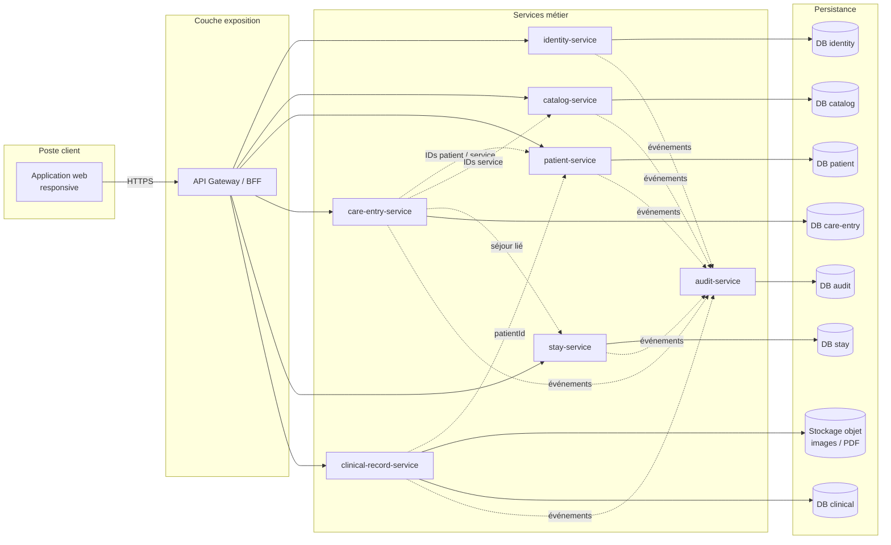

**Variante 6 services** : fusionner `care-entry-service` et `stay-service` en un seul composant **encounter-stay-service** ; les flèches vers `D_CE` et `D_ST` deviennent une base unique ou deux schémas dans le même déployable.

---

## 4. Diagramme de déploiement (vue simplifiée)

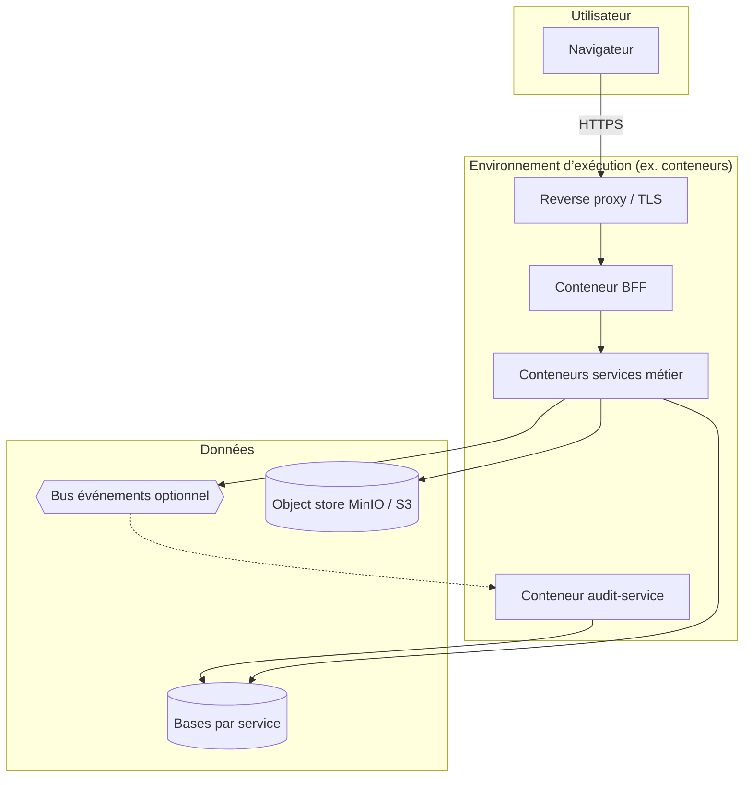

---

## 5. Modèle du domaine (MCD — `erDiagram`)

Vue **entités–associations** par **contexte délimité** (un microservice = une base PostgreSQL). Les liens **entre contextes** passent par des identifiants (`patientId`, `hospitalServiceId`, `admissionId`) sans clé étrangère JPA inter-bases.

```mermaid
erDiagram
  %% --- identity-service ---
  APP_USER ||--o{ USER_ROLE : possede
  ROLE ||--o{ USER_ROLE : reference
  APP_USER ||--o{ REFRESH_TOKEN : session
  APP_USER {
    bigint id PK
    string username UK
    string email UK
    string full_name
    string password_hash
    boolean active
    timestamp created_at
  }
  ROLE {
    bigint id PK
    string code UK
    string label
  }
  REFRESH_TOKEN {
    bigint id PK
    bigint user_id FK
    string token_hash UK
    timestamp expires_at
    boolean revoked
  }
  REVOKED_ACCESS_JTI {
    string jti PK
    timestamp expires_at
    timestamp revoked_at
  }

  %% --- catalog-service ---
  DEPARTMENT ||--o{ HOSPITAL_SERVICE : contient
  HOSPITAL_SERVICE ||--o{ BED : equipe
  DEPARTMENT {
    bigint id PK
    string code UK
    string name
    boolean active
  }
  HOSPITAL_SERVICE {
    bigint id PK
    bigint department_id FK
    string name UK
    int bed_capacity
    boolean active
  }
  BED {
    bigint id PK
    bigint hospital_service_id FK
    string label
    boolean occupied
  }

  %% --- patient-service ---
  PATIENT ||--o{ APPOINTMENT : planifie
  PATIENT {
    bigint id PK
    string dossier_number UK
    string first_name
    string last_name
    date birth_date
    string sex
  }
  APPOINTMENT {
    bigint id PK
    bigint patient_id FK
    timestamp scheduled_at
    string status
    string reason
  }

  %% --- care-entry-service ---
  ADMISSION ||--o{ TRANSFER_REQUEST : demande
  PATIENT ||--o{ ADMISSION : "patientId (logique)"
  HOSPITAL_SERVICE ||--o{ ADMISSION : "hospitalServiceId (logique)"
  PATIENT ||--o{ EMERGENCY_VISIT : "patientId (logique)"
  ADMISSION {
    bigint id PK
    bigint patient_id
    bigint hospital_service_id
    timestamp admitted_at
    timestamp discharged_at
    string status
  }
  TRANSFER_REQUEST {
    bigint id PK
    bigint admission_id FK
    bigint from_service_id
    bigint to_service_id
    timestamp requested_at
  }
  EMERGENCY_VISIT {
    bigint id PK
    bigint patient_id
    timestamp arrived_at
    timestamp ended_at
    string status
  }

  %% --- stay-service ---
  ADMISSION ||--|| STAY : "admissionId (logique)"
  PATIENT ||--o{ STAY : "patientId (logique)"
  STAY ||--o| HOSPITALIZATION_FORM : formulaire
  STAY {
    bigint id PK
    bigint patient_id
    bigint admission_id UK
    timestamp check_in_at
    timestamp check_out_at
    string room_label
    string bed_label
    string status
  }
  HOSPITALIZATION_FORM {
    bigint stay_id PK_FK
    string chief_complaint
    string history_text
    string allergies
  }

  %% --- clinical-record-service ---
  PATIENT ||--o| MEDICAL_RECORD : "patientId (logique)"
  PATIENT ||--o{ CONSULTATION : "patientId (logique)"
  ADMISSION ||--o{ CONSULTATION : "admissionId (logique)"
  CONSULTATION ||--o{ CONSULTATION_EVENT : evenement
  MEDICAL_RECORD ||--o{ CLINICAL_NOTE : note
  MEDICAL_RECORD ||--o{ DIAGNOSIS : diagnostic dossier
  MEDICAL_RECORD ||--o{ PRESCRIPTION_LINE : prescription
  MEDICAL_RECORD ||--o{ NURSING_CARE_RECORD : soin
  MEDICAL_RECORD ||--o{ CLINICAL_DOCUMENT : document
  PRESCRIPTION_LINE ||--o{ MEDICATION_ADMINISTRATION : administre
  CONSULTATION {
    bigint id PK
    bigint patient_id
    bigint admission_id
    string doctor_name
    string reason
  }
  CONSULTATION_EVENT {
    bigint id PK
    bigint consultation_id FK
    string event_type
    string content
    string disease_type
    string disease_name
    timestamp created_at
  }
  DISEASE_CATALOG {
    bigint id PK
    string disease_type
    string label
    string label_normalized
    int usage_count
  }
  MEDICAL_RECORD {
    bigint id PK
    bigint patient_id UK
    timestamp opened_at
  }
  CLINICAL_NOTE {
    bigint id PK
    bigint medical_record_id FK
    string author_username
    string narrative
  }
  DIAGNOSIS {
    bigint id PK
    bigint medical_record_id FK
    string code
    string label
  }
  PRESCRIPTION_LINE {
    bigint id PK
    bigint medical_record_id FK
    string drug_name
    string status
  }
  MEDICATION_ADMINISTRATION {
    bigint id PK
    bigint prescription_line_id FK
    timestamp administered_at
    string nurse_username
  }
  NURSING_CARE_RECORD {
    bigint id PK
    bigint medical_record_id FK
    string care_type
    string description
  }
  CLINICAL_DOCUMENT {
    bigint id PK
    bigint medical_record_id FK
    string title
    string object_storage_key
  }

  %% --- audit-service ---
  AUDIT_EVENT {
    bigint id PK
    uuid event_id UK
    timestamp occurred_at
    string actor_username
    string action
    string resource_type
    string source_service
  }
```

**Légende métier** : `Admission.status` ∈ {`OUVERTE`, `TRANSFEREE`, `SORTIE`, `ANNULEE`} ; `Stay.status` ∈ {`PLANIFIE`, `EN_COURS`, `SUSPENDU`, `CLOTURE`, `ANNULE`} ; `EmergencyVisit.status` ∈ {`EN_COURS`, `SORTIE`, `ADMIS`}.

Variante PlantUML (export PNG/PDF) : [plantuml/MODELE_DOMAINE_AFYA.puml](plantuml/MODELE_DOMAINE_AFYA.puml).

**Tous les diagrammes Mermaid du mémoire (8 CU)** : [MERMAID_MEMOIRE_AFYA.md](MERMAID_MEMOIRE_AFYA.md) (classes participantes, activités, conception).

---

## 6. Diagrammes d'activité

### 6.0 Mermaid (8 cas d'utilisation)

Voir [MERMAID_MEMOIRE_AFYA.md § Activités](MERMAID_MEMOIRE_AFYA.md#6-diagrammes-dactivité-mermaid).

### 6.1 PlantUML

Alignés sur les **8 cas d'utilisation** du mémoire (§ II.3.2) — fichiers dans [plantuml/](plantuml/) :

| CU | Fichier PlantUML |
|----|------------------|
| 1 — S'authentifier | [ACTIVITE_AUTHENTIFICATION_AFYA.puml](plantuml/ACTIVITE_AUTHENTIFICATION_AFYA.puml) |
| 2 — Gérer les utilisateurs | [ACTIVITE_GERER_UTILISATEURS_AFYA.puml](plantuml/ACTIVITE_GERER_UTILISATEURS_AFYA.puml) |
| 3 — Gérer les services hospitaliers | [ACTIVITE_GERER_SERVICES_HOSP_AFYA.puml](plantuml/ACTIVITE_GERER_SERVICES_HOSP_AFYA.puml) |
| 4 — Gérer les activités du système | [ACTIVITE_GERER_ACTIVITES_AFYA.puml](plantuml/ACTIVITE_GERER_ACTIVITES_AFYA.puml) |
| 5 — Enregistrer un patient | [ACTIVITE_ENREGISTRER_PATIENT_AFYA.puml](plantuml/ACTIVITE_ENREGISTRER_PATIENT_AFYA.puml) |
| 6 — Gérer les admissions | [ACTIVITE_ADMISSION_PATIENT_AFYA.puml](plantuml/ACTIVITE_ADMISSION_PATIENT_AFYA.puml) |
| 7 — Prise en charge médicale | [ACTIVITE_PRISE_EN_CHARGE_MEDICALE_AFYA.puml](plantuml/ACTIVITE_PRISE_EN_CHARGE_MEDICALE_AFYA.puml) |
| 8 — Enregistrer les soins | [ACTIVITE_SOIN_INFIRMIER_AFYA.puml](plantuml/ACTIVITE_SOIN_INFIRMIER_AFYA.puml) |

Compléments : [ACTIVITE_SORTIE_TRANSFERT_AFYA.puml](plantuml/ACTIVITE_SORTIE_TRANSFERT_AFYA.puml) (sortie / transfert, branche du CU 7).

---

## 7. Diagrammes de conception

Niveau **conception** : organisation technique (couches, microservices), **patron par service**, **séquences** d’appels REST et **états** des agrégats.

### 7.1 Vue d’ensemble — architecture en couches (plateforme)

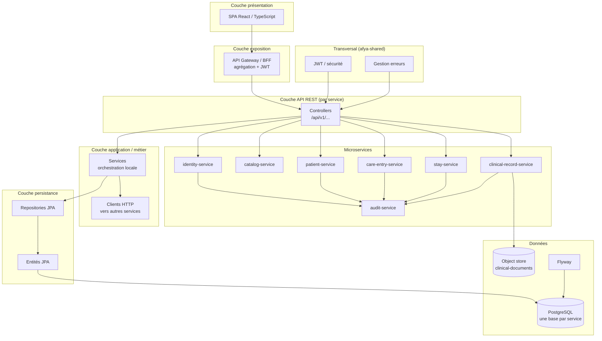

### 7.2 Patron en couches — exemple `care-entry-service`

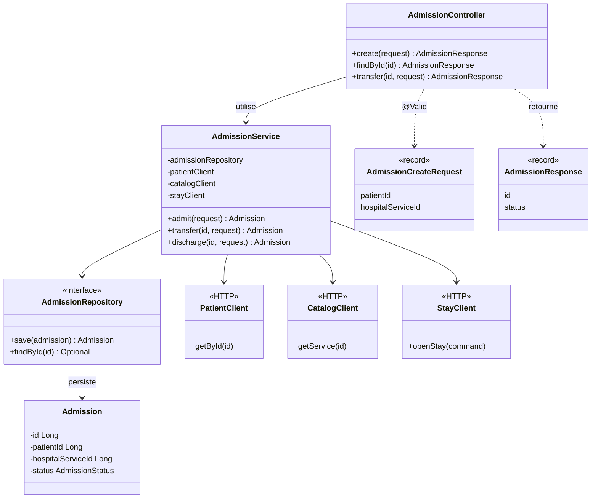

### 7.3 Séquence — authentification (login)

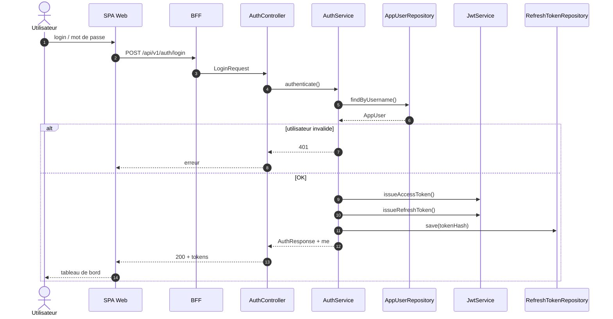

### 7.4 Séquence — enregistrer une admission

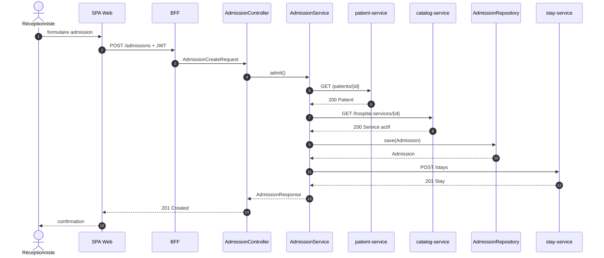

### 7.5 Séquence — prescription et administration

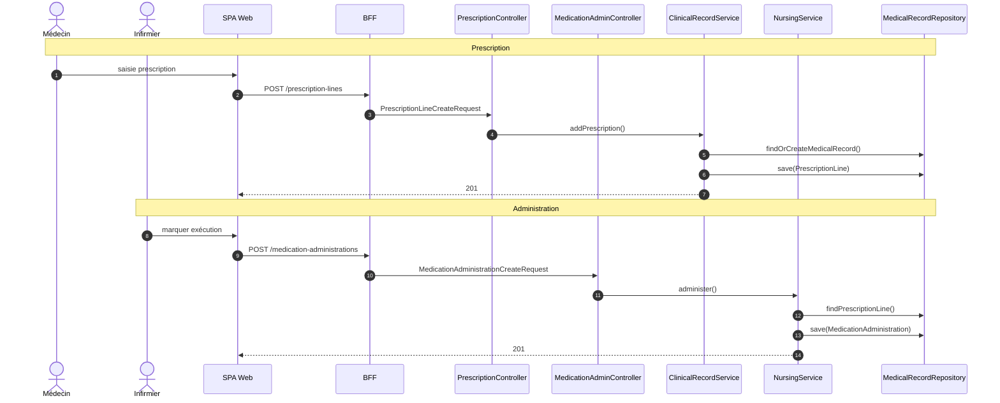

### 7.6 Diagrammes d’états (agrégats)

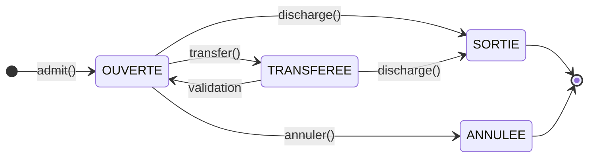

États **`Admission`** (`care-entry-service`). Pour **`Stay`** : `PLANIFIE` → `EN_COURS` → `CLOTURE` / `ANNULE` — voir [plantuml/ETAT_STAY_AFYA.puml](plantuml/ETAT_STAY_AFYA.puml).

### 7.7 Séquence — prise en charge médicale (consultation)

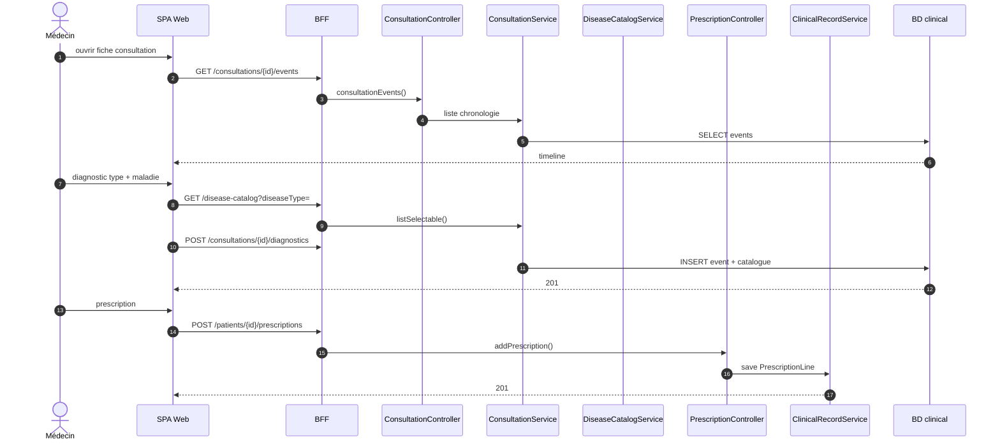

Voir aussi [MERMAID_MEMOIRE_AFYA.md § Conception](MERMAID_MEMOIRE_AFYA.md#7-diagrammes-de-conception-mermaid).

### 7.8 Patron consultation — `clinical-record-service`

Diagramme complet (attributs + méthodes) : [MERMAID_MEMOIRE_AFYA.md §7.6](MERMAID_MEMOIRE_AFYA.md#76-classes--consultation-et-catalogue-conception) et [plantuml/CONCEPTION_CONSULTATION_AFYA.puml](plantuml/CONCEPTION_CONSULTATION_AFYA.puml).

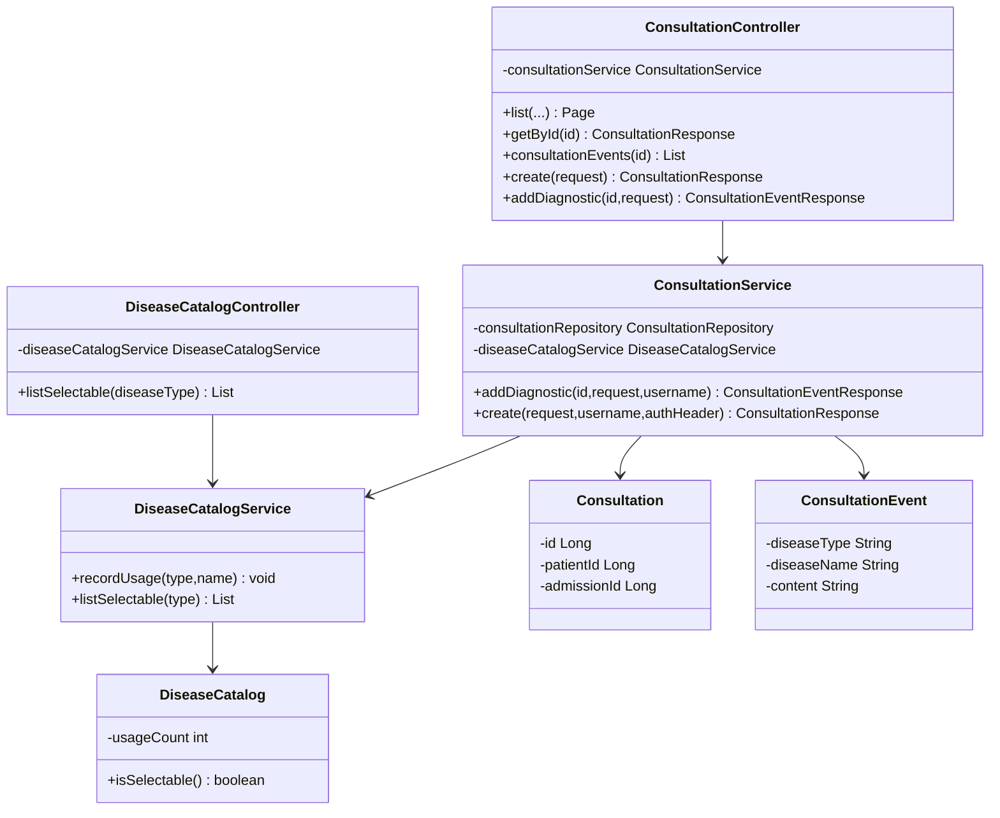

### 7.9 Fichiers PlantUML (export PNG/PDF)

| Fichier | Contenu |
|---------|---------|
| [CONCEPTION_COUCHE_SERVICE_AFYA.puml](plantuml/CONCEPTION_COUCHE_SERVICE_AFYA.puml) | Patron couches détaillé (care-entry) |
| [CONCEPTION_SEQUENCE_AUTHENTIFICATION_AFYA.puml](plantuml/CONCEPTION_SEQUENCE_AUTHENTIFICATION_AFYA.puml) | Séquence login |
| [CONCEPTION_SEQUENCE_ADMISSION_AFYA.puml](plantuml/CONCEPTION_SEQUENCE_ADMISSION_AFYA.puml) | Séquence admission |
| [CONCEPTION_SEQUENCE_CLINICAL_AFYA.puml](plantuml/CONCEPTION_SEQUENCE_CLINICAL_AFYA.puml) | Séquence prescription / administration |
| [CONCEPTION_SEQUENCE_PRISE_EN_CHARGE_AFYA.puml](plantuml/CONCEPTION_SEQUENCE_PRISE_EN_CHARGE_AFYA.puml) | Séquence consultation, diagnostic, catalogue, prescription |
| [CONCEPTION_CONSULTATION_AFYA.puml](plantuml/CONCEPTION_CONSULTATION_AFYA.puml) | Couches `ConsultationService` / `DiseaseCatalog` |
| [ETAT_ADMISSION_AFYA.puml](plantuml/ETAT_ADMISSION_AFYA.puml) | Cycle de vie `Admission` |
| [ETAT_STAY_AFYA.puml](plantuml/ETAT_STAY_AFYA.puml) | Cycle de vie `Stay` |

---

## 8. Classes participantes (analyse)

### 8.0 Mermaid (8 cas d'utilisation)

Diagrammes `classDiagram` avec **attributs et méthodes** par classe : [MERMAID_MEMOIRE_AFYA.md §5](MERMAID_MEMOIRE_AFYA.md#5-classes-participantes-mermaid).

### 8.1 PlantUML

Un diagramme **par cas d'utilisation** (notation frontière / contrôle / entité, avec BFF + microservices réels) :

| CU | Fichier PlantUML |
|----|------------------|
| h — S'authentifier | [CLASSES_PARTICIPANTES_AUTH.puml](plantuml/CLASSES_PARTICIPANTES_AUTH.puml) |
| a — Gérer les utilisateurs | [CLASSES_PARTICIPANTES_UTILISATEURS.puml](plantuml/CLASSES_PARTICIPANTES_UTILISATEURS.puml) |
| b — Gérer les services hospitaliers | [CLASSES_PARTICIPANTES_SERVICES_HOSP.puml](plantuml/CLASSES_PARTICIPANTES_SERVICES_HOSP.puml) |
| c — Gérer les activités du système | [CLASSES_PARTICIPANTES_ACTIVITES.puml](plantuml/CLASSES_PARTICIPANTES_ACTIVITES.puml) |
| d — Enregistrer un patient | [CLASSES_PARTICIPANTES_PATIENT.puml](plantuml/CLASSES_PARTICIPANTES_PATIENT.puml) |
| e — Gérer les admissions | [CLASSES_PARTICIPANTES_ADMISSIONS.puml](plantuml/CLASSES_PARTICIPANTES_ADMISSIONS.puml) |
| f — Prise en charge médicale | [CLASSES_PARTICIPANTES_PRISE_EN_CHARGE.puml](plantuml/CLASSES_PARTICIPANTES_PRISE_EN_CHARGE.puml) |
| g — Enregistrer les soins | [CLASSES_PARTICIPANTES_SOINS.puml](plantuml/CLASSES_PARTICIPANTES_SOINS.puml) |

Vue synthèse : [CLASSES_PARTICIPANTES_AFYA.puml](plantuml/CLASSES_PARTICIPANTES_AFYA.puml).

**Modèle du domaine** (conceptuel, contextes délimités) : [MODELE_DOMAINE_AFYA.puml](plantuml/MODELE_DOMAINE_AFYA.puml) — inclut `Consultation`, `ConsultationEvent`, `DiseaseCatalog` (migrations V6/V7).

---

## 9. Correspondance rapide UML ↔ documentation

| Élément UML | Où le trouver |
|-------------|----------------|
| Cas d’utilisation / acteurs | §1–2 de ce fichier + [CARTOGRAPHIE_EXIGENCES.md](CARTOGRAPHIE_EXIGENCES.md) |
| Composants / responsabilités | §3 + [ARCHITECTURE_SERVICES.md](ARCHITECTURE_SERVICES.md) |
| **Modèle du domaine (MCD)** | **§5** (Mermaid) + [plantuml/MODELE_DOMAINE_AFYA.puml](plantuml/MODELE_DOMAINE_AFYA.puml) |
| **Diagrammes de conception** | **§7** (Mermaid) + [plantuml/CONCEPTION_*.puml](plantuml/README.md) |
| Classes participantes (8 CU) | §8 + [plantuml/CLASSES_PARTICIPANTES_*.puml](plantuml/README.md) |
| Dictionnaire des données | [DICTIONNAIRE_DES_DONNEES.md](DICTIONNAIRE_DES_DONNEES.md) |
| Activités (8 CU) | §6 + [MERMAID_MEMOIRE_AFYA.md](MERMAID_MEMOIRE_AFYA.md) + [plantuml/ACTIVITE_*.puml](plantuml/README.md) |
| Séquences mémoire II.3.2 | Figures II.3–II.10 (texte) + §7.3–7.7 Mermaid + [plantuml/CONCEPTION_SEQUENCE_*.puml](plantuml/README.md) |
| **Mémoire complet en Mermaid** | **[MERMAID_MEMOIRE_AFYA.md](MERMAID_MEMOIRE_AFYA.md)** |
| **Classes par service** | **[MERMAID_CLASSES_PAR_SERVICE.md](MERMAID_CLASSES_PAR_SERVICE.md)** |

Pour exporter en **PNG/SVG** : coller les blocs `` ```mermaid `` dans [mermaid.live](https://mermaid.live) ou utiliser `mmdc` (CLI Mermaid) dans votre pipeline CI.
