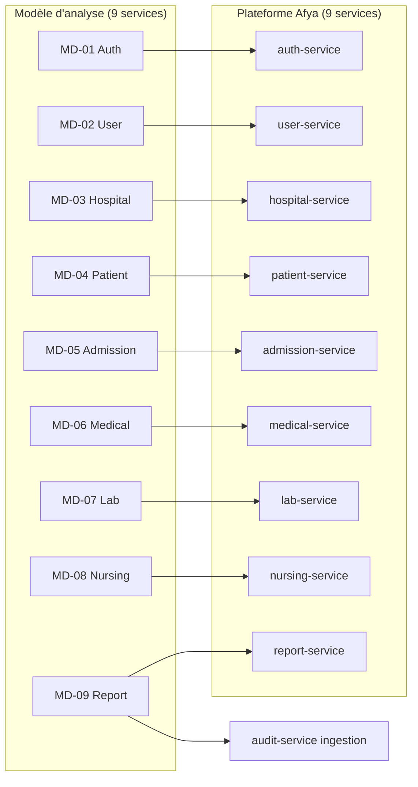

# Mapping — modèle mémoire (9 microservices) → prototype Afya (7 microservices)

**Système de gestion des patients — HGR Jason Sendwe**

Le **mémoire** retient comme référence officielle le modèle **9 microservices / 38 classes** : [MODELE_DOMAINE_MEMOIRE_9_SERVICES.md](MODELE_DOMAINE_MEMOIRE_9_SERVICES.md).

Ce document établit la correspondance entre ce modèle d'analyse et l'**implémentation Afya** (9 services métier + BFF + gateway) — prototype en migration progressive depuis l'ancienne découpe à 7 modules.

**Références Afya :**

| Ressource | Chemin |
|-----------|--------|
| **Référence mémoire (9 services)** | [MODELE_DOMAINE_MEMOIRE_9_SERVICES.md](MODELE_DOMAINE_MEMOIRE_9_SERVICES.md) |
| Architecture prototype (9 services) | [ARCHITECTURE_SERVICES.md](ARCHITECTURE_SERVICES.md) |
| Modèle du domaine JPA (implémentation) | [MERMAID_DOMAINE_AFYA.md](MERMAID_DOMAINE_AFYA.md) |
| PlantUML mémoire MD-01…MD-09 | [plantuml/memoire/](plantuml/memoire/) |
| Cartographie exigences | [CARTOGRAPHIE_EXIGENCES.md](CARTOGRAPHIE_EXIGENCES.md) |

---

## 1. Vue synthèse

| Modèle analyse | Service Afya | Base PostgreSQL | Statut global |
|----------------|--------------|-----------------|---------------|
| **MD-01** Auth Service | `auth-service` | `afya_auth` | Partiel |
| **MD-02** User Service | `user-service` | `afya_user` | Partiel |
| **MD-03** Hospital Service | `hospital-service` | `afya_hospital` | Partiel |
| **MD-04** Patient Service | `patient-service` | `afya_patient` | Partiel |
| **MD-05** Admission Service | `admission-service` | `afya_admission` | Partiel |
| **MD-06** Medical Service | `medical-service` | `afya_medical` | Partiel |
| **MD-07** Lab Service | `lab-service` | `afya_lab` | Implémenté (schéma complet) |
| **MD-08** Nursing Service | `nursing-service` | `afya_nursing` | Partiel — notifications + administrations |
| **MD-09** Report Service | `report-service` + `audit-service` | `afya_report` + `afya_audit` | Partiel — rapports matérialisés, stats labo/soins |

Tous les modules legacy ont été retirés. ~~`identity-service`~~, ~~`catalog-service`~~, ~~`care-entry-service`~~, ~~`stay-service`~~ et ~~`clinical-record-service`~~ remplacés par la stack cible (9 microservices).

---

## 2. Correspondance détaillée des classes

### MD-01 — Auth Service → `auth-service`

| Classe mémoire | Classe / concept Afya | Statut |
|----------------|----------------------|--------|
| `Credential` | `Credential` (`auth-service`, table `credentials`) | **Fait** — hash, statut, tentatives, blocage |
| `TokenJWT` | JWT stateless + `RefreshToken` + `RevokedAccessJti` | Partiel — pas de table `TokenJWT` |
| `JournalConnexion` | `AuditEvent` (`audit-service`) | Partiel — pas de journal dédié auth |

**Alignement P1 :** le hash mot de passe et le lockout sont dans `auth-service` ; `user-service` gère le profil `Utilisateur` (rôles, affectations, actif).

---

### MD-02 — User Service → `user-service`

| Classe mémoire | Classe / concept Afya | Statut |
|----------------|----------------------|--------|
| `Utilisateur` | `AppUser` | Implémenté |
| `Role` | `Role` | Implémenté |
| `Affectation` | `AppUser.hospitalServiceIds` | Partiel — pas de dates début/fin |
| `JournalAction` | `AuditEvent` (`audit-service`) | Partiel — journal centralisé transversal |

---

### MD-03 — Hospital Service → `hospital-service`

| Classe mémoire | Classe / concept Afya | Statut |
|----------------|----------------------|--------|
| `ServiceHospitalier` | `HospitalService` + `Department` | Implémenté (+ département parent) |
| `Lit` | `Bed` | Partiel — `occupied` booléen, pas de type/statut mémoire |
| `OccupationLit` | `BedOccupation` (`hospital-service`) | **Fait** — historique patient/admission par lit |

---

### MD-04 — Patient Service → `patient-service`

| Classe mémoire | Classe / concept Afya | Statut |
|----------------|----------------------|--------|
| `Patient` | `Patient` | Implémenté (champs enrichis : `postName`, `heightCm`, `deceasedAt`) |
| `AntecedentMedical` | `MedicalAntecedent` | Implémenté (types MEDICAL, CHIRURGICAL, FAMILIAL, ALLERGIE) |
| `ContactUrgence` | `EmergencyContact` | Implémenté |

---

### MD-05 — Admission Service → `admission-service`

| Classe mémoire | Classe / concept Afya | Statut |
|----------------|----------------------|--------|
| `Admission` | `Admission` | Partiel — pas de `numAdmission`, type NORMALE/URGENCE |
| `Affectation` | `Admission.hospitalServiceId` + `Stay.roomLabel/bedLabel` | Partiel |
| `Transfert` | `TransferRequest` | Implémenté |
| `Sortie` | `DischargeRecord` | Implémenté (types GUERI, TRANSFERE_EXTERNE, DECEDE, CONTRE_AVIS_MEDICAL) |
| `NotificationAdmission` | `AdmissionNotification` | Implémenté (HOSPITALISATION, SORTIE_AUTORISEE, TRANSFERT) |
| *(extension Afya)* | `EmergencyVisit`, `Stay`, `HospitalizationForm` | Hors mémoire MD-05 |

**Note :** fusion `care-entry` + `stay` → `admission-service` (une base `afya_admission`).

---

### MD-06 — Medical Service → `medical-service`

| Classe mémoire | Classe / concept Afya | Statut |
|----------------|----------------------|--------|
| `DossierMedical` | `MedicalRecord` | Implémenté |
| `Consultation` | `Consultation` | Partiel — diagnostic dans `ConsultationEvent` / `Diagnosis` |
| `Prescription` | — (lignes directes) | Partiel — pas d'agrégat `Prescription` |
| `Medicament` | `PrescriptionLine` | Implémenté (ligne = médicament ; `admission_id` optionnel pour le parcours hospi) |
| `DecisionMedicale` | `ConsultationEvent` + workflow admission | Partiel — demande labo matérialisée (`exam_request_id` → `ExamRequest`) |

**Extensions Afya :** `ClinicalDocument`, `ClinicalNote`, `DiseaseCatalog`, prescriptions par admission (`GET/POST/PUT /api/v1/admissions/{id}/prescription-lines`).

---

### MD-07 — Lab Service → `lab-service`

| Classe mémoire | Classe / concept Afya | Statut |
|----------------|----------------------|--------|
| `TypeExamen` | `ExamType` | Implémenté |
| `DemandeExamen` | `ExamRequest` | Implémenté |
| `LigneDemandeExamen` | `ExamRequestLine` | Implémenté |
| `Prelevement` | `SpecimenCollection` | Implémenté |
| `ResultatExamen` | `ExamResult` | Implémenté |
| `ParametreResultat` | `ResultParameter` | Implémenté |

**Seul service aligné à 100 % sur les 6 classes du mémoire.**

---

### MD-08 — Nursing Service → `nursing-service`

| Classe mémoire | Classe / concept Afya | Statut |
|----------------|----------------------|--------|
| `SoinInfirmier` | `NursingCareRecord` | Partiel — lien `medicalRecordId`, pas `prescriptionId` |
| `ConstanteVitale` | `VitalSignReading` (`nursing-service`) | Implémenté |
| `AlerteConstante` | `VitalSignAlert` | Implémenté (seuils automatiques) |
| `NotificationPrescription` | `PrescriptionNotification` | **Fait** — envoi à la création, statuts ENVOYEE / LUE / EXECUTEE |
| *(extension Afya)* | `MedicationAdministration` | **Fait** — administrations par date + créneau (MATIN/SOIR/JOURNEE), endpoint admission |

---

### MD-09 — Report Service → `report-service` + `audit-service`

| Classe mémoire | Classe / concept Afya | Statut |
|----------------|----------------------|--------|
| `Rapport` | `GeneratedReport` + export PDF/Excel | **Fait** — persistance `generated_reports`, téléchargement via BFF |
| `StatistiqueAdmission` | Agrégation via `ActivityReportService` | Partiel |
| `StatistiqueMedical` | Partiel via audit + volumes medical | Partiel |
| `StatistiqueLaboratoire` | `OperationalStatsService` (lab-service) | **Fait** — KPI demandes, délais, résultats |
| `StatistiqueSoins` | `OperationalStatsService` (nursing-service) | **Fait** — constantes, alertes, soins |
| *(transversal)* | `AuditEvent` (`audit-service`) | Ingestion événements |

---

## 3. Composants transversaux (hors MD-01…MD-09)

| Composant | Rôle | Équivalent analyse |
|-----------|------|-------------------|
| `afya-bff` | Agrégation API pour le front, KPI, rapports combinés | Partie de MD-09 (vue consolidée) |
| `infra/gateway` (`api`) | TLS, rate-limit, routage `/api` | Non modélisé en analyse (couche edge) |
| `frontend/` | SPA React | Interface utilisateur |
| `afya-shared` | Correlation ID, résilience HTTP, audit publisher, JWT | Infrastructure transversale |

---

## 4. Tableau récapitulatif — classes par service

| Microservice mémoire | Nb classes | Service Afya | Couverture estimée |
|----------------------|------------|--------------|-------------------|
| MD-01 Auth | 3 | `auth-service` | ~75 % |
| MD-02 User | 4 | `user-service` | ~75 % |
| MD-03 Hospital | 3 | `hospital-service` | ~85 % |
| MD-04 Patient | 3 | `patient-service` | ~85 % |
| MD-05 Admission | 5 | `admission-service` | ~85 % |
| MD-06 Medical | 5 | `medical-service` | ~85 % |
| MD-07 Lab | 6 | `lab-service` | **~100 %** |
| MD-08 Nursing | 4 | `nursing-service` | ~85 % |
| MD-09 Report | 5 | `report-service` + `audit-service` | ~70 % |
| **Total** | **38** | **9 services** | **~82 %** |

---

## 5. Justification des écarts architecturaux

| Choix Afya | Justification |
|------------|---------------|
| Auth / User scindés | Alignement mémoire MD-01 / MD-02 ; credentials via API interne user |
| Admission unifiée | Fusion `care-entry` + `stay` → `admission-service` (MD-05) |
| Medical / Nursing scindés | Alignement mémoire MD-06 / MD-08 |
| Constantes vitales en admission | Triage et suivi au parcours d'entrée (écart MD-08) |
| Antécédents en medical | Stockés dans `MedicalRecord`, pas dans `patient-service` (écart MD-04) |
| Audit transversal | Journal connexions et actions hors services dédiés |
| Références inter-services par ID | Pas de FK cross-BDD ; aligné microservices |

---

## 6. Feuille de route d'alignement (optionnelle)

| Priorité | Écart mémoire | Action proposée | Service cible |
|----------|---------------|-----------------|---------------|
| P1 | `Credential` séparé de `Utilisateur` | ~~Table credentials + tentatives / blocage~~ **Fait** | `auth-service` |
| P2 | `ContactUrgence`, `AntecedentMedical` (MD-04) | ~~Entités dédiées patient~~ **Fait** | `patient-service` |
| P3 | `NotificationAdmission` (MD-05) | ~~Bus événements~~ **Fait** (persisté + lecture) | `admission-service` |
| P4 | `ConstanteVitale` → nursing (MD-08) | ~~Migrer `VitalSignReading`~~ **Fait** | `nursing-service` |
| P5 | `AlerteConstante`, `NotificationPrescription` | ~~Règles seuils~~ alertes **Fait** ; notifications **Fait** | `nursing-service` |
| P6 | `OccupationLit` (MD-03) | ~~Historique occupations~~ **Fait** | `hospital-service` |
| P7 | `Rapport` PDF/Excel + stats (MD-09) | ~~Persistance agrégats~~ **Fait** | `report-service` |
| P8 | Prescriptions par admission (MD-06 / MD-08) | ~~`admission_id` + administrations créneau~~ **Fait** | `medical-service`, `nursing-service`, BFF |

### Backlog optionnel (non bloquant soutenance)

| Priorité | Écart / fonctionnalité | Action proposée | Service cible |
|----------|------------------------|-----------------|---------------|
| P9 | Consultation → `DemandeExamen` labo | ~~Créer `ExamRequest` depuis consultation~~ **Fait** | `medical-service` → `lab-service` |
| P10 | Admin UI types d'examens | ~~Écran CRUD sur `GET/POST /api/v1/lab/exam-types`~~ **Fait** (`LabExamTypesPage`) | `frontend` |
| P11 | Table `TokenJWT` (MD-01) | Persistance tokens émis / révoqués (au-delà de `RevokedAccessJti`) | `auth-service` |
| P12 | Agrégat `Prescription` (MD-06) | Entité parente regroupant plusieurs `PrescriptionLine` | `medical-service` |
| P13 | `Affectation` dates début/fin (MD-02) | Remplacer `hospitalServiceIds` par entité datée | `user-service` |

## 7. Références pour le mémoire

**Formulation suggérée (soutenance) :**

> Le modèle d'analyse du mémoire (9 microservices, 38 classes) constitue la **référence officielle du domaine**. Le prototype Afya implémente **9 modules Maven alignés** sur cette découpe ; la couverture fonctionnelle est **majoritairement atteinte (~82 %)** avec des écarts documentés (table `TokenJWT`, agrégat `Prescription`, dates d'affectation utilisateur). Ce mapping trace la correspondance bidirectionnelle entre analyse et implémentation.

**Diagrammes à citer :**

- Analyse (9 services) : modèles MD-01…MD-09 du mémoire
- Conception / implémentation : [MODELE_DOMAINE_AFYA.puml](plantuml/MODELE_DOMAINE_AFYA.puml)
- Déploiement : [DEPLOIEMENT_AFYA.puml](plantuml/DEPLOIEMENT_AFYA.puml)

---

*Document maintenu avec le dépôt Afya — plateforme HGR Jason Sendwe.*
