# UML Diagrams — Analysis Phase (Before Development)

**Functional design** document aligned with thesis use cases (§ II.3.2).  
Names are **business-oriented** (English), with no reference to Java microservices or the BFF.

> **Actual implementation** (after development): [MERMAID_MEMOIRE_AFYA.md](MERMAID_MEMOIRE_AFYA.md), [MERMAID_CLASSES_PAR_SERVICE.md](MERMAID_CLASSES_PAR_SERVICE.md).

French version: [MEMOIRE_UML_ANALYSE_FR.md](MEMOIRE_UML_ANALYSE_FR.md).

---

## 1. Domain Model (Conceptual)

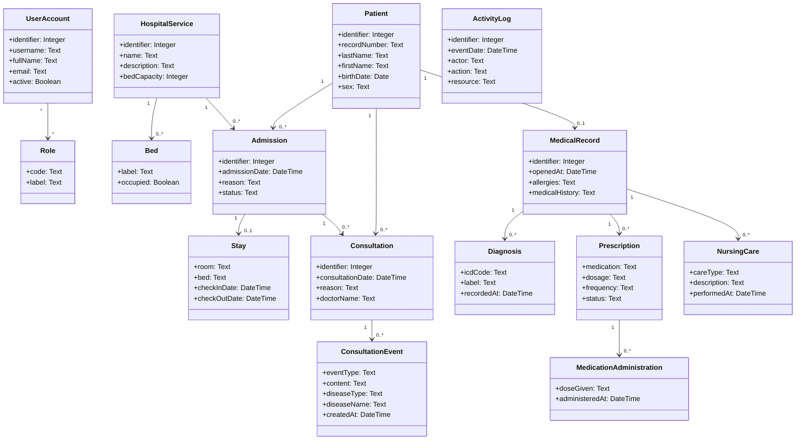
```mermaid
classDiagram
  direction TB

  class Patient {
    +identifier: Integer
    +recordNumber: Text
    +lastName: Text
    +firstName: Text
    +birthDate: Date
    +sex: Text
  }

  class UserAccount {
    +identifier: Integer
    +username: Text
    +fullName: Text
    +email: Text
    +active: Boolean
  }

  class Role {
    +code: Text
    +label: Text
  }

  class HospitalService {
    +identifier: Integer
    +name: Text
    +description: Text
    +bedCapacity: Integer
  }

  class Bed {
    +label: Text
    +occupied: Boolean
  }

  class Admission {
    +identifier: Integer
    +admissionDate: DateTime
    +reason: Text
    +status: Text
  }

  class Stay {
    +room: Text
    +bed: Text
    +checkInDate: DateTime
    +checkOutDate: DateTime
  }

  class MedicalRecord {
    +identifier: Integer
    +openedAt: DateTime
    +allergies: Text
    +medicalHistory: Text
  }

  class Consultation {
    +identifier: Integer
    +consultationDate: DateTime
    +reason: Text
    +doctorName: Text
  }

  class ConsultationEvent {
    +eventType: Text
    +content: Text
    +diseaseType: Text
    +diseaseName: Text
    +createdAt: DateTime
  }

  class Diagnosis {
    +icdCode: Text
    +label: Text
    +recordedAt: DateTime
  }

  class Prescription {
    +medication: Text
    +dosage: Text
    +frequency: Text
    +status: Text
  }

  class NursingCare {
    +careType: Text
    +description: Text
    +performedAt: DateTime
  }

  class MedicationAdministration {
    +doseGiven: Text
    +administeredAt: DateTime
  }

  class ActivityLog {
    +identifier: Integer
    +eventDate: DateTime
    +actor: Text
    +action: Text
    +resource: Text
  }

  Patient "1" --> "0..*" Admission
  Patient "1" --> "0..1" MedicalRecord
  Patient "1" --> "0..*" Consultation
  HospitalService "1" --> "0..*" Bed
  HospitalService "1" --> "0..*" Admission
  Admission "1" --> "0..1" Stay
  Admission "1" --> "0..*" Consultation
  MedicalRecord "1" --> "0..*" Diagnosis
  MedicalRecord "1" --> "0..*" Prescription
  MedicalRecord "1" --> "0..*" NursingCare
  Consultation "1" --> "0..*" ConsultationEvent
  Prescription "1" --> "0..*" MedicationAdministration
  UserAccount "*" --> "*" Role
```

---

## 2. Participating Classes (Analysis)

Notation: **<<boundary>>** (interface), **<<control>>** (business logic), **<<entity>>** (persisted data).

### 2.1 UC — Sign In

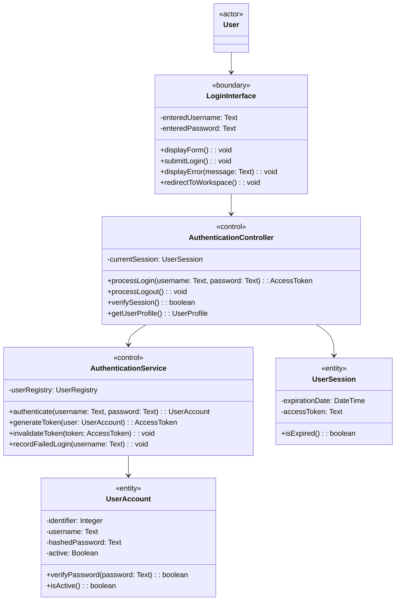
```mermaid
classDiagram
  direction TB

  class User {
    <<actor>>
  }

  class LoginInterface {
    <<boundary>>
    -enteredUsername: Text
    -enteredPassword: Text
    +displayForm(): void
    +submitLogin(): void
    +displayError(message: Text): void
    +redirectToWorkspace(): void
  }

  class AuthenticationController {
    <<control>>
    -currentSession: UserSession
    +processLogin(username: Text, password: Text): AccessToken
    +processLogout(): void
    +verifySession(): boolean
    +getUserProfile(): UserProfile
  }

  class AuthenticationService {
    <<control>>
    -userRegistry: UserRegistry
    +authenticate(username: Text, password: Text): UserAccount
    +generateToken(user: UserAccount): AccessToken
    +invalidateToken(token: AccessToken): void
    +recordFailedLogin(username: Text): void
  }

  class UserAccount {
    <<entity>>
    -identifier: Integer
    -username: Text
    -hashedPassword: Text
    -active: Boolean
    +verifyPassword(password: Text): boolean
    +isActive(): boolean
  }

  class UserSession {
    <<entity>>
    -expirationDate: DateTime
    -accessToken: Text
    +isExpired(): boolean
  }

  User --> LoginInterface
  LoginInterface --> AuthenticationController
  AuthenticationController --> AuthenticationService
  AuthenticationService --> UserAccount
  AuthenticationController --> UserSession
```

### 2.2 UC — Manage Users

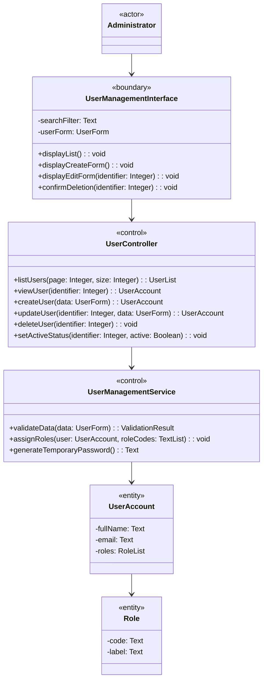
```mermaid
classDiagram
  direction TB

  class Administrator {
    <<actor>>
  }

  class UserManagementInterface {
    <<boundary>>
    -searchFilter: Text
    -userForm: UserForm
    +displayList(): void
    +displayCreateForm(): void
    +displayEditForm(identifier: Integer): void
    +confirmDeletion(identifier: Integer): void
  }

  class UserController {
    <<control>>
    +listUsers(page: Integer, size: Integer): UserList
    +viewUser(identifier: Integer): UserAccount
    +createUser(data: UserForm): UserAccount
    +updateUser(identifier: Integer, data: UserForm): UserAccount
    +deleteUser(identifier: Integer): void
    +setActiveStatus(identifier: Integer, active: Boolean): void
  }

  class UserManagementService {
    <<control>>
    +validateData(data: UserForm): ValidationResult
    +assignRoles(user: UserAccount, roleCodes: TextList): void
    +generateTemporaryPassword(): Text
  }

  class UserAccount {
    <<entity>>
    -fullName: Text
    -email: Text
    -roles: RoleList
  }

  class Role {
    <<entity>>
    -code: Text
    -label: Text
  }

  Administrator --> UserManagementInterface
  UserManagementInterface --> UserController
  UserController --> UserManagementService
  UserManagementService --> UserAccount
  UserAccount --> Role
```

### 2.3 UC — Manage Hospital Services

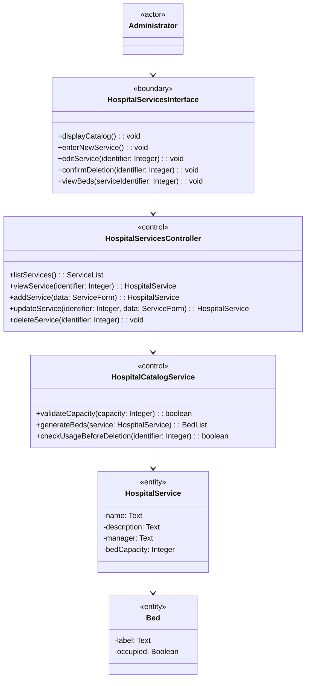
```mermaid
classDiagram
  direction TB

  class Administrator {
    <<actor>>
  }

  class HospitalServicesInterface {
    <<boundary>>
    +displayCatalog(): void
    +enterNewService(): void
    +editService(identifier: Integer): void
    +confirmDeletion(identifier: Integer): void
    +viewBeds(serviceIdentifier: Integer): void
  }

  class HospitalServicesController {
    <<control>>
    +listServices(): ServiceList
    +viewService(identifier: Integer): HospitalService
    +addService(data: ServiceForm): HospitalService
    +updateService(identifier: Integer, data: ServiceForm): HospitalService
    +deleteService(identifier: Integer): void
  }

  class HospitalCatalogService {
    <<control>>
    +validateCapacity(capacity: Integer): boolean
    +generateBeds(service: HospitalService): BedList
    +checkUsageBeforeDeletion(identifier: Integer): boolean
  }

  class HospitalService {
    <<entity>>
    -name: Text
    -description: Text
    -manager: Text
    -bedCapacity: Integer
  }

  class Bed {
    <<entity>>
    -label: Text
    -occupied: Boolean
  }

  Administrator --> HospitalServicesInterface
  HospitalServicesInterface --> HospitalServicesController
  HospitalServicesController --> HospitalCatalogService
  HospitalCatalogService --> HospitalService
  HospitalService --> Bed
```

### 2.4 UC — Manage System Activity

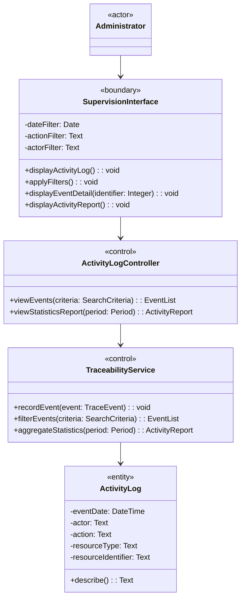
```mermaid
classDiagram
  direction TB

  class Administrator {
    <<actor>>
  }

  class SupervisionInterface {
    <<boundary>>
    -dateFilter: Date
    -actionFilter: Text
    -actorFilter: Text
    +displayActivityLog(): void
    +applyFilters(): void
    +displayEventDetail(identifier: Integer): void
    +displayActivityReport(): void
  }

  class ActivityLogController {
    <<control>>
    +viewEvents(criteria: SearchCriteria): EventList
    +viewStatisticsReport(period: Period): ActivityReport
  }

  class TraceabilityService {
    <<control>>
    +recordEvent(event: TraceEvent): void
    +filterEvents(criteria: SearchCriteria): EventList
    +aggregateStatistics(period: Period): ActivityReport
  }

  class ActivityLog {
    <<entity>>
    -eventDate: DateTime
    -actor: Text
    -action: Text
    -resourceType: Text
    -resourceIdentifier: Text
    +describe(): Text
  }

  Administrator --> SupervisionInterface
  SupervisionInterface --> ActivityLogController
  ActivityLogController --> TraceabilityService
  TraceabilityService --> ActivityLog
```

### 2.5 UC — Register a Patient

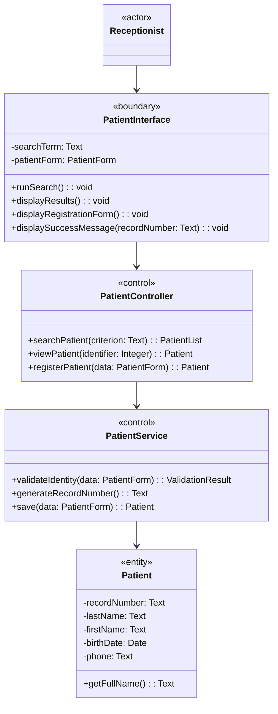
```mermaid
classDiagram
  direction TB

  class Receptionist {
    <<actor>>
  }

  class PatientInterface {
    <<boundary>>
    -searchTerm: Text
    -patientForm: PatientForm
    +runSearch(): void
    +displayResults(): void
    +displayRegistrationForm(): void
    +displaySuccessMessage(recordNumber: Text): void
  }

  class PatientController {
    <<control>>
    +searchPatient(criterion: Text): PatientList
    +viewPatient(identifier: Integer): Patient
    +registerPatient(data: PatientForm): Patient
  }

  class PatientService {
    <<control>>
    +validateIdentity(data: PatientForm): ValidationResult
    +generateRecordNumber(): Text
    +save(data: PatientForm): Patient
  }

  class Patient {
    <<entity>>
    -recordNumber: Text
    -lastName: Text
    -firstName: Text
    -birthDate: Date
    -phone: Text
    +getFullName(): Text
  }

  Receptionist --> PatientInterface
  PatientInterface --> PatientController
  PatientController --> PatientService
  PatientService --> Patient
```

### 2.6 UC — Manage Admissions

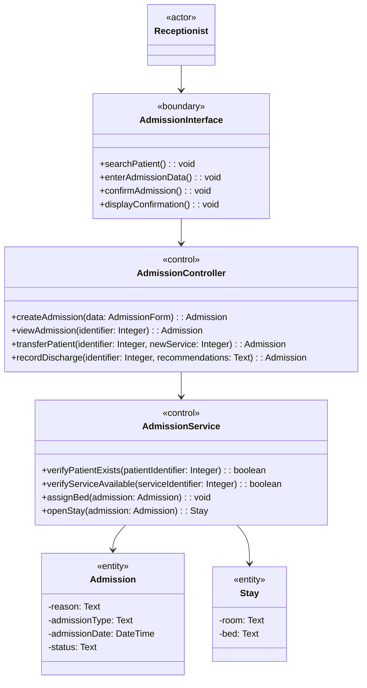
```mermaid
classDiagram
  direction TB

  class Receptionist {
    <<actor>>
  }

  class AdmissionInterface {
    <<boundary>>
    +searchPatient(): void
    +enterAdmissionData(): void
    +confirmAdmission(): void
    +displayConfirmation(): void
  }

  class AdmissionController {
    <<control>>
    +createAdmission(data: AdmissionForm): Admission
    +viewAdmission(identifier: Integer): Admission
    +transferPatient(identifier: Integer, newService: Integer): Admission
    +recordDischarge(identifier: Integer, recommendations: Text): Admission
  }

  class AdmissionService {
    <<control>>
    +verifyPatientExists(patientIdentifier: Integer): boolean
    +verifyServiceAvailable(serviceIdentifier: Integer): boolean
    +assignBed(admission: Admission): void
    +openStay(admission: Admission): Stay
  }

  class Admission {
    <<entity>>
    -reason: Text
    -admissionType: Text
    -admissionDate: DateTime
    -status: Text
  }

  class Stay {
    <<entity>>
    -room: Text
    -bed: Text
  }

  Receptionist --> AdmissionInterface
  AdmissionInterface --> AdmissionController
  AdmissionController --> AdmissionService
  AdmissionService --> Admission
  AdmissionService --> Stay
```

### 2.7 UC — Medical Care Pathway

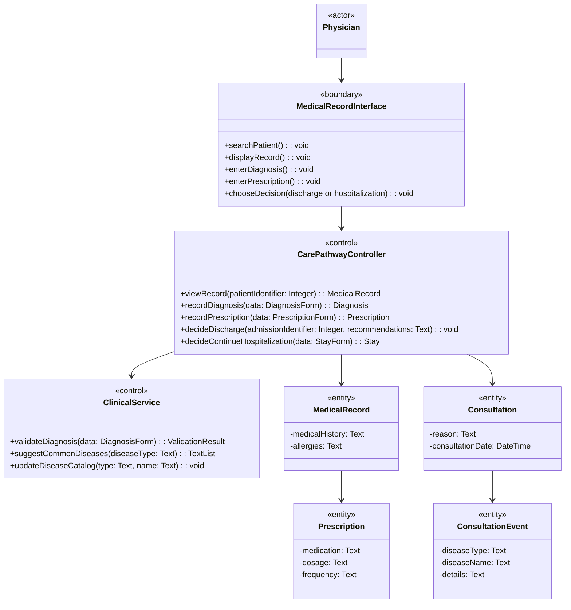
```mermaid
classDiagram
  direction TB

  class Physician {
    <<actor>>
  }

  class MedicalRecordInterface {
    <<boundary>>
    +searchPatient(): void
    +displayRecord(): void
    +enterDiagnosis(): void
    +enterPrescription(): void
    +chooseDecision(discharge or hospitalization): void
  }

  class CarePathwayController {
    <<control>>
    +viewRecord(patientIdentifier: Integer): MedicalRecord
    +recordDiagnosis(data: DiagnosisForm): Diagnosis
    +recordPrescription(data: PrescriptionForm): Prescription
    +decideDischarge(admissionIdentifier: Integer, recommendations: Text): void
    +decideContinueHospitalization(data: StayForm): Stay
  }

  class ClinicalService {
    <<control>>
    +validateDiagnosis(data: DiagnosisForm): ValidationResult
    +suggestCommonDiseases(diseaseType: Text): TextList
    +updateDiseaseCatalog(type: Text, name: Text): void
  }

  class MedicalRecord {
    <<entity>>
    -medicalHistory: Text
    -allergies: Text
  }

  class Consultation {
    <<entity>>
    -reason: Text
    -consultationDate: DateTime
  }

  class ConsultationEvent {
    <<entity>>
    -diseaseType: Text
    -diseaseName: Text
    -details: Text
  }

  class Prescription {
    <<entity>>
    -medication: Text
    -dosage: Text
    -frequency: Text
  }

  Physician --> MedicalRecordInterface
  MedicalRecordInterface --> CarePathwayController
  CarePathwayController --> ClinicalService
  CarePathwayController --> MedicalRecord
  CarePathwayController --> Consultation
  Consultation --> ConsultationEvent
  MedicalRecord --> Prescription
```

### 2.8 UC — Record Nursing Care

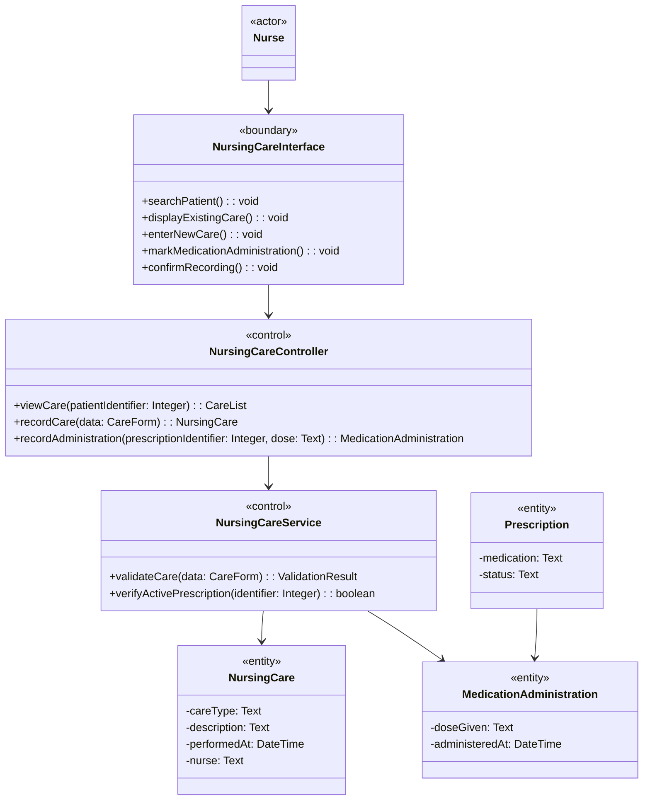
```mermaid
classDiagram
  direction TB

  class Nurse {
    <<actor>>
  }

  class NursingCareInterface {
    <<boundary>>
    +searchPatient(): void
    +displayExistingCare(): void
    +enterNewCare(): void
    +markMedicationAdministration(): void
    +confirmRecording(): void
  }

  class NursingCareController {
    <<control>>
    +viewCare(patientIdentifier: Integer): CareList
    +recordCare(data: CareForm): NursingCare
    +recordAdministration(prescriptionIdentifier: Integer, dose: Text): MedicationAdministration
  }

  class NursingCareService {
    <<control>>
    +validateCare(data: CareForm): ValidationResult
    +verifyActivePrescription(identifier: Integer): boolean
  }

  class NursingCare {
    <<entity>>
    -careType: Text
    -description: Text
    -performedAt: DateTime
    -nurse: Text
  }

  class Prescription {
    <<entity>>
    -medication: Text
    -status: Text
  }

  class MedicationAdministration {
    <<entity>>
    -doseGiven: Text
    -administeredAt: DateTime
  }

  Nurse --> NursingCareInterface
  NursingCareInterface --> NursingCareController
  NursingCareController --> NursingCareService
  NursingCareService --> NursingCare
  NursingCareService --> MedicationAdministration
  Prescription --> MedicationAdministration
```

---

## 3. Activity Diagrams (Analysis)

### 3.1 Sign In

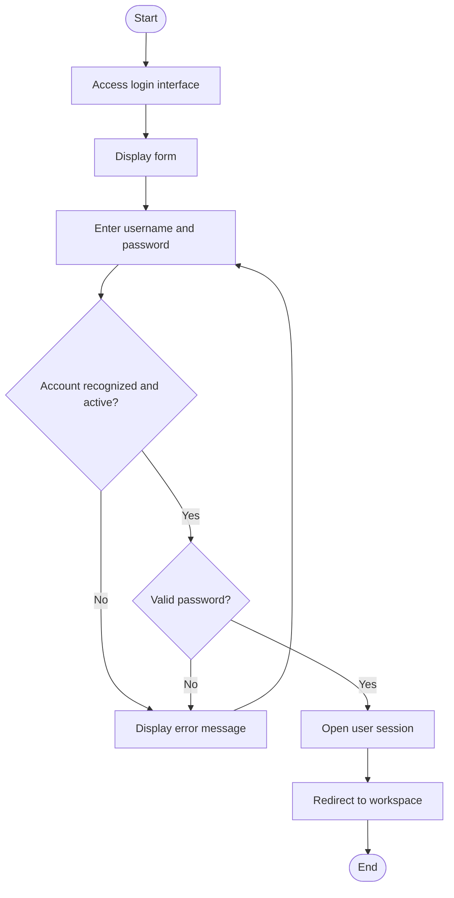
```mermaid
flowchart TD
  A([Start]) --> B[Access login interface]
  B --> C[Display form]
  C --> D[Enter username and password]
  D --> E{Account recognized and active?}
  E -->|No| F[Display error message]
  F --> D
  E -->|Yes| G{Valid password?}
  G -->|No| F
  G -->|Yes| H[Open user session]
  H --> I[Redirect to workspace]
  I --> J([End])
```

### 3.2 Manage Users

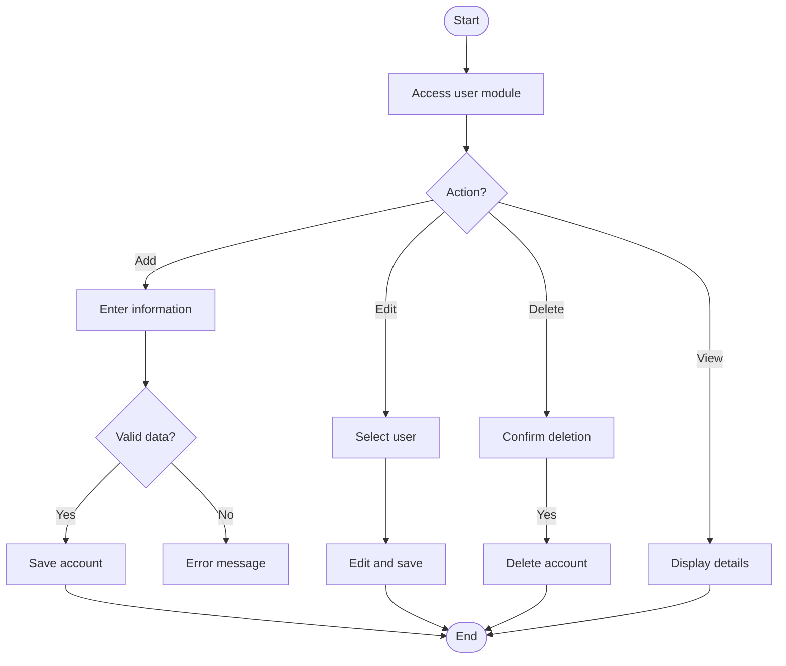
```mermaid
flowchart TD
  A([Start]) --> B[Access user module]
  B --> C{Action?}
  C -->|Add| D[Enter information]
  D --> E{Valid data?}
  E -->|Yes| F[Save account]
  E -->|No| G[Error message]
  C -->|Edit| H[Select user]
  H --> I[Edit and save]
  C -->|Delete| J[Confirm deletion]
  J -->|Yes| K[Delete account]
  C -->|View| L[Display details]
  F --> M([End])
  I --> M
  K --> M
  L --> M
```

### 3.3 Manage Hospital Services

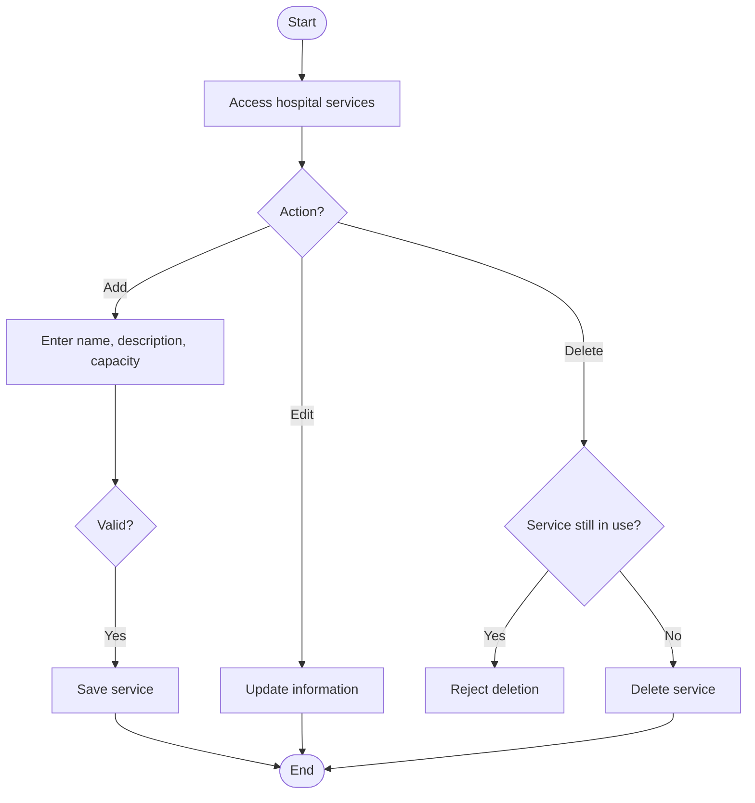
```mermaid
flowchart TD
  A([Start]) --> B[Access hospital services]
  B --> C{Action?}
  C -->|Add| D[Enter name, description, capacity]
  D --> E{Valid?}
  E -->|Yes| F[Save service]
  C -->|Edit| G[Update information]
  C -->|Delete| H{Service still in use?}
  H -->|Yes| I[Reject deletion]
  H -->|No| J[Delete service]
  F --> K([End])
  G --> K
  J --> K
```

### 3.4 Manage System Activity

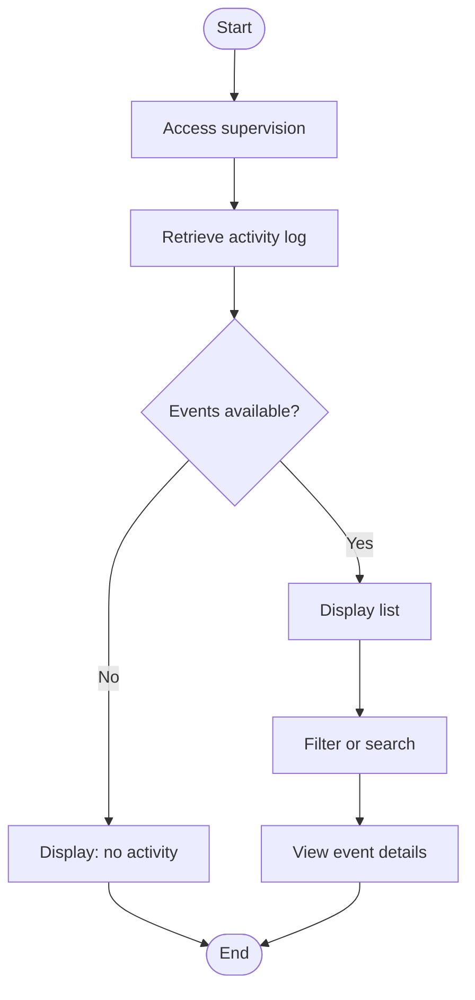
```mermaid
flowchart TD
  A([Start]) --> B[Access supervision]
  B --> C[Retrieve activity log]
  C --> D{Events available?}
  D -->|No| E[Display: no activity]
  D -->|Yes| F[Display list]
  F --> G[Filter or search]
  G --> H[View event details]
  E --> I([End])
  H --> I
```

### 3.5 Register a Patient

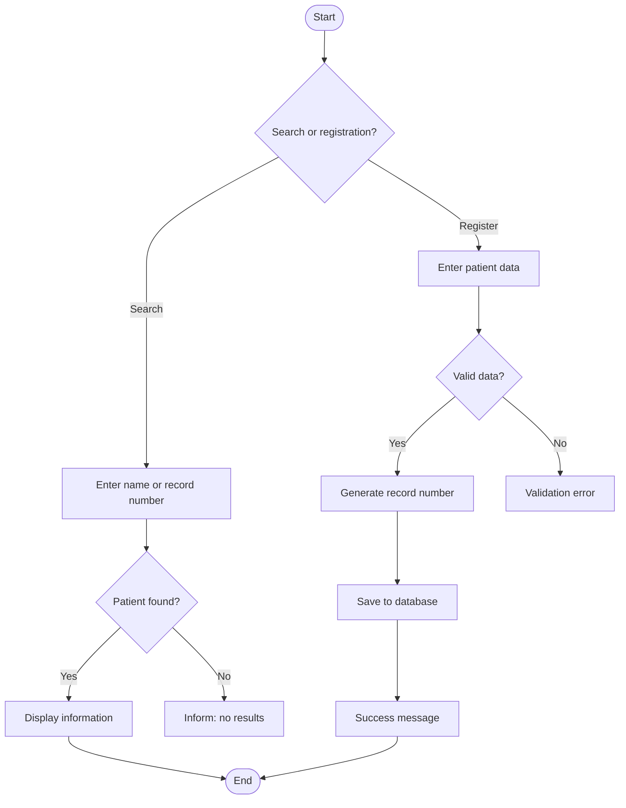
```mermaid
flowchart TD
  A([Start]) --> B{Search or registration?}
  B -->|Search| C[Enter name or record number]
  C --> D{Patient found?}
  D -->|Yes| E[Display information]
  D -->|No| F[Inform: no results]
  B -->|Register| G[Enter patient data]
  G --> H{Valid data?}
  H -->|Yes| I[Generate record number]
  I --> J[Save to database]
  J --> K[Success message]
  H -->|No| L[Validation error]
  E --> M([End])
  K --> M
```

### 3.6 Manage Admissions

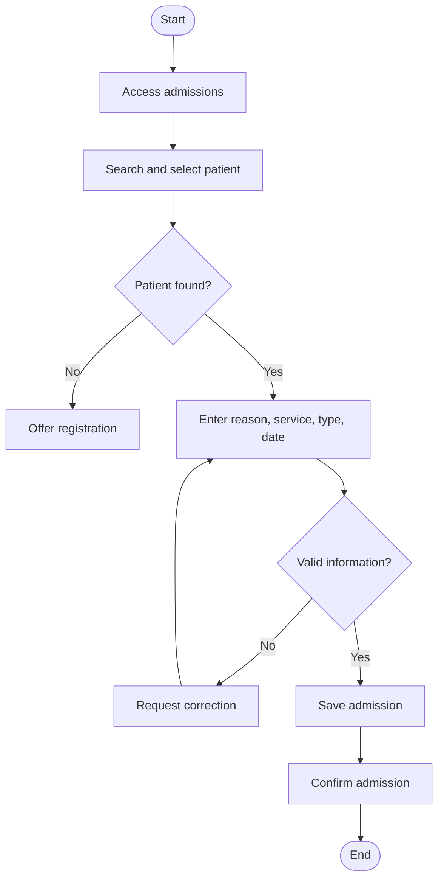
```mermaid
flowchart TD
  A([Start]) --> B[Access admissions]
  B --> C[Search and select patient]
  C --> D{Patient found?}
  D -->|No| E[Offer registration]
  D -->|Yes| F[Enter reason, service, type, date]
  F --> G{Valid information?}
  G -->|No| H[Request correction]
  G -->|Yes| I[Save admission]
  I --> J[Confirm admission]
  H --> F
  J --> K([End])
```

### 3.7 Medical Care Pathway

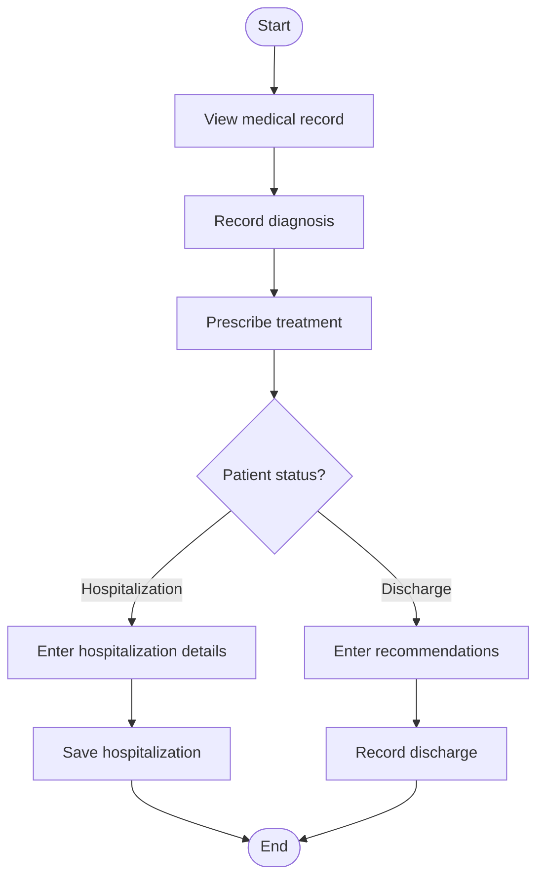
```mermaid
flowchart TD
  A([Start]) --> B[View medical record]
  B --> C[Record diagnosis]
  C --> D[Prescribe treatment]
  D --> E{Patient status?}
  E -->|Hospitalization| F[Enter hospitalization details]
  F --> G[Save hospitalization]
  E -->|Discharge| H[Enter recommendations]
  H --> I[Record discharge]
  G --> J([End])
  I --> J
```

### 3.8 Record Nursing Care

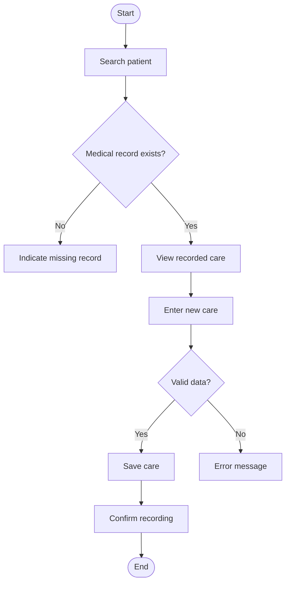
```mermaid
flowchart TD
  A([Start]) --> B[Search patient]
  B --> C{Medical record exists?}
  C -->|No| D[Indicate missing record]
  C -->|Yes| E[View recorded care]
  E --> F[Enter new care]
  F --> G{Valid data?}
  G -->|Yes| H[Save care]
  H --> I[Confirm recording]
  G -->|No| J[Error message]
  I --> K([End])
```

---

## 4. Overall Design Diagram (Logical Layers)

**Target** view before microservice split: a layered hospital information system.

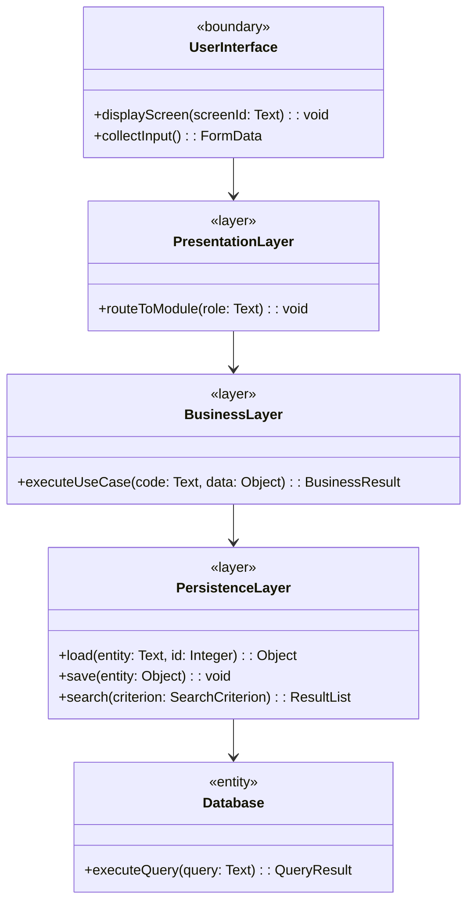
```mermaid
classDiagram
  direction TB

  class UserInterface {
    <<boundary>>
    +displayScreen(screenId: Text): void
    +collectInput(): FormData
  }

  class PresentationLayer {
    <<layer>>
    +routeToModule(role: Text): void
  }

  class BusinessLayer {
    <<layer>>
    +executeUseCase(code: Text, data: Object): BusinessResult
  }

  class PersistenceLayer {
    <<layer>>
    +load(entity: Text, id: Integer): Object
    +save(entity: Object): void
    +search(criterion: SearchCriterion): ResultList
  }

  class Database {
    <<entity>>
    +executeQuery(query: Text): QueryResult
  }

  UserInterface --> PresentationLayer
  PresentationLayer --> BusinessLayer
  BusinessLayer --> PersistenceLayer
  PersistenceLayer --> Database
```

---

## 5. Mapping to Thesis

| Use case (thesis) | Participating classes | Activity |
|-------------------|----------------------|----------|
| Sign in | § 2.1 | § 3.1 |
| Manage users | § 2.2 | § 3.2 |
| Manage hospital services | § 2.3 | § 3.3 |
| Manage system activity | § 2.4 | § 3.4 |
| Register a patient | § 2.5 | § 3.5 |
| Manage admissions | § 2.6 | § 3.6 |
| Medical care pathway | § 2.7 | § 3.7 |
| Record nursing care | § 2.8 | § 3.8 |

**Sequence diagrams** (Figures II.3 to II.10) remain those written in the thesis; this document complements the domain model, participating classes, activity diagrams, and logical design.
