# Diagrammes UML — phase d'analyse (avant développement)

Document de **conception fonctionnelle** aligné sur les cas d'utilisation du mémoire (§ II.3.2).  
Les noms sont **métier** (français), sans référence aux modules Java du prototype.

> **Référence officielle du mémoire — 9 microservices, 38 classes :**  
> [MODELE_DOMAINE_MEMOIRE_9_SERVICES.md](MODELE_DOMAINE_MEMOIRE_9_SERVICES.md) · PlantUML : [plantuml/memoire/](plantuml/memoire/)

> **Implémentation prototype Afya** (7 services Java) : [MERMAID_MEMOIRE_AFYA.md](MERMAID_MEMOIRE_AFYA.md), [MAPPING_MODELE_ANALYSE_AFYA.md](MAPPING_MODELE_ANALYSE_AFYA.md).

Version anglaise : [MEMOIRE_UML_ANALYSE_EN.md](MEMOIRE_UML_ANALYSE_EN.md).

PlantUML (export PNG/PDF) : [plantuml/class_participantes_et_activite/](plantuml/class_participantes_et_activite/README.md) — fichiers `CLASSES_PARTICIPANTES_*_FR.puml` (un par CU) et `DIAGRAMME_PERSISTANCE_AFYA.puml`.

Relations UML et cardinalités (inventaire complet) : [RELATIONS_UML_DIAGRAMMES.md](plantuml/class_participantes_et_activite/RELATIONS_UML_DIAGRAMMES.md).

---

## 1. Modèle du domaine (conceptuel)

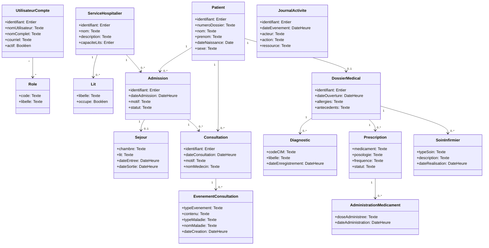
```mermaid
classDiagram
  direction TB

  class Patient {
    +identifiant: Entier
    +numeroDossier: Texte
    +nom: Texte
    +prenom: Texte
    +dateNaissance: Date
    +sexe: Texte
  }

  class UtilisateurCompte {
    +identifiant: Entier
    +nomUtilisateur: Texte
    +nomComplet: Texte
    +courriel: Texte
    +actif: Booléen
  }

  class Role {
    +code: Texte
    +libelle: Texte
  }

  class ServiceHospitalier {
    +identifiant: Entier
    +nom: Texte
    +description: Texte
    +capaciteLits: Entier
  }

  class Lit {
    +libelle: Texte
    +occupe: Booléen
  }

  class Admission {
    +identifiant: Entier
    +dateAdmission: DateHeure
    +motif: Texte
    +statut: Texte
  }

  class Sejour {
    +chambre: Texte
    +lit: Texte
    +dateEntree: DateHeure
    +dateSortie: DateHeure
  }

  class DossierMedical {
    +identifiant: Entier
    +dateOuverture: DateHeure
    +allergies: Texte
    +antecedents: Texte
  }

  class Consultation {
    +identifiant: Entier
    +dateConsultation: DateHeure
    +motif: Texte
    +nomMedecin: Texte
  }

  class EvenementConsultation {
    +typeEvenement: Texte
    +contenu: Texte
    +typeMaladie: Texte
    +nomMaladie: Texte
    +dateCreation: DateHeure
  }

  class Diagnostic {
    +codeCIM: Texte
    +libelle: Texte
    +dateEnregistrement: DateHeure
  }

  class Prescription {
    +medicament: Texte
    +posologie: Texte
    +frequence: Texte
    +statut: Texte
  }

  class SoinInfirmier {
    +typeSoin: Texte
    +description: Texte
    +dateRealisation: DateHeure
  }

  class AdministrationMedicament {
    +doseAdministree: Texte
    +dateAdministration: DateHeure
  }

  class JournalActivite {
    +identifiant: Entier
    +dateEvenement: DateHeure
    +acteur: Texte
    +action: Texte
    +ressource: Texte
  }

  Patient "1" --> "0..*" Admission
  Patient "1" --> "0..1" DossierMedical
  Patient "1" --> "0..*" Consultation
  ServiceHospitalier "1" --> "0..*" Lit
  ServiceHospitalier "1" --> "0..*" Admission
  Admission "1" --> "0..1" Sejour
  Admission "1" --> "0..*" Consultation
  DossierMedical "1" --> "0..*" Diagnostic
  DossierMedical "1" --> "0..*" Prescription
  DossierMedical "1" --> "0..*" SoinInfirmier
  Consultation "1" --> "0..*" EvenementConsultation
  Prescription "1" --> "0..*" AdministrationMedicament
  UtilisateurCompte "*" --> "*" Role
```

---

## 2. Classes participantes (analyse)

Notation : **<<frontière>>** (interface), **<<contrôle>>** (logique métier), **<<entité>>** (données persistées).

### 2.1 CU — S'authentifier

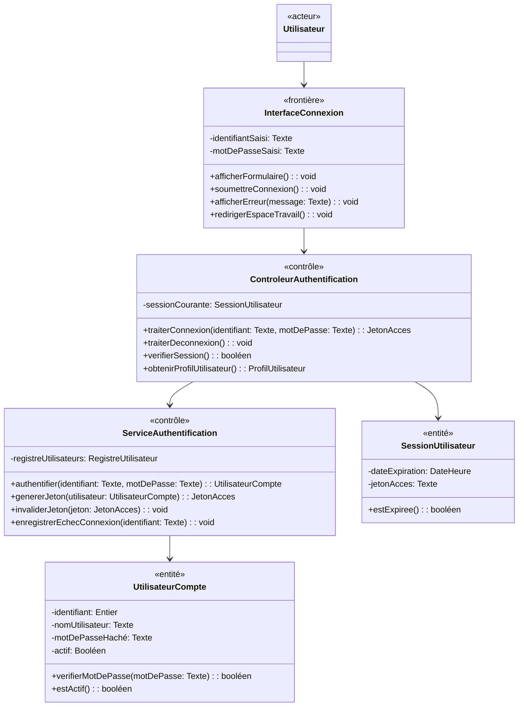
```mermaid
classDiagram
  direction TB

  class Utilisateur {
    <<acteur>>
  }

  class InterfaceConnexion {
    <<frontière>>
    -identifiantSaisi: Texte
    -motDePasseSaisi: Texte
    +afficherFormulaire(): void
    +soumettreConnexion(): void
    +afficherErreur(message: Texte): void
    +redirigerEspaceTravail(): void
  }

  class ControleurAuthentification {
    <<contrôle>>
    -sessionCourante: SessionUtilisateur
    +traiterConnexion(identifiant: Texte, motDePasse: Texte): JetonAcces
    +traiterDeconnexion(): void
    +verifierSession(): booléen
    +obtenirProfilUtilisateur(): ProfilUtilisateur
  }

  class ServiceAuthentification {
    <<contrôle>>
    -registreUtilisateurs: RegistreUtilisateur
    +authentifier(identifiant: Texte, motDePasse: Texte): UtilisateurCompte
    +genererJeton(utilisateur: UtilisateurCompte): JetonAcces
    +invaliderJeton(jeton: JetonAcces): void
    +enregistrerEchecConnexion(identifiant: Texte): void
  }

  class UtilisateurCompte {
    <<entité>>
    -identifiant: Entier
    -nomUtilisateur: Texte
    -motDePasseHaché: Texte
    -actif: Booléen
    +verifierMotDePasse(motDePasse: Texte): booléen
    +estActif(): booléen
  }

  class SessionUtilisateur {
    <<entité>>
    -dateExpiration: DateHeure
    -jetonAcces: Texte
    +estExpiree(): booléen
  }

  Utilisateur --> InterfaceConnexion
  InterfaceConnexion --> ControleurAuthentification
  ControleurAuthentification --> ServiceAuthentification
  ServiceAuthentification --> UtilisateurCompte
  ControleurAuthentification --> SessionUtilisateur
```

### 2.2 CU — Gérer les utilisateurs

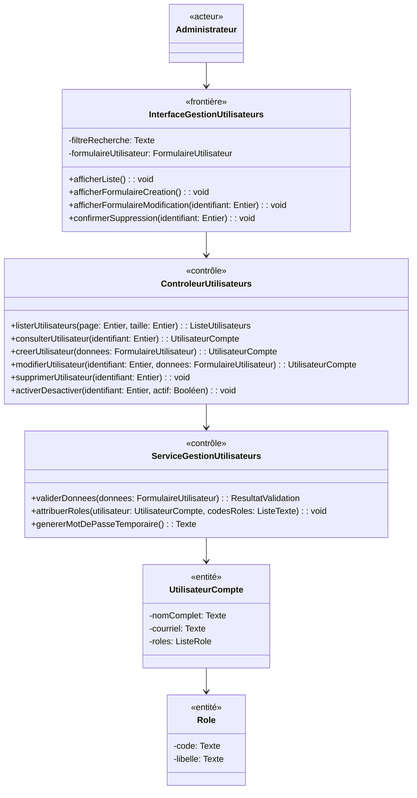
```mermaid
classDiagram
  direction TB

  class Administrateur {
    <<acteur>>
  }

  class InterfaceGestionUtilisateurs {
    <<frontière>>
    -filtreRecherche: Texte
    -formulaireUtilisateur: FormulaireUtilisateur
    +afficherListe(): void
    +afficherFormulaireCreation(): void
    +afficherFormulaireModification(identifiant: Entier): void
    +confirmerSuppression(identifiant: Entier): void
  }

  class ControleurUtilisateurs {
    <<contrôle>>
    +listerUtilisateurs(page: Entier, taille: Entier): ListeUtilisateurs
    +consulterUtilisateur(identifiant: Entier): UtilisateurCompte
    +creerUtilisateur(donnees: FormulaireUtilisateur): UtilisateurCompte
    +modifierUtilisateur(identifiant: Entier, donnees: FormulaireUtilisateur): UtilisateurCompte
    +supprimerUtilisateur(identifiant: Entier): void
    +activerDesactiver(identifiant: Entier, actif: Booléen): void
  }

  class ServiceGestionUtilisateurs {
    <<contrôle>>
    +validerDonnees(donnees: FormulaireUtilisateur): ResultatValidation
    +attribuerRoles(utilisateur: UtilisateurCompte, codesRoles: ListeTexte): void
    +genererMotDePasseTemporaire(): Texte
  }

  class UtilisateurCompte {
    <<entité>>
    -nomComplet: Texte
    -courriel: Texte
    -roles: ListeRole
  }

  class Role {
    <<entité>>
    -code: Texte
    -libelle: Texte
  }

  Administrateur --> InterfaceGestionUtilisateurs
  InterfaceGestionUtilisateurs --> ControleurUtilisateurs
  ControleurUtilisateurs --> ServiceGestionUtilisateurs
  ServiceGestionUtilisateurs --> UtilisateurCompte
  UtilisateurCompte --> Role
```

### 2.3 CU — Gérer les services hospitaliers

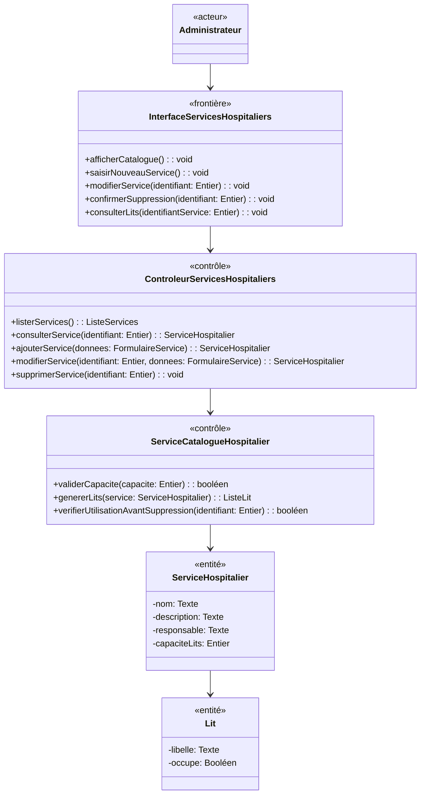
```mermaid
classDiagram
  direction TB

  class Administrateur {
    <<acteur>>
  }

  class InterfaceServicesHospitaliers {
    <<frontière>>
    +afficherCatalogue(): void
    +saisirNouveauService(): void
    +modifierService(identifiant: Entier): void
    +confirmerSuppression(identifiant: Entier): void
    +consulterLits(identifiantService: Entier): void
  }

  class ControleurServicesHospitaliers {
    <<contrôle>>
    +listerServices(): ListeServices
    +consulterService(identifiant: Entier): ServiceHospitalier
    +ajouterService(donnees: FormulaireService): ServiceHospitalier
    +modifierService(identifiant: Entier, donnees: FormulaireService): ServiceHospitalier
    +supprimerService(identifiant: Entier): void
  }

  class ServiceCatalogueHospitalier {
    <<contrôle>>
    +validerCapacite(capacite: Entier): booléen
    +genererLits(service: ServiceHospitalier): ListeLit
    +verifierUtilisationAvantSuppression(identifiant: Entier): booléen
  }

  class ServiceHospitalier {
    <<entité>>
    -nom: Texte
    -description: Texte
    -responsable: Texte
    -capaciteLits: Entier
  }

  class Lit {
    <<entité>>
    -libelle: Texte
    -occupe: Booléen
  }

  Administrateur --> InterfaceServicesHospitaliers
  InterfaceServicesHospitaliers --> ControleurServicesHospitaliers
  ControleurServicesHospitaliers --> ServiceCatalogueHospitalier
  ServiceCatalogueHospitalier --> ServiceHospitalier
  ServiceHospitalier --> Lit
```

### 2.4 CU — Gérer les activités du système

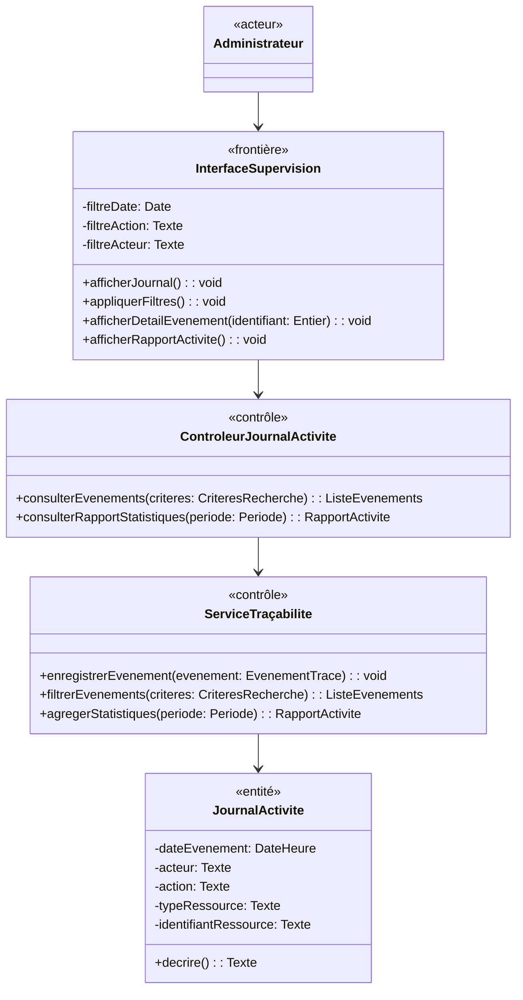
```mermaid
classDiagram
  direction TB

  class Administrateur {
    <<acteur>>
  }

  class InterfaceSupervision {
    <<frontière>>
    -filtreDate: Date
    -filtreAction: Texte
    -filtreActeur: Texte
    +afficherJournal(): void
    +appliquerFiltres(): void
    +afficherDetailEvenement(identifiant: Entier): void
    +afficherRapportActivite(): void
  }

  class ControleurJournalActivite {
    <<contrôle>>
    +consulterEvenements(criteres: CriteresRecherche): ListeEvenements
    +consulterRapportStatistiques(periode: Periode): RapportActivite
  }

  class ServiceTraçabilite {
    <<contrôle>>
    +enregistrerEvenement(evenement: EvenementTrace): void
    +filtrerEvenements(criteres: CriteresRecherche): ListeEvenements
    +agregerStatistiques(periode: Periode): RapportActivite
  }

  class JournalActivite {
    <<entité>>
    -dateEvenement: DateHeure
    -acteur: Texte
    -action: Texte
    -typeRessource: Texte
    -identifiantRessource: Texte
    +decrire(): Texte
  }

  Administrateur --> InterfaceSupervision
  InterfaceSupervision --> ControleurJournalActivite
  ControleurJournalActivite --> ServiceTraçabilite
  ServiceTraçabilite --> JournalActivite
```

### 2.5 CU — Enregistrer un patient

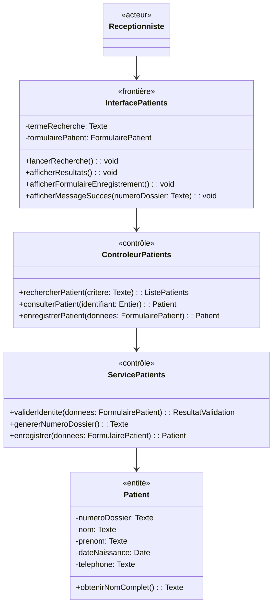
```mermaid
classDiagram
  direction TB

  class Receptionniste {
    <<acteur>>
  }

  class InterfacePatients {
    <<frontière>>
    -termeRecherche: Texte
    -formulairePatient: FormulairePatient
    +lancerRecherche(): void
    +afficherResultats(): void
    +afficherFormulaireEnregistrement(): void
    +afficherMessageSucces(numeroDossier: Texte): void
  }

  class ControleurPatients {
    <<contrôle>>
    +rechercherPatient(critere: Texte): ListePatients
    +consulterPatient(identifiant: Entier): Patient
    +enregistrerPatient(donnees: FormulairePatient): Patient
  }

  class ServicePatients {
    <<contrôle>>
    +validerIdentite(donnees: FormulairePatient): ResultatValidation
    +genererNumeroDossier(): Texte
    +enregistrer(donnees: FormulairePatient): Patient
  }

  class Patient {
    <<entité>>
    -numeroDossier: Texte
    -nom: Texte
    -prenom: Texte
    -dateNaissance: Date
    -telephone: Texte
    +obtenirNomComplet(): Texte
  }

  Receptionniste --> InterfacePatients
  InterfacePatients --> ControleurPatients
  ControleurPatients --> ServicePatients
  ServicePatients --> Patient
```

### 2.6 CU — Gérer les admissions

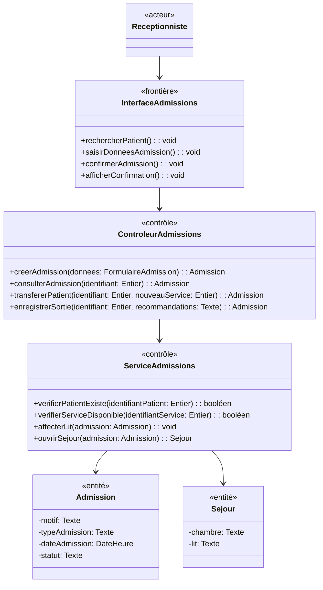
```mermaid
classDiagram
  direction TB

  class Receptionniste {
    <<acteur>>
  }

  class InterfaceAdmissions {
    <<frontière>>
    +rechercherPatient(): void
    +saisirDonneesAdmission(): void
    +confirmerAdmission(): void
    +afficherConfirmation(): void
  }

  class ControleurAdmissions {
    <<contrôle>>
    +creerAdmission(donnees: FormulaireAdmission): Admission
    +consulterAdmission(identifiant: Entier): Admission
    +transfererPatient(identifiant: Entier, nouveauService: Entier): Admission
    +enregistrerSortie(identifiant: Entier, recommandations: Texte): Admission
  }

  class ServiceAdmissions {
    <<contrôle>>
    +verifierPatientExiste(identifiantPatient: Entier): booléen
    +verifierServiceDisponible(identifiantService: Entier): booléen
    +affecterLit(admission: Admission): void
    +ouvrirSejour(admission: Admission): Sejour
  }

  class Admission {
    <<entité>>
    -motif: Texte
    -typeAdmission: Texte
    -dateAdmission: DateHeure
    -statut: Texte
  }

  class Sejour {
    <<entité>>
    -chambre: Texte
    -lit: Texte
  }

  Receptionniste --> InterfaceAdmissions
  InterfaceAdmissions --> ControleurAdmissions
  ControleurAdmissions --> ServiceAdmissions
  ServiceAdmissions --> Admission
  ServiceAdmissions --> Sejour
```

### 2.7 CU — Prise en charge médicale

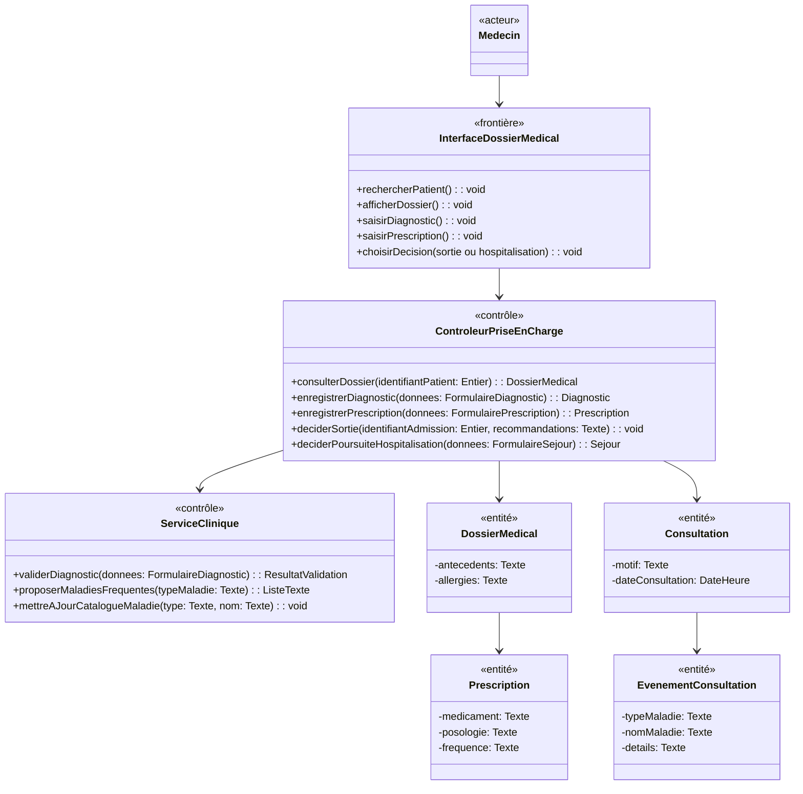
```mermaid
classDiagram
  direction TB

  class Medecin {
    <<acteur>>
  }

  class InterfaceDossierMedical {
    <<frontière>>
    +rechercherPatient(): void
    +afficherDossier(): void
    +saisirDiagnostic(): void
    +saisirPrescription(): void
    +choisirDecision(sortie ou hospitalisation): void
  }

  class ControleurPriseEnCharge {
    <<contrôle>>
    +consulterDossier(identifiantPatient: Entier): DossierMedical
    +enregistrerDiagnostic(donnees: FormulaireDiagnostic): Diagnostic
    +enregistrerPrescription(donnees: FormulairePrescription): Prescription
    +deciderSortie(identifiantAdmission: Entier, recommandations: Texte): void
    +deciderPoursuiteHospitalisation(donnees: FormulaireSejour): Sejour
  }

  class ServiceClinique {
    <<contrôle>>
    +validerDiagnostic(donnees: FormulaireDiagnostic): ResultatValidation
    +proposerMaladiesFrequentes(typeMaladie: Texte): ListeTexte
    +mettreAJourCatalogueMaladie(type: Texte, nom: Texte): void
  }

  class DossierMedical {
    <<entité>>
    -antecedents: Texte
    -allergies: Texte
  }

  class Consultation {
    <<entité>>
    -motif: Texte
    -dateConsultation: DateHeure
  }

  class EvenementConsultation {
    <<entité>>
    -typeMaladie: Texte
    -nomMaladie: Texte
    -details: Texte
  }

  class Prescription {
    <<entité>>
    -medicament: Texte
    -posologie: Texte
    -frequence: Texte
  }

  Medecin --> InterfaceDossierMedical
  InterfaceDossierMedical --> ControleurPriseEnCharge
  ControleurPriseEnCharge --> ServiceClinique
  ControleurPriseEnCharge --> DossierMedical
  ControleurPriseEnCharge --> Consultation
  Consultation --> EvenementConsultation
  DossierMedical --> Prescription
```

### 2.8 CU — Enregistrer les soins

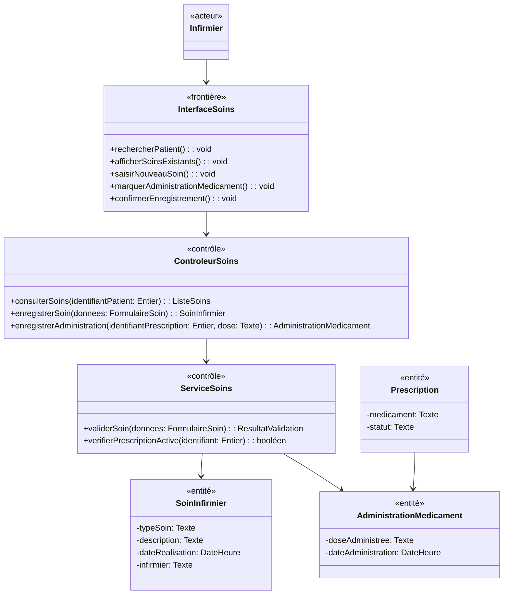
```mermaid
classDiagram
  direction TB

  class Infirmier {
    <<acteur>>
  }

  class InterfaceSoins {
    <<frontière>>
    +rechercherPatient(): void
    +afficherSoinsExistants(): void
    +saisirNouveauSoin(): void
    +marquerAdministrationMedicament(): void
    +confirmerEnregistrement(): void
  }

  class ControleurSoins {
    <<contrôle>>
    +consulterSoins(identifiantPatient: Entier): ListeSoins
    +enregistrerSoin(donnees: FormulaireSoin): SoinInfirmier
    +enregistrerAdministration(identifiantPrescription: Entier, dose: Texte): AdministrationMedicament
  }

  class ServiceSoins {
    <<contrôle>>
    +validerSoin(donnees: FormulaireSoin): ResultatValidation
    +verifierPrescriptionActive(identifiant: Entier): booléen
  }

  class SoinInfirmier {
    <<entité>>
    -typeSoin: Texte
    -description: Texte
    -dateRealisation: DateHeure
    -infirmier: Texte
  }

  class Prescription {
    <<entité>>
    -medicament: Texte
    -statut: Texte
  }

  class AdministrationMedicament {
    <<entité>>
    -doseAdministree: Texte
    -dateAdministration: DateHeure
  }

  Infirmier --> InterfaceSoins
  InterfaceSoins --> ControleurSoins
  ControleurSoins --> ServiceSoins
  ServiceSoins --> SoinInfirmier
  ServiceSoins --> AdministrationMedicament
  Prescription --> AdministrationMedicament
```

---

## 3. Diagrammes d'activité (analyse)

### 3.1 S'authentifier

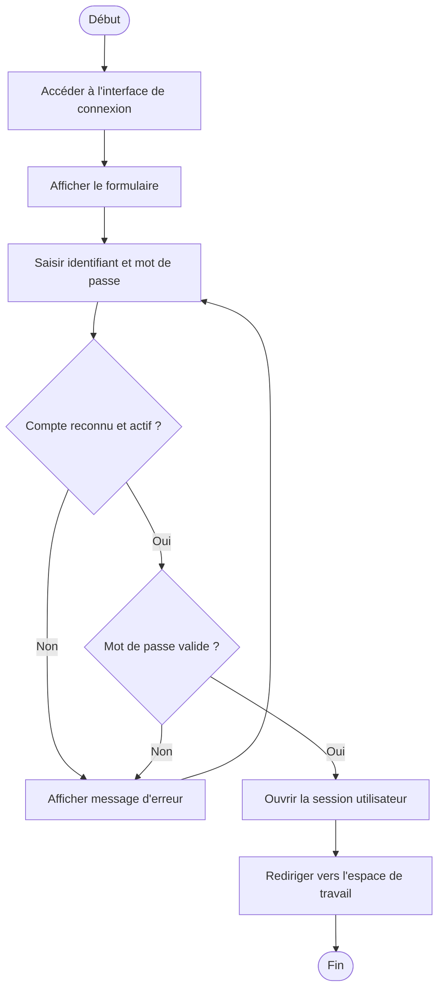
```mermaid
flowchart TD
  A([Début]) --> B[Accéder à l'interface de connexion]
  B --> C[Afficher le formulaire]
  C --> D[Saisir identifiant et mot de passe]
  D --> E{Compte reconnu et actif ?}
  E -->|Non| F[Afficher message d'erreur]
  F --> D
  E -->|Oui| G{Mot de passe valide ?}
  G -->|Non| F
  G -->|Oui| H[Ouvrir la session utilisateur]
  H --> I[Rediriger vers l'espace de travail]
  I --> J([Fin])
```

### 3.2 Gérer les utilisateurs

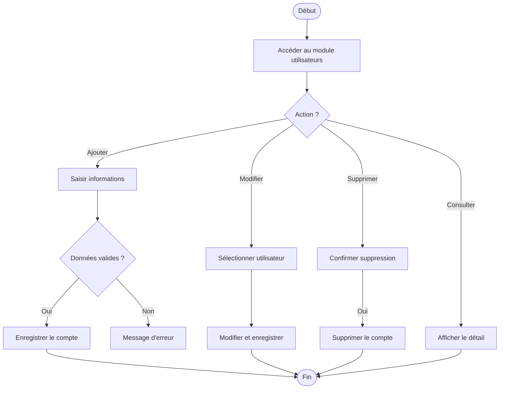
```mermaid
flowchart TD
  A([Début]) --> B[Accéder au module utilisateurs]
  B --> C{Action ?}
  C -->|Ajouter| D[Saisir informations]
  D --> E{Données valides ?}
  E -->|Oui| F[Enregistrer le compte]
  E -->|Non| G[Message d'erreur]
  C -->|Modifier| H[Sélectionner utilisateur]
  H --> I[Modifier et enregistrer]
  C -->|Supprimer| J[Confirmer suppression]
  J -->|Oui| K[Supprimer le compte]
  C -->|Consulter| L[Afficher le détail]
  F --> M([Fin])
  I --> M
  K --> M
  L --> M
```

### 3.3 Gérer les services hospitaliers

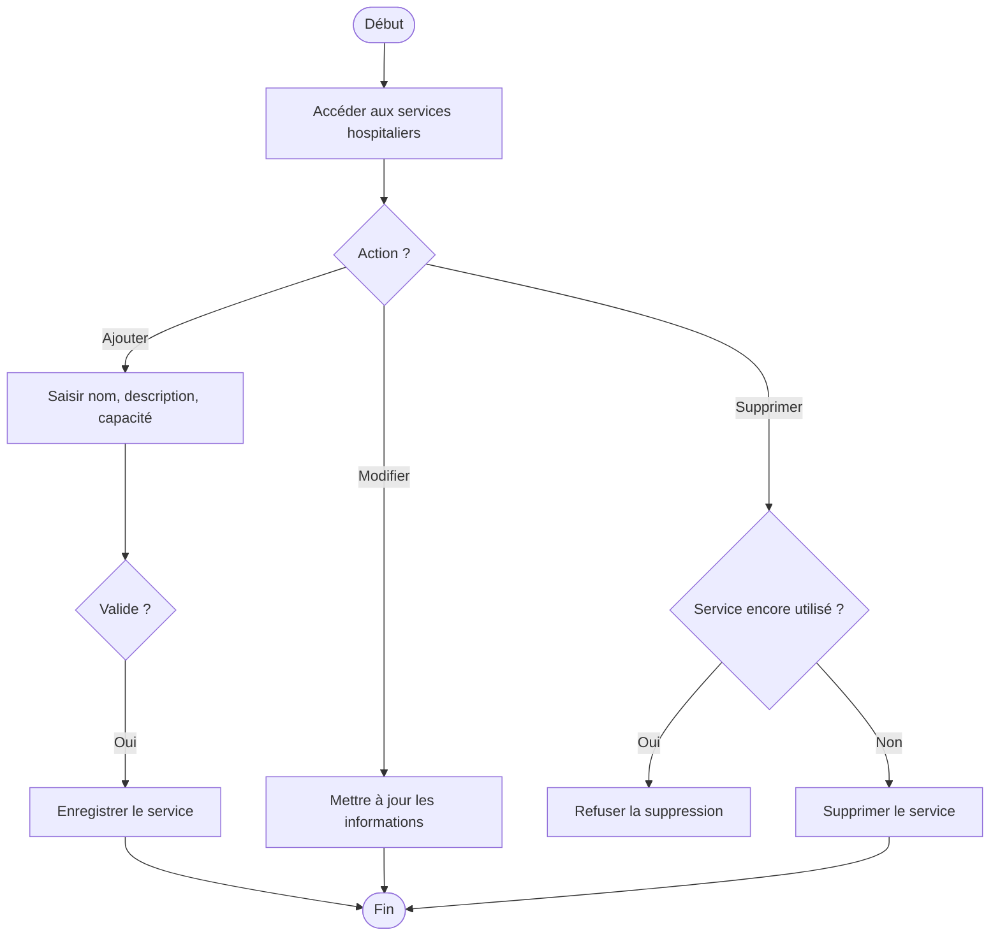
```mermaid
flowchart TD
  A([Début]) --> B[Accéder aux services hospitaliers]
  B --> C{Action ?}
  C -->|Ajouter| D[Saisir nom, description, capacité]
  D --> E{Valide ?}
  E -->|Oui| F[Enregistrer le service]
  C -->|Modifier| G[Mettre à jour les informations]
  C -->|Supprimer| H{Service encore utilisé ?}
  H -->|Oui| I[Refuser la suppression]
  H -->|Non| J[Supprimer le service]
  F --> K([Fin])
  G --> K
  J --> K
```

### 3.4 Gérer les activités du système

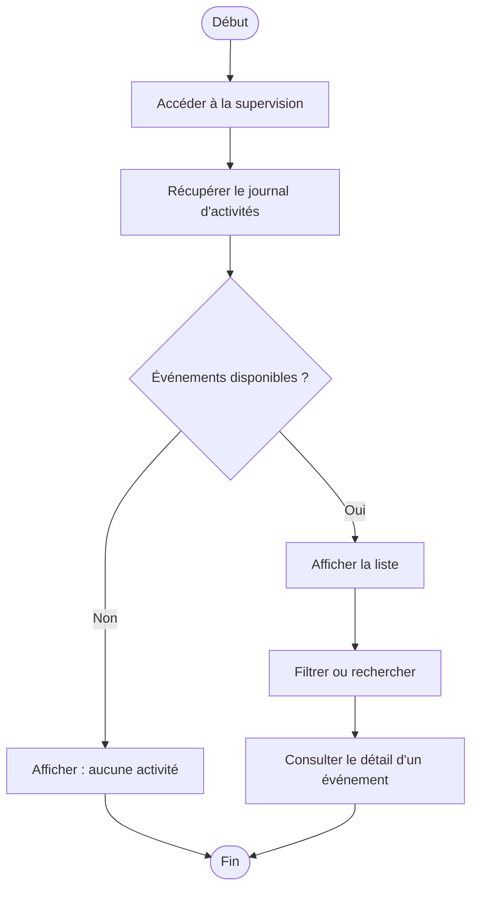
```mermaid
flowchart TD
  A([Début]) --> B[Accéder à la supervision]
  B --> C[Récupérer le journal d'activités]
  C --> D{Événements disponibles ?}
  D -->|Non| E[Afficher : aucune activité]
  D -->|Oui| F[Afficher la liste]
  F --> G[Filtrer ou rechercher]
  G --> H[Consulter le détail d'un événement]
  E --> I([Fin])
  H --> I
```

### 3.5 Enregistrer un patient

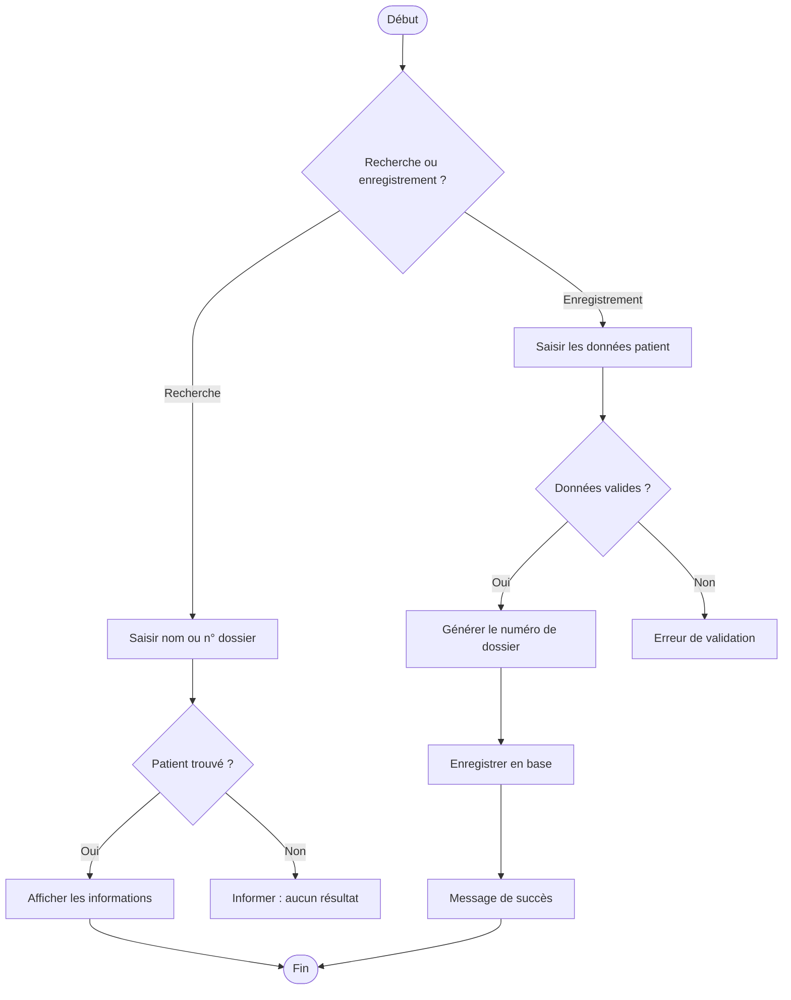
```mermaid
flowchart TD
  A([Début]) --> B{Recherche ou enregistrement ?}
  B -->|Recherche| C[Saisir nom ou n° dossier]
  C --> D{Patient trouvé ?}
  D -->|Oui| E[Afficher les informations]
  D -->|Non| F[Informer : aucun résultat]
  B -->|Enregistrement| G[Saisir les données patient]
  G --> H{Données valides ?}
  H -->|Oui| I[Générer le numéro de dossier]
  I --> J[Enregistrer en base]
  J --> K[Message de succès]
  H -->|Non| L[Erreur de validation]
  E --> M([Fin])
  K --> M
```

### 3.6 Gérer les admissions

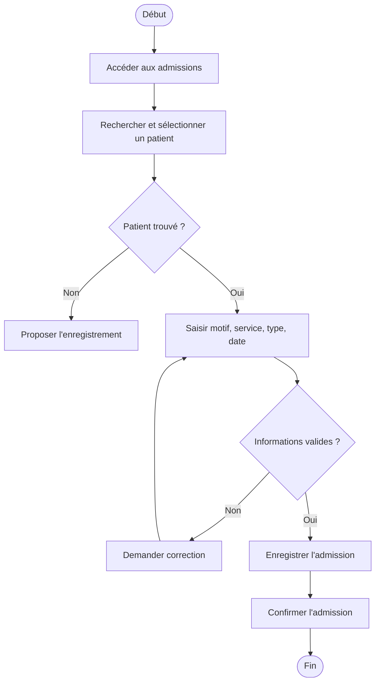
```mermaid
flowchart TD
  A([Début]) --> B[Accéder aux admissions]
  B --> C[Rechercher et sélectionner un patient]
  C --> D{Patient trouvé ?}
  D -->|Non| E[Proposer l'enregistrement]
  D -->|Oui| F[Saisir motif, service, type, date]
  F --> G{Informations valides ?}
  G -->|Non| H[Demander correction]
  G -->|Oui| I[Enregistrer l'admission]
  I --> J[Confirmer l'admission]
  H --> F
  J --> K([Fin])
```

### 3.7 Prise en charge médicale

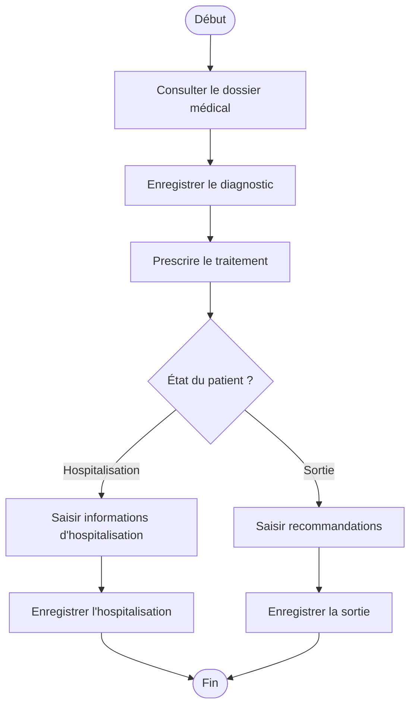
```mermaid
flowchart TD
  A([Début]) --> B[Consulter le dossier médical]
  B --> C[Enregistrer le diagnostic]
  C --> D[Prescrire le traitement]
  D --> E{État du patient ?}
  E -->|Hospitalisation| F[Saisir informations d'hospitalisation]
  F --> G[Enregistrer l'hospitalisation]
  E -->|Sortie| H[Saisir recommandations]
  H --> I[Enregistrer la sortie]
  G --> J([Fin])
  I --> J
```

### 3.8 Enregistrer les soins

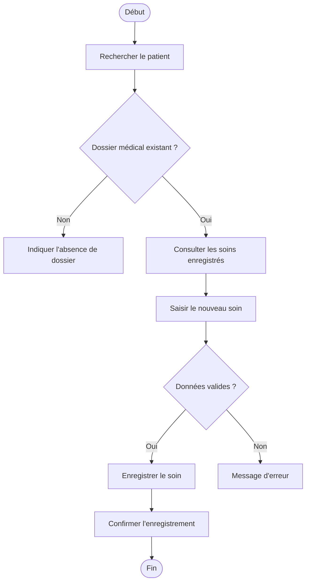
```mermaid
flowchart TD
  A([Début]) --> B[Rechercher le patient]
  B --> C{Dossier médical existant ?}
  C -->|Non| D[Indiquer l'absence de dossier]
  C -->|Oui| E[Consulter les soins enregistrés]
  E --> F[Saisir le nouveau soin]
  F --> G{Données valides ?}
  G -->|Oui| H[Enregistrer le soin]
  H --> I[Confirmer l'enregistrement]
  G -->|Non| J[Message d'erreur]
  I --> K([Fin])
```

---

## 4. Diagramme de conception global (couches logiques)

Vue **cible** avant découpage en microservices : un système hospitalier en couches.

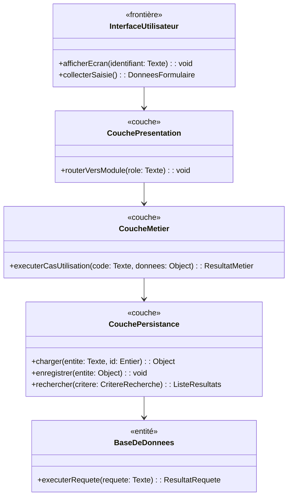
```mermaid
classDiagram
  direction TB

  class InterfaceUtilisateur {
    <<frontière>>
    +afficherEcran(identifiant: Texte): void
    +collecterSaisie(): DonneesFormulaire
  }

  class CouchePresentation {
    <<couche>>
    +routerVersModule(role: Texte): void
  }

  class CoucheMetier {
    <<couche>>
    +executerCasUtilisation(code: Texte, donnees: Object): ResultatMetier
  }

  class CouchePersistance {
    <<couche>>
    +charger(entite: Texte, id: Entier): Object
    +enregistrer(entite: Object): void
    +rechercher(critere: CritereRecherche): ListeResultats
  }

  class BaseDeDonnees {
    <<entité>>
    +executerRequete(requete: Texte): ResultatRequete
  }

  InterfaceUtilisateur --> CouchePresentation
  CouchePresentation --> CoucheMetier
  CoucheMetier --> CouchePersistance
  CouchePersistance --> BaseDeDonnees
```

---

## 5. Correspondance avec le mémoire

| Cas d'utilisation (mémoire) | Classes participantes | Activité |
|-----------------------------|----------------------|----------|
| S'authentifier | § 2.1 | § 3.1 |
| Gérer les utilisateurs | § 2.2 | § 3.2 |
| Gérer les services hospitaliers | § 2.3 | § 3.3 |
| Gérer les activités du système | § 2.4 | § 3.4 |
| Enregistrer un patient | § 2.5 | § 3.5 |
| Gérer les admissions | § 2.6 | § 3.6 |
| Prise en charge médicale | § 2.7 | § 3.7 |
| Enregistrer les soins | § 2.8 | § 3.8 |

Les **diagrammes de séquence** (Figures II.3 à II.10) restent ceux rédigés dans le mémoire ; ce document complète le modèle du domaine, les classes participantes, les activités et la conception logique.
