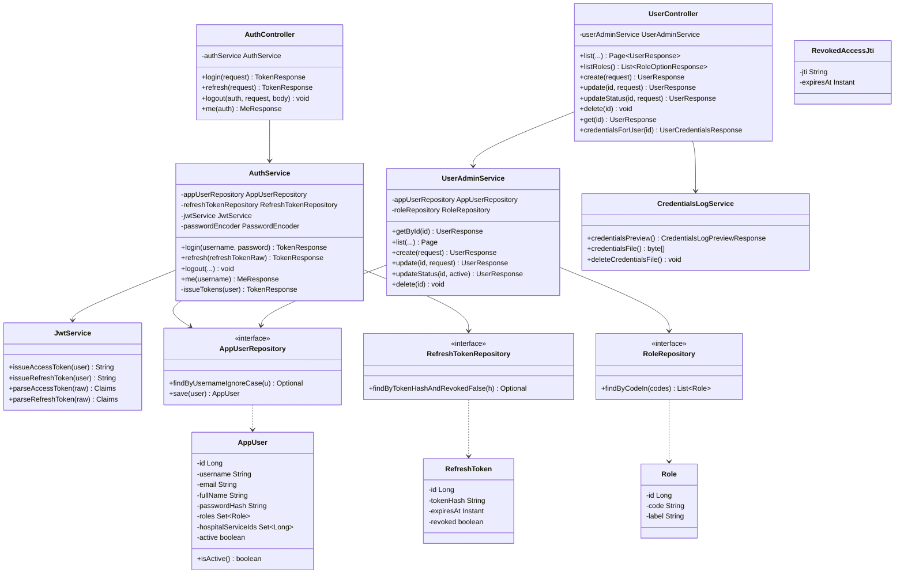
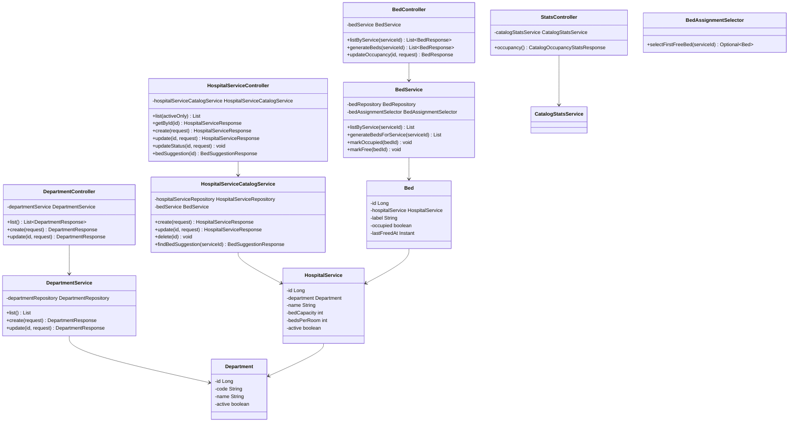
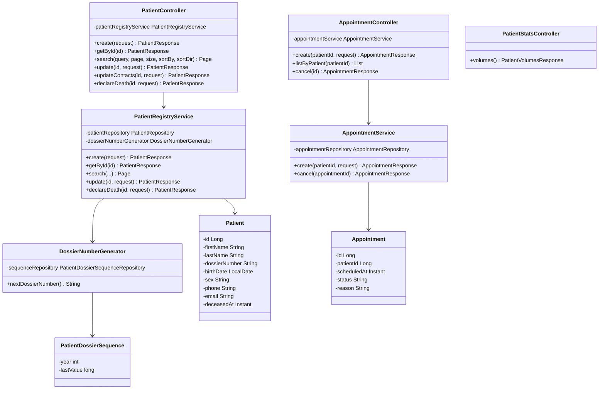
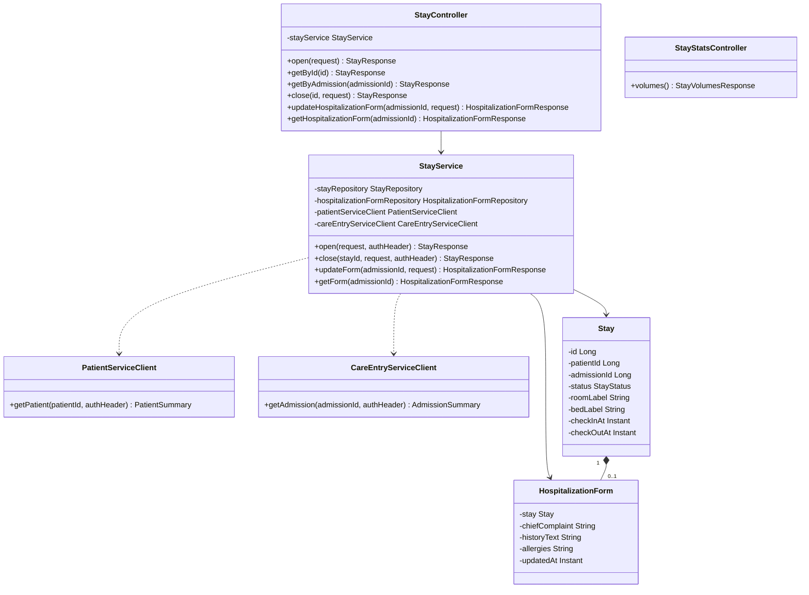
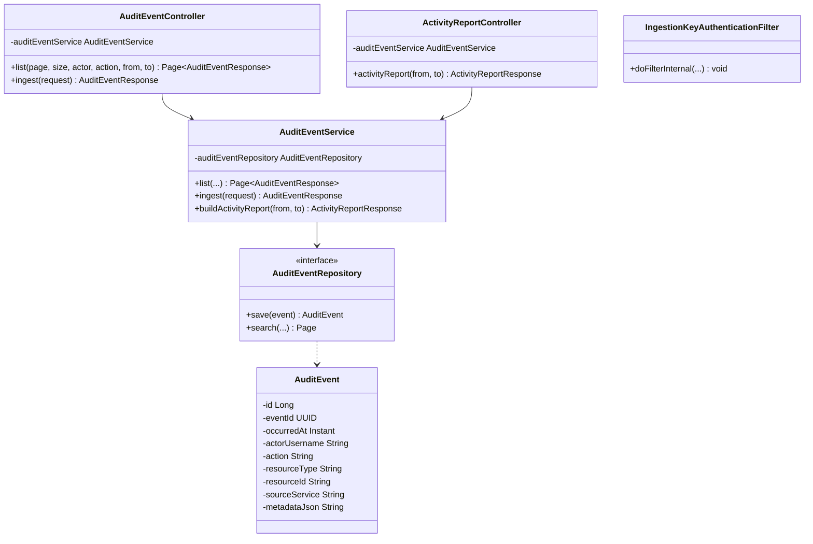

# Diagrammes de classes par service — Afya Platform

Un diagramme **par microservice** (et le BFF), avec **attributs** et **méthodes** principales.  
Équivalent PlantUML : [plantuml/CLASSES_SERVICE_*.puml](plantuml/README.md).

Rendu : [mermaid.live](https://mermaid.live) ou extension Mermaid dans l’IDE.

---

## 1. identity-service (port 8081)

---

## 2. catalog-service (port 8082)

---

## 3. patient-service (port 8083)

---

## 4. care-entry-service (port 8084)

```mermaid
classDiagram
  direction TB

  class AdmissionController {
    -admissionService AdmissionService
    +create(request) AdmissionResponse
    +getById(id) AdmissionResponse
    +list(...) Page
    +transfer(id, request) AdmissionResponse
    +discharge(id, request) AdmissionResponse
    +cancel(id) AdmissionResponse
    +declareDeath(id, request) AdmissionResponse
  }

  class EmergencyController {
    -emergencyVisitService EmergencyVisitService
    +create(request) EmergencyResponse
    +list(...) Page
    +triage(id, request) EmergencyResponse
    +orientation(id, request) EmergencyResponse
    +close(id) EmergencyResponse
  }

  class VitalSignController {
    -vitalSignService VitalSignService
    +record(admissionId, request) VitalSignResponse
    +list(admissionId) List
  }

  class CareEntryStatsController {
    +volumes() CareEntryVolumesResponse
  }

  class AdmissionService {
    -admissionRepository AdmissionRepository
    -admissionWriter AdmissionWriter
    -patientServiceClient PatientServiceClient
    -catalogServiceClient CatalogServiceClient
    -stayServiceClient StayServiceClient
    +admit(request, authHeader) AdmissionResponse
    +transfer(id, request, authHeader) AdmissionResponse
    +discharge(id, request, authHeader) AdmissionResponse
    +cancel(id, authHeader) AdmissionResponse
  }

  class AdmissionWriter {
    +saveAdmission(entity) Admission
  }

  class EmergencyVisitService {
    -emergencyVisitRepository EmergencyVisitRepository
    -timelineService EmergencyVisitTimelineService
    +create(request, authHeader) EmergencyResponse
    +applyTriage(id, request) EmergencyResponse
    +applyOrientation(id, request) EmergencyResponse
    +close(id) EmergencyResponse
  }

  class VitalSignService {
    -vitalSignReadingRepository VitalSignReadingRepository
    +record(admissionId, request) VitalSignResponse
    +listByAdmission(admissionId) List
  }

  class PatientServiceClient {
    +getPatient(patientId, authHeader) PatientSummary
  }

  class CatalogServiceClient {
    +getService(serviceId, authHeader) ServiceSummary
    +suggestBed(serviceName, authHeader) BedSuggestion
  }

  class StayServiceClient {
    +openStay(request, authHeader) StaySummary
    +closeStay(stayId, authHeader) void
  }

  class Admission {
    -id Long
    -patientId Long
    -hospitalServiceId Long
    -status AdmissionStatus
    -admittedAt Instant
    -dischargedAt Instant
    -roomLabel String
    -bedLabel String
  }

  class TransferRequest {
    -id Long
    -admissionId Long
    -fromServiceId Long
    -toServiceId Long
  }

  class EmergencyVisit {
    -id Long
    -patientId Long
    -status String
    -priority String
    -triageLevel String
  }

  class VitalSignReading {
    -id Long
    -admissionId Long
    -recordedAt Instant
    -temperatureCelsius BigDecimal
    -pulseBpm Integer
  }

  AdmissionController --> AdmissionService
  EmergencyController --> EmergencyVisitService
  VitalSignController --> VitalSignService
  AdmissionService --> Admission
  AdmissionService ..> PatientServiceClient
  AdmissionService ..> CatalogServiceClient
  AdmissionService ..> StayServiceClient
  AdmissionService --> AdmissionWriter
  EmergencyVisitService --> EmergencyVisit
  VitalSignService --> VitalSignReading
```

---

## 5. stay-service (port 8085)

---

## 6. clinical-record-service (port 8086)

```mermaid
classDiagram
  direction TB

  class MedicalRecordController {
    -clinicalRecordService ClinicalRecordService
    +getMedicalRecord(patientId, activeOnly) MedicalRecordResponse
    +updateAllergies(patientId, request) MedicalRecordResponse
    +updateAntecedents(patientId, request) MedicalRecordResponse
    +addNote(patientId, request) ClinicalNoteResponse
    +addDiagnosis(patientId, request) DiagnosisResponse
    +addNursingCare(patientId, request) NursingCareResponse
    +addMedicationAdministration(...) MedicationAdministrationResponse
    +uploadDocument(patientId, file, title) ClinicalDocumentResponse
    +downloadDocument(patientId, docId) Resource
  }

  class ConsultationController {
    -consultationService ConsultationService
    +list(...) Page~ConsultationResponse~
    +getById(id) ConsultationResponse
    +consultationEvents(id) List
    +create(request) ConsultationResponse
    +addObservation(id, request) ConsultationEventResponse
    +addDiagnostic(id, request) ConsultationEventResponse
    +addExamOrder(id, request) ConsultationEventResponse
  }

  class PrescriptionController {
    -clinicalRecordService ClinicalRecordService
    +create(patientId, request) PrescriptionResponse
    +list(patientId, activeOnly) List
  }

  class DiseaseCatalogController {
    -diseaseCatalogService DiseaseCatalogService
    +listSelectable(diseaseType) List~DiseaseCatalogResponse~
  }

  class ClinicalStatsController {
    +volumes() ClinicalVolumesResponse
  }

  class ClinicalRecordService {
    -medicalRecordRepository MedicalRecordRepository
    -prescriptionLineRepository PrescriptionLineRepository
    -nursingCareRecordRepository NursingCareRecordRepository
    -medicationAdministrationRepository MedicationAdministrationRepository
    -objectStorageService ObjectStorageService
    +getMedicalRecord(patientId, authHeader, activeOnly) MedicalRecordResponse
    +addPrescription(...) PrescriptionResponse
    +addNursingCare(...) NursingCareResponse
    +addMedicationAdministration(...) MedicationAdministrationResponse
    +attachDocument(...) ClinicalDocumentResponse
    -findOrCreateRecord(patientId) MedicalRecord
  }

  class ConsultationService {
    -consultationRepository ConsultationRepository
    -consultationEventRepository ConsultationEventRepository
    -diseaseCatalogService DiseaseCatalogService
    -patientServiceClient PatientServiceClient
    -careEntryServiceClient CareEntryServiceClient
    +create(request, username, authHeader) ConsultationResponse
    +addDiagnostic(id, request, username) ConsultationEventResponse
    +consultationEvents(consultationId) List
    +patientTimeline(patientId) List
  }

  class DiseaseCatalogService {
    -diseaseCatalogRepository DiseaseCatalogRepository
    +recordUsage(diseaseType, diseaseName) void
    +listSelectable(diseaseType) List
    +normalizeLabel(label) String
  }

  class ObjectStorageService {
    <<interface>>
    +putObject(key, bytes, contentType) void
    +getObject(key) InputStream
  }

  class FilesystemObjectStorageService {
    +putObject(...) void
    +getObject(key) InputStream
  }

  class MinioObjectStorageService {
    +putObject(...) void
    +getObject(key) InputStream
  }

  class MedicalRecord {
    -id Long
    -patientId Long
    -allergies String
    -antecedents String
  }

  class Consultation {
    -id Long
    -patientId Long
    -admissionId Long
    -doctorName String
    -reason String
  }

  class ConsultationEvent {
    -eventType ConsultationEventType
    -content String
    -diseaseType String
    -diseaseName String
  }

  class DiseaseCatalog {
    -diseaseType String
    -label String
    -usageCount int
    +isSelectable() boolean
  }

  class PrescriptionLine {
    -drugName String
    -dosage String
    -frequency String
    -status String
  }

  class NursingCareRecord {
    -careType String
    -description String
    -performedAt Instant
  }

  class MedicationAdministration {
    -administeredAt Instant
    -doseGiven String
  }

  class Diagnosis {
    -code String
    -label String
  }

  class ClinicalNote {
    -narrative String
    -authorUsername String
  }

  class ClinicalDocument {
    -title String
    -objectStorageKey String
    -contentType String
  }

  MedicalRecordController --> ClinicalRecordService
  ConsultationController --> ConsultationService
  PrescriptionController --> ClinicalRecordService
  DiseaseCatalogController --> DiseaseCatalogService
  ClinicalRecordService --> MedicalRecord
  ClinicalRecordService --> PrescriptionLine
  ClinicalRecordService --> ObjectStorageService
  FilesystemObjectStorageService ..|> ObjectStorageService
  MinioObjectStorageService ..|> ObjectStorageService
  ConsultationService --> Consultation
  ConsultationService --> ConsultationEvent
  ConsultationService --> DiseaseCatalogService
  DiseaseCatalogService --> DiseaseCatalog
  MedicalRecord "1" *-- "*" PrescriptionLine
  MedicalRecord "1" *-- "*" NursingCareRecord
  Consultation "1" *-- "*" ConsultationEvent
```

---

## 7. audit-service (port 8087)

---

## 8. afya-bff (port 8080)

```mermaid
classDiagram
  direction TB

  class AuthBffController {
    -identityClient IdentityClient
    +login(request) TokenResponse
    +refresh(request) TokenResponse
    +logout(request) void
    +me(authHeader) MeResponse
  }

  class UserBffController {
    -identityClient IdentityClient
    +listUsers(...) Page
    +createUser(request) UserResponse
    +updateUser(id, request) UserResponse
  }

  class PatientBffController {
    -patientClient PatientClient
    +search(...) Page
    +create(request) PatientResponse
    +getById(id) PatientResponse
  }

  class AdmissionBffController {
    -careEntryClient CareEntryClient
    +createAdmission(request) AdmissionResponse
    +transfer(id, request) AdmissionResponse
    +discharge(id, request) AdmissionResponse
  }

  class EmergencyBffController {
    -careEntryClient CareEntryClient
    +listEmergencies(...) Page
    +createEmergency(request) EmergencyResponse
  }

  class StayBffController {
    -stayClient StayClient
    +getStayByAdmission(admissionId) StayResponse
    +updateClinicalForm(admissionId, request) HospitalizationFormResponse
  }

  class PatientClinicalBffController {
    -clinicalRecordClient ClinicalRecordClient
    +getMedicalRecord(patientId) MedicalRecordResponse
    +addNursingCare(...) NursingCareResponse
  }

  class ConsultationBffController {
    -clinicalRecordClient ClinicalRecordClient
    +listConsultations(...) Page
    +consultationEvents(id) List
    +createConsultation(request) ConsultationResponse
  }

  class PrescriptionBffController {
    -clinicalRecordClient ClinicalRecordClient
    +createPrescription(patientId, request) PrescriptionResponse
  }

  class DiseaseCatalogBffController {
    -clinicalRecordClient ClinicalRecordClient
    +listSelectable(diseaseType) List
  }

  class HospitalServiceBffController {
    -catalogClient CatalogClient
    +listServices() List
    +createService(request) HospitalServiceResponse
  }

  class DepartmentBffController {
    -catalogClient CatalogClient
    +listDepartments() List
  }

  class AuditBffController {
    -auditClient AuditClient
    +listAuditEvents(...) Page
  }

  class StatsBffController {
    -auditClient AuditClient
    -careEntryClient CareEntryClient
    -clinicalRecordClient ClinicalRecordClient
    +activityReport() ActivityReportResponse
    +volumes() PlatformReportOverviewResponse
    +occupancy() CatalogOccupancyStatsResponse
  }

  class IdentityClient {
    +login(request) TokenResponse
    +listUsers(...) Page
    +createUser(request) UserResponse
  }

  class PatientClient {
    +search(...) Page
    +getById(id) PatientResponse
    +create(request) PatientResponse
  }

  class CareEntryClient {
    +createAdmission(request) AdmissionResponse
    +listAdmissions(...) Page
    +createEmergency(request) EmergencyResponse
  }

  class StayClient {
    +openStay(request) StayResponse
    +getForm(admissionId) HospitalizationFormResponse
  }

  class ClinicalRecordClient {
    +getMedicalRecord(patientId) MedicalRecordResponse
    +consultationEvents(id) List
    +addDiagnostic(...) ConsultationEventResponse
    +createPrescription(...) PrescriptionResponse
    +listSelectableDiseases(type) List
  }

  class CatalogClient {
    +listHospitalServices() List
    +occupancyStats() CatalogOccupancyStatsResponse
  }

  class AuditClient {
    +listEvents(...) Page
    +activityReport() ActivityReportResponse
  }

  AuthBffController --> IdentityClient
  UserBffController --> IdentityClient
  PatientBffController --> PatientClient
  AdmissionBffController --> CareEntryClient
  EmergencyBffController --> CareEntryClient
  StayBffController --> StayClient
  PatientClinicalBffController --> ClinicalRecordClient
  ConsultationBffController --> ClinicalRecordClient
  PrescriptionBffController --> ClinicalRecordClient
  DiseaseCatalogBffController --> ClinicalRecordClient
  HospitalServiceBffController --> CatalogClient
  DepartmentBffController --> CatalogClient
  AuditBffController --> AuditClient
  StatsBffController --> AuditClient
  StatsBffController --> CareEntryClient
  StatsBffController --> ClinicalRecordClient
```

---

## Export

| Format | Fichiers |
|--------|----------|
| Mermaid | ce document |
| PlantUML | `docs/plantuml/CLASSES_SERVICE_*.puml` |

Index : [DIAGRAMMES_UML.md](DIAGRAMMES_UML.md) · [MERMAID_MEMOIRE_AFYA.md](MERMAID_MEMOIRE_AFYA.md)
