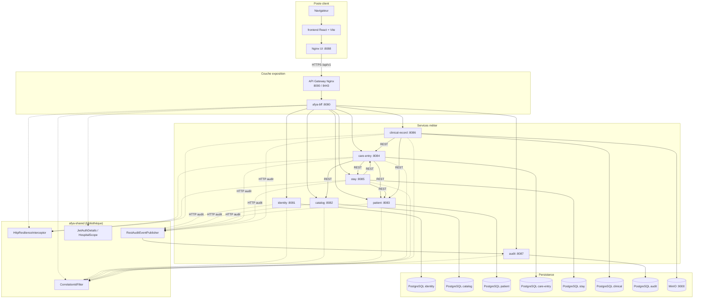
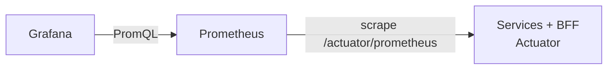

# Diagramme de composants — plateforme Afya

Vue **déploiement** : composants exécutables, ports, persistance et dépendances REST.  
PlantUML (détaillé) : [plantuml/COMPOSANTS_AFYA.puml](plantuml/COMPOSANTS_AFYA.puml).

## Vue d'ensemble

## afya-bff (décomposition interne)

| Composant | Rôle |
|-----------|------|
| **Contrôleurs REST** | Point d'entrée unique `/api/v1/*` pour le front (auth, patients, admissions, urgences, consultations, users, audit, stats…) |
| **Clients REST** | `IdentityClient`, `CatalogClient`, `PatientClient`, `CareEntryClient`, `StayClient`, `ClinicalRecordClient`, `AuditClient` |
| **Services d'agrégation** | KPI tableau de bord, rapports admin, enrichissement listes admissions |

## Matrice des dépendances REST

| Source | Cible | Usage |
|--------|--------|--------|
| **web / SPA** | API Gateway | Toutes les requêtes API |
| **Gateway** | BFF | Proxy `/api/`, `/actuator/` |
| **BFF** | 7 services | Agrégation métier, JWT relay |
| **care-entry** | patient, catalog, stay | Vérifier patient/service ; ouvrir séjour à l'admission |
| **stay** | care-entry, patient | Valider admission ; afficher identité |
| **clinical-record** | patient, care-entry | Valider patient/admission avant consultation |
| **Tous services métier** | audit | `RestAuditEventPublisher` → `POST /api/v1/audit/events` |

## Stack Docker (`docker-compose.stack.yml`)

| Composant | Image / build | Port exposé |
|-----------|---------------|-------------|
| identity … audit | `Dockerfile.spring` par module | internes 8081–8087 |
| bff | afya-bff | interne 8080 |
| api | `infra/gateway` | **8090**, **8443** |
| web | `frontend` (Nginx) | **8088** |
| minio | minio/minio | **9000**, 9001 |
| *-db | postgres:16-alpine | interne |

## Observabilité

Métriques résilience : `afya.http.resilience.*` (retry, 5xx, circuit breaker).
