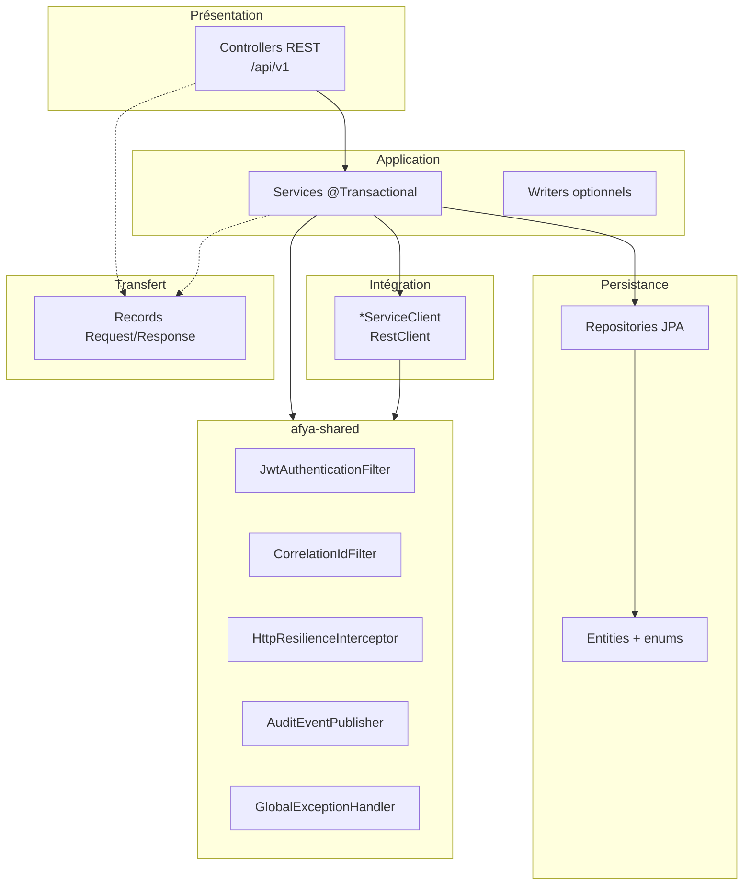
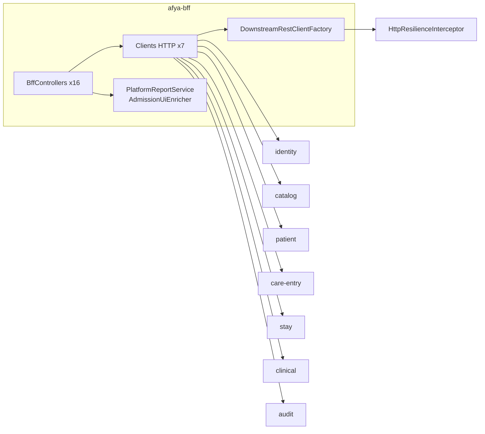
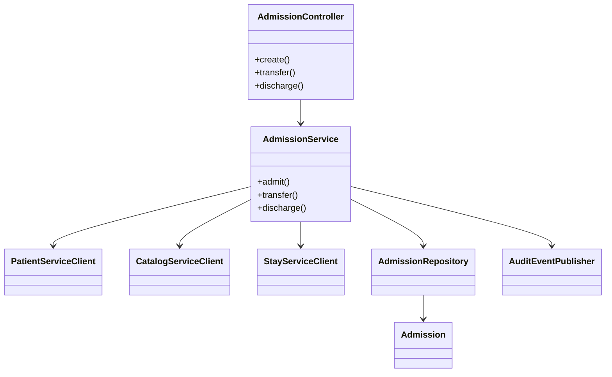

# Diagramme de conception — plateforme Afya

Vue **architecture logicielle** (couches, BFF, transversal, référence care-entry).  
PlantUML : [plantuml/CONCEPTION_AFYA.puml](plantuml/CONCEPTION_AFYA.puml)

Diagrammes complémentaires :

| Fichier | Contenu |
|---------|---------|
| [CONCEPTION_COUCHE_SERVICE_AFYA.puml](plantuml/CONCEPTION_COUCHE_SERVICE_AFYA.puml) | Classes care-entry (détail) |
| [CONCEPTION_CONSULTATION_AFYA.puml](plantuml/CONCEPTION_CONSULTATION_AFYA.puml) | Classes consultation / maladies |
| [CONCEPTION_SEQUENCE_ADMISSION_AFYA.puml](plantuml/CONCEPTION_SEQUENCE_ADMISSION_AFYA.puml) | Séquence admission |
| [CONCEPTION_SEQUENCE_AUTHENTIFICATION_AFYA.puml](plantuml/CONCEPTION_SEQUENCE_AUTHENTIFICATION_AFYA.puml) | Séquence login |
| [CONCEPTION_SEQUENCE_CLINICAL_AFYA.puml](plantuml/CONCEPTION_SEQUENCE_CLINICAL_AFYA.puml) | Séquence prescription |
| [CONCEPTION_SEQUENCE_PRISE_EN_CHARGE_AFYA.puml](plantuml/CONCEPTION_SEQUENCE_PRISE_EN_CHARGE_AFYA.puml) | Séquence consultation |

## Patron en couches (microservice)

## afya-bff (agrégation)

## Référence care-entry — classes clés

## Règles de conception

1. **Une base par service** — pas de JOIN inter-bases ; IDs logiques (`patientId`, `admissionId`).
2. **Transaction locale** — `@Transactional` dans le service du microservice concerné.
3. **Orchestration HTTP** — validation cross-service via `*ServiceClient` + résilience.
4. **Audit** — `RestAuditEventPublisher` vers audit-service après action réussie.
5. **Sécurité** — JWT validé dans chaque service ; `HospitalScopeSupport` pour le périmètre.
6. **BFF** — pas d’entités JPA ; proxy et agrégation pour le SPA uniquement.
