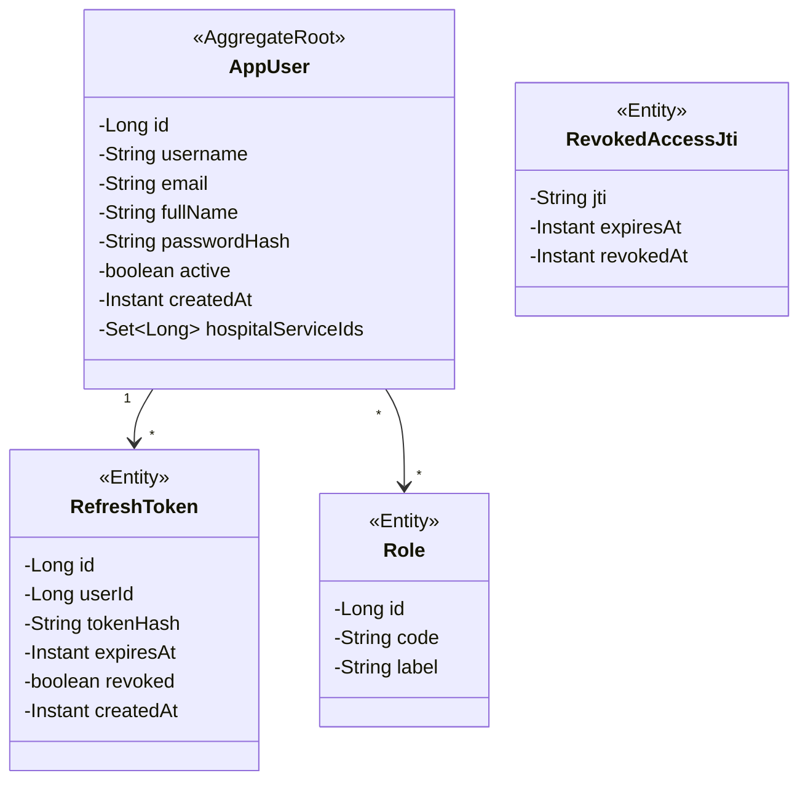
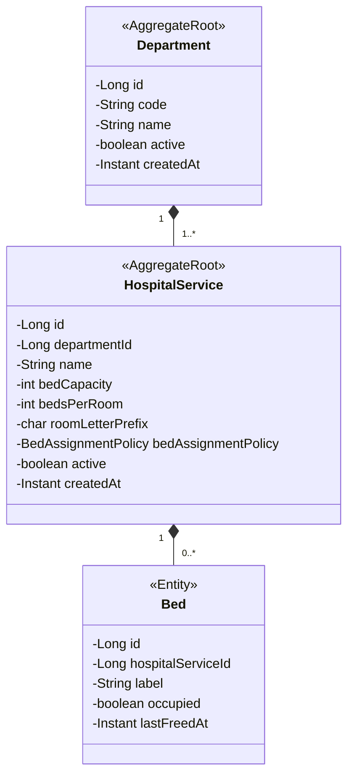
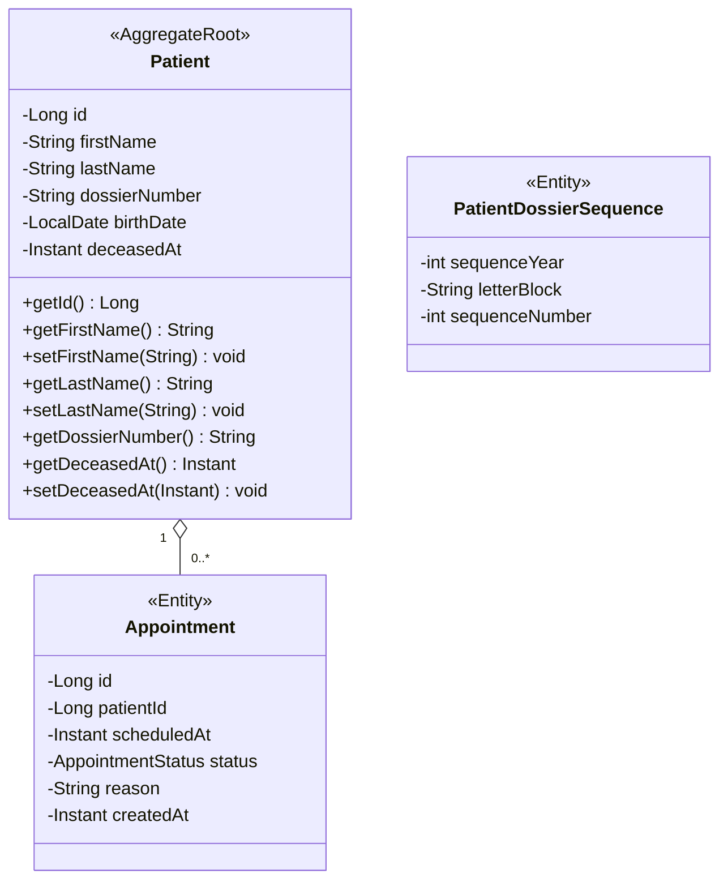
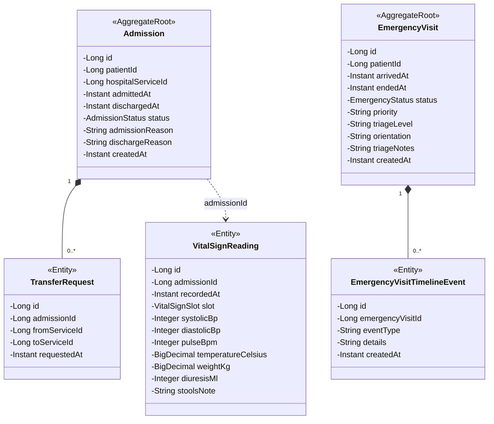
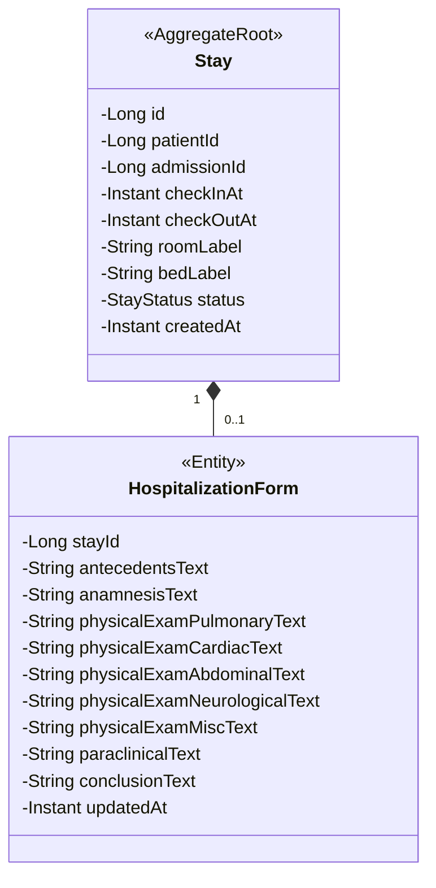
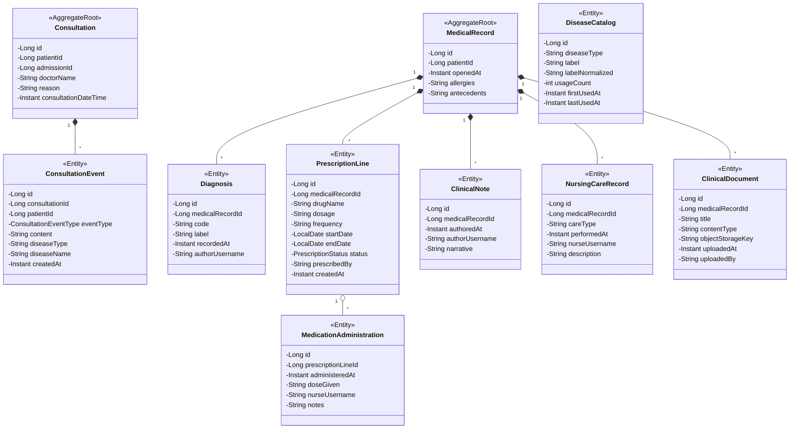
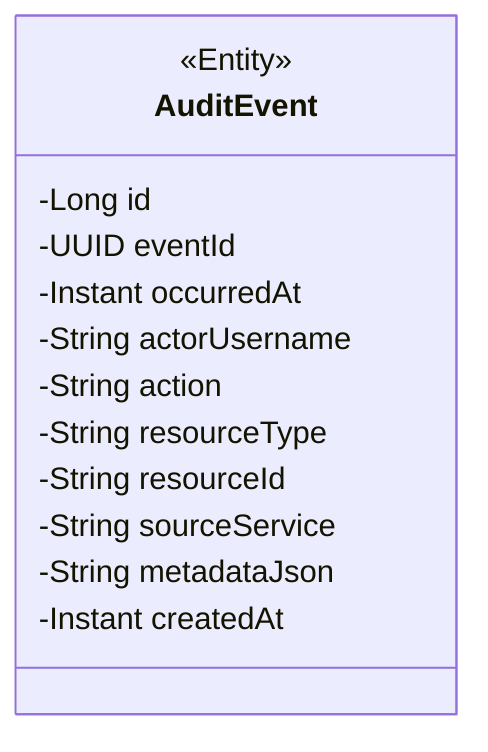
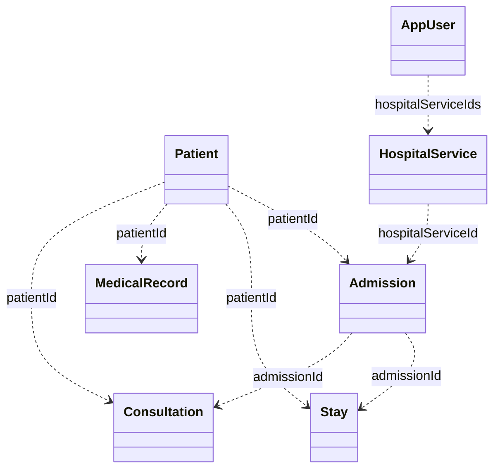

# Modèle du domaine Afya — diagramme de classes avec attributs et méthodes

Attributs et **méthodes publiques** alignés sur les entités JPA (`**/model/*.java`).  
Export complet (recommandé) : [plantuml/MODELE_DOMAINE_AFYA.puml](plantuml/MODELE_DOMAINE_AFYA.puml).

## identity-service

## catalog-service

## patient-service

## care-entry-service

## stay-service

## clinical-record-service

## audit-service

## Liens inter-contextes (références logiques)

