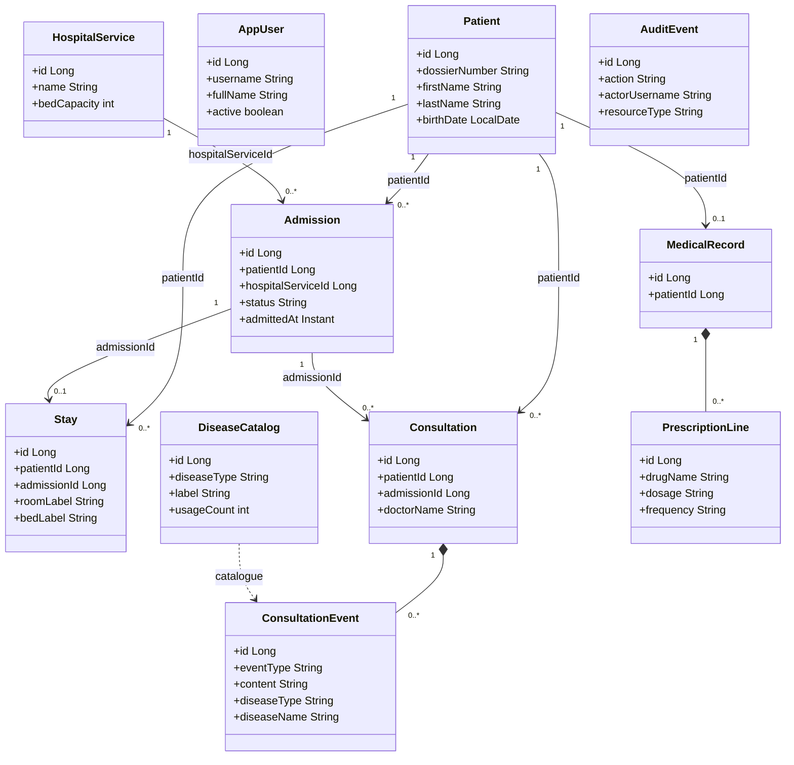
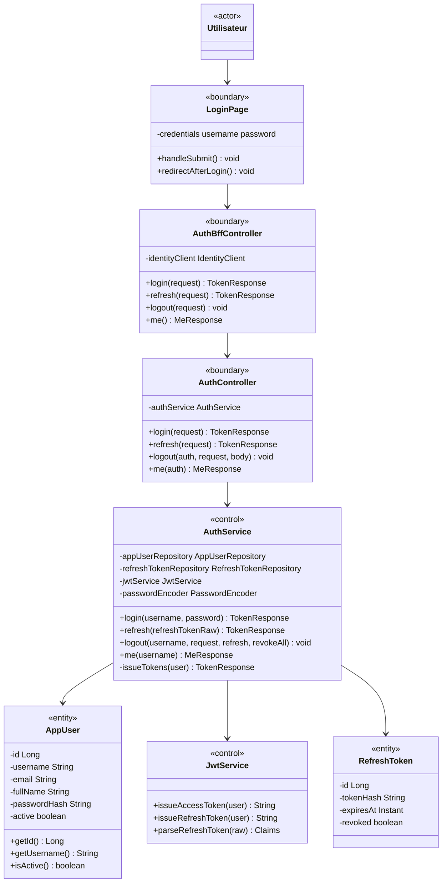
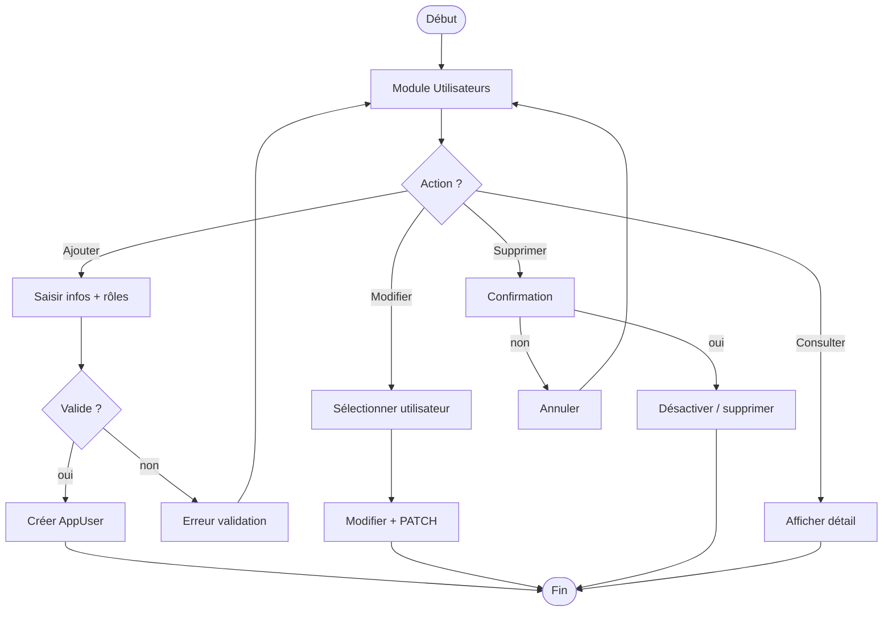
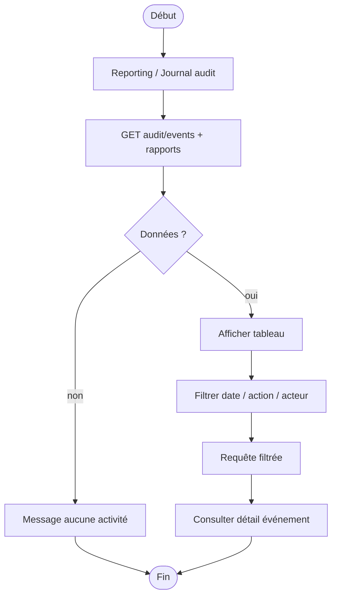
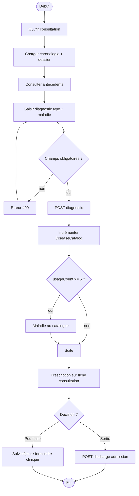
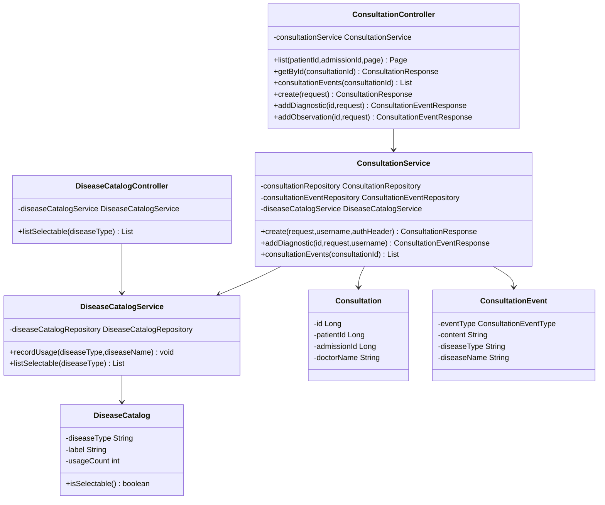
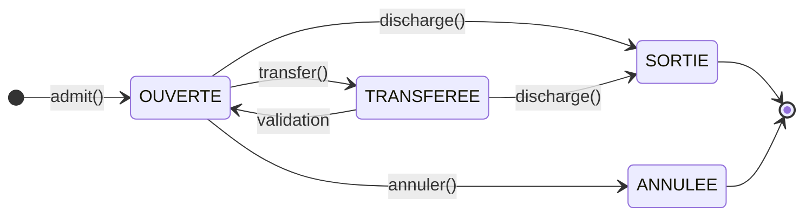
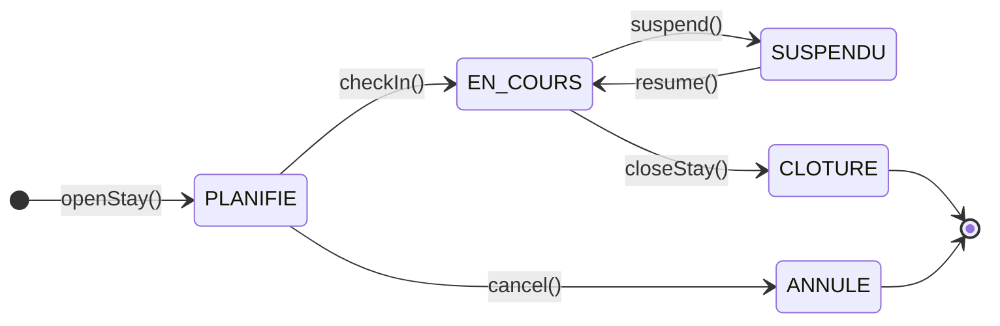

# Diagrammes Mermaid — mémoire Afya (8 cas d'utilisation)

Complément de [DIAGRAMMES_UML.md](DIAGRAMMES_UML.md) et des fichiers [plantuml/](plantuml/).  
Rendu : GitHub, GitLab, VS Code / Cursor (extension Mermaid), ou [mermaid.live](https://mermaid.live).

## Sommaire

1. [Modèle du domaine](#4-modèle-du-domaine-mermaid)
2. [Classes participantes](#5-classes-participantes-mermaid) (CU 1 à 8)
3. [Diagrammes d'activité](#6-diagrammes-dactivité-mermaid) (CU 1 à 8)
4. [Diagrammes de conception](#7-diagrammes-de-conception-mermaid)

---

## 4. Modèle du domaine (Mermaid)

Vue **conceptuelle** avec **attributs** principaux (équivalent [MODELE_DOMAINE_AFYA.puml](plantuml/MODELE_DOMAINE_AFYA.puml)).



MCD détaillé (tables) : [DIAGRAMMES_UML.md §5](DIAGRAMMES_UML.md#5-modèle-du-domaine-mcd--erdiagram).

---

## 5. Classes participantes (Mermaid)

Chaque classe liste ses **attributs** (`-`) et **méthodes** (`+`). Stéréotypes : `<<boundary>>`, `<<control>>`, `<<entity>>`.  
Équivalent PlantUML détaillé : [plantuml/CLASSES_PARTICIPANTES_*.puml](plantuml/README.md).

### 5.1 CU 1 — S'authentifier



### 5.2 CU 2 — Gérer les utilisateurs

```mermaid
classDiagram
  direction TB
  class Administrateur { <<actor>> }
  class UsersAdminPage {
    <<boundary>>
    -users UserResponse[]
    -form UserCreateRequest
    +loadUsers() void
    +submitCreate() void
    +submitUpdate(id) void
    +confirmDelete(id) void
  }
  class UserBffController {
    <<boundary>>
    -identityClient IdentityClient
    +list(page,size,search) Page
    +get(id) UserResponse
    +create(request) UserResponse
    +update(id,request) UserResponse
    +delete(id) void
  }
  class UserController {
    <<boundary>>
    -userAdminService UserAdminService
    +list(...) Page
    +listRoles() List
    +create(request) UserResponse
    +update(id,request) UserResponse
    +updateStatus(id,request) UserResponse
    +delete(id) void
    +get(id) UserResponse
  }
  class UserAdminService {
    <<control>>
    -appUserRepository AppUserRepository
    -roleRepository RoleRepository
    +getById(id) UserResponse
    +list(...) Page
    +create(request) UserResponse
    +update(id,request) UserResponse
    +updateStatus(id,active) UserResponse
    +delete(id) void
  }
  class AppUser {
    <<entity>>
    -id Long
    -username String
    -fullName String
    -passwordHash String
    -active boolean
  }
  class Role {
    <<entity>>
    -id Long
    -code String
    -label String
  }
  Administrateur --> UsersAdminPage --> UserBffController --> UserController --> UserAdminService
  UserAdminService --> AppUser
  UserAdminService --> Role
```

### 5.3 CU 3 — Gérer les services hospitaliers

```mermaid
classDiagram
  direction TB
  class Administrateur { <<actor>> }
  class HospitalServicesPage {
    <<boundary>>
    +loadCatalog() void
    +saveService(form) void
    +generateBeds(serviceId) void
  }
  class HospitalServiceBffController {
    <<boundary>>
    +listDepartments() List
    +listServices() List
    +createService(request) HospitalServiceResponse
    +updateService(id,request) HospitalServiceResponse
  }
  class HospitalServiceController {
    <<boundary>>
    -hospitalServiceCatalogService HospitalServiceCatalogService
    +list(activeOnly) List
    +getById(id) HospitalServiceResponse
    +create(request) HospitalServiceResponse
    +update(id,request) HospitalServiceResponse
  }
  class HospitalServiceCatalogService {
    <<control>>
    +create(request) HospitalServiceResponse
    +update(id,request) HospitalServiceResponse
    +delete(id) void
  }
  class Department {
    <<entity>>
    -id Long
    -code String
    -name String
  }
  class HospitalService {
    <<entity>>
    -id Long
    -name String
    -bedCapacity int
    -bedsPerRoom int
  }
  class Bed {
    <<entity>>
    -id Long
    -label String
    -occupied boolean
  }
  Administrateur --> HospitalServicesPage --> HospitalServiceBffController --> HospitalServiceController
  HospitalServiceController --> HospitalServiceCatalogService
  HospitalServiceCatalogService --> HospitalService
  HospitalService --> Department
  HospitalServiceCatalogService --> Bed
```

### 5.4 CU 4 — Gérer les activités du système

```mermaid
classDiagram
  direction TB
  class Administrateur { <<actor>> }
  class ReportingPage {
    <<boundary>>
    -auditEvents AuditEventResponse[]
    -filters object
    +loadAudit(page) void
    +applyFilters() void
    +loadReportOverview() void
  }
  class AuditBffController {
    <<boundary>>
    +listEvents(page,size,filters) Page
  }
  class StatsBffController {
    <<boundary>>
    +activityReport() ActivityReportResponse
    +volumes() PlatformReportOverviewResponse
  }
  class AuditEventController {
    <<boundary>>
    -auditEventService AuditEventService
    +list(page,size,actor,action,from,to) Page
    +ingest(request) AuditEventResponse
  }
  class AuditEventService {
    <<control>>
    +list(...) Page
    +ingest(request) AuditEventResponse
    +buildActivityReport() ActivityReportResponse
  }
  class AuditEvent {
    <<entity>>
    -id Long
    -occurredAt Instant
    -actorUsername String
    -action String
    -resourceType String
    -resourceId String
    -sourceService String
  }
  Administrateur --> ReportingPage
  ReportingPage --> AuditBffController
  ReportingPage --> StatsBffController
  AuditBffController --> AuditEventController --> AuditEventService --> AuditEvent
```

### 5.5 CU 5 — Enregistrer un patient

```mermaid
classDiagram
  direction TB
  class Receptionniste { <<actor>> }
  class PatientsPage {
    <<boundary>>
    -searchQuery string
    -createForm PatientCreateRequest
    +search() void
    +submitCreate() void
  }
  class PatientBffController {
    <<boundary>>
    +search(query,page,size) Page
    +getById(id) PatientResponse
    +create(request) PatientResponse
    +update(id,request) PatientResponse
  }
  class PatientController {
    <<boundary>>
    -patientRegistryService PatientRegistryService
    +create(request) PatientResponse
    +getById(id) PatientResponse
    +search(query,page,size,sortBy,sortDir) Page
    +update(id,request) PatientResponse
  }
  class PatientRegistryService {
    <<control>>
    +create(request) PatientResponse
    +getById(id) PatientResponse
    +search(...) Page
    -generateDossierNumber() String
  }
  class Patient {
    <<entity>>
    -id Long
    -dossierNumber String
    -firstName String
    -lastName String
    -birthDate LocalDate
    -sex String
  }
  class PatientDossierSequence {
    <<entity>>
    -year int
    -lastValue long
  }
  Receptionniste --> PatientsPage --> PatientBffController --> PatientController
  PatientController --> PatientRegistryService
  PatientRegistryService --> Patient
  PatientRegistryService --> PatientDossierSequence
```

### 5.6 CU 6 — Gérer les admissions

```mermaid
classDiagram
  direction TB
  class Receptionniste { <<actor>> }
  class AdmissionsPage {
    <<boundary>>
    +searchPatient() void
    +submitAdmission() void
    +submitTransfer(id) void
    +submitDischarge(id) void
  }
  class AdmissionBffController {
    <<boundary>>
    +create(request) AdmissionResponse
    +transfer(id,request) AdmissionResponse
    +discharge(id,request) AdmissionResponse
  }
  class AdmissionController {
    <<boundary>>
    -admissionService AdmissionService
    +create(request) AdmissionResponse
    +getById(id) AdmissionResponse
    +transfer(id,request) AdmissionResponse
    +discharge(id,request) AdmissionResponse
  }
  class AdmissionService {
    <<control>>
    +admit(request,authHeader) AdmissionResponse
    +transfer(id,request,authHeader) AdmissionResponse
    +discharge(id,request,authHeader) AdmissionResponse
  }
  class PatientServiceClient {
    <<boundary>>
    +getPatient(patientId,authHeader) PatientSummary
  }
  class CatalogServiceClient {
    <<boundary>>
    +getService(serviceId,authHeader) ServiceSummary
  }
  class StayServiceClient {
    <<boundary>>
    +openStay(request,authHeader) StaySummary
  }
  class Admission {
    <<entity>>
    -id Long
    -patientId Long
    -hospitalServiceId Long
    -status AdmissionStatus
    -admittedAt Instant
  }
  Receptionniste --> AdmissionsPage --> AdmissionBffController --> AdmissionController
  AdmissionController --> AdmissionService --> Admission
  AdmissionService ..> PatientServiceClient
  AdmissionService ..> CatalogServiceClient
  AdmissionService ..> StayServiceClient
```

### 5.7 CU 7 — Prise en charge médicale

```mermaid
classDiagram
  direction TB
  class Medecin { <<actor>> }
  class ConsultationDetailView {
    <<boundary>>
    -timeline ConsultationEventResponse[]
    -diagnosticDiseaseType string
    -diagnosticDiseaseName string
    +loadData() Promise
    +submitDiagnostic() Promise
    +submitPrescription() Promise
  }
  class ConsultationBffController {
    <<boundary>>
    +list(...) Page
    +consultationEvents(id) List
    +addDiagnostic(id,request) ConsultationEventResponse
  }
  class DiseaseCatalogBffController {
    <<boundary>>
    +listSelectable(diseaseType) List
  }
  class PrescriptionBffController {
    <<boundary>>
    +create(patientId,request) PrescriptionResponse
  }
  class ConsultationController {
    <<boundary>>
    -consultationService ConsultationService
    +getById(id) ConsultationResponse
    +consultationEvents(id) List
    +addDiagnostic(id,request) ConsultationEventResponse
    +addObservation(id,request) ConsultationEventResponse
  }
  class ConsultationService {
    <<control>>
    +addDiagnostic(id,request,username) ConsultationEventResponse
    +consultationEvents(consultationId) List
    +create(request,username,authHeader) ConsultationResponse
  }
  class DiseaseCatalogService {
    <<control>>
    +listSelectable(diseaseType) List
    +recordUsage(diseaseType,diseaseName) void
  }
  class Consultation {
    <<entity>>
    -id Long
    -patientId Long
    -admissionId Long
    -doctorName String
  }
  class ConsultationEvent {
    <<entity>>
    -eventType ConsultationEventType
    -content String
    -diseaseType String
    -diseaseName String
  }
  class DiseaseCatalog {
    <<entity>>
    -diseaseType String
    -label String
    -usageCount int
    +isSelectable() boolean
  }
  class PrescriptionLine {
    <<entity>>
    -drugName String
    -dosage String
    -frequency String
  }
  Medecin --> ConsultationDetailView
  ConsultationDetailView --> ConsultationBffController
  ConsultationDetailView --> DiseaseCatalogBffController
  ConsultationDetailView --> PrescriptionBffController
  ConsultationBffController --> ConsultationController --> ConsultationService
  ConsultationService --> Consultation
  ConsultationService --> ConsultationEvent
  ConsultationService --> DiseaseCatalogService --> DiseaseCatalog
```

### 5.8 CU 8 — Enregistrer les soins

```mermaid
classDiagram
  direction TB
  class Infirmier { <<actor>> }
  class MedicalRecordDetailPage {
    <<boundary>>
    -medicalRecord MedicalRecordResponse
    +loadMedicalRecord() void
    +submitNursingCare() void
    +submitMedicationAdmin(lineId) void
  }
  class PatientClinicalBffController {
    <<boundary>>
    +getMedicalRecord(patientId) MedicalRecordResponse
    +addNursingCare(patientId,request) NursingCareResponse
    +administerMedication(patientId,request) MedicationAdministrationResponse
  }
  class MedicalRecordController {
    <<boundary>>
    -clinicalRecordService ClinicalRecordService
    +getMedicalRecord(patientId,activeOnly) MedicalRecordResponse
    +addNursingCare(patientId,request) NursingCareResponse
    +addMedicationAdministration(patientId,request) MedicationAdministrationResponse
  }
  class ClinicalRecordService {
    <<control>>
    +getMedicalRecord(patientId,authHeader,activeOnly) MedicalRecordResponse
    +addNursingCare(patientId,request,username,authHeader) NursingCareResponse
    +addMedicationAdministration(...) MedicationAdministrationResponse
    -findOrCreateRecord(patientId) MedicalRecord
  }
  class MedicalRecord {
    <<entity>>
    -id Long
    -patientId Long
    -allergies String
    -antecedents String
  }
  class NursingCareRecord {
    <<entity>>
    -careType String
    -description String
    -performedAt Instant
    -nurseUsername String
  }
  class MedicationAdministration {
    <<entity>>
    -administeredAt Instant
    -doseGiven String
    -nurseUsername String
  }
  Infirmier --> MedicalRecordDetailPage --> PatientClinicalBffController
  PatientClinicalBffController --> MedicalRecordController --> ClinicalRecordService
  ClinicalRecordService --> MedicalRecord
  ClinicalRecordService --> NursingCareRecord
  ClinicalRecordService --> MedicationAdministration
```

---

## 6. Diagrammes d'activité (Mermaid)

### 6.1 CU 1 — S'authentifier


### 6.2 CU 2 — Gérer les utilisateurs



### 6.3 CU 3 — Gérer les services hospitaliers


### 6.4 CU 4 — Gérer les activités du système



### 6.5 CU 5 — Enregistrer un patient


### 6.6 CU 6 — Gérer les admissions


### 6.7 CU 7 — Prise en charge médicale



### 6.8 CU 8 — Enregistrer les soins


---

## 7. Diagrammes de conception (Mermaid)

### 7.1 Architecture en couches

Voir [DIAGRAMMES_UML.md §7.1](DIAGRAMMES_UML.md#71-vue-densemble--architecture-en-couches-plateforme).

### 7.2 Séquence — authentification

Voir [DIAGRAMMES_UML.md §7.3](DIAGRAMMES_UML.md#73-séquence--authentification-login).

### 7.3 Séquence — admission

Voir [DIAGRAMMES_UML.md §7.4](DIAGRAMMES_UML.md#74-séquence--enregistrer-une-admission).

### 7.4 Séquence — prise en charge médicale

Voir [DIAGRAMMES_UML.md §7.7](DIAGRAMMES_UML.md#77-séquence--prise-en-charge-médicale-consultation).

### 7.5 Séquence — prescription et administration

Voir [DIAGRAMMES_UML.md §7.5](DIAGRAMMES_UML.md#75-séquence--prescription-et-administration).

### 7.6 Classes — consultation et catalogue (conception)



Voir aussi [DIAGRAMMES_UML.md §7.8](DIAGRAMMES_UML.md#78-patron-consultation--clinical-record-service).

### 7.7 États — Admission



### 7.8 États — Stay (séjour)



---

## Export PNG

```bash
# Avec @mermaid-js/mermaid-cli (npm)
npx @mermaid-js/mermaid-cli -i docs/MERMAID_MEMOIRE_AFYA.md -o docs/mermaid/out/
```

Ou copier chaque bloc `` ```mermaid `` dans [mermaid.live](https://mermaid.live) → Export PNG/SVG.

PlantUML équivalent : [plantuml/README.md](plantuml/README.md).
