# Diagrammes Mermaid — mémoire Afya (8 cas d'utilisation)

Complément de [DIAGRAMMES_UML.md](DIAGRAMMES_UML.md) et des fichiers [plantuml/](plantuml/).  
Rendu : GitHub, GitLab, VS Code / Cursor (extension Mermaid), ou [mermaid.live](https://mermaid.live).

## Sommaire

1. [Modèle du domaine](#4-modèle-du-domaine-mermaid)
2. [Classes participantes](#5-classes-participantes-mermaid) (CU 1 à 8)
3. [Diagrammes d'activité](#6-diagrammes-dactivité-mermaid) (CU 1 à 8)
4. [Diagrammes de conception](#7-diagrammes-de-conception-mermaid)

---

## 4. Modèle du domaine (Mermaid)

Vue **conceptuelle** par contexte délimité (équivalent [MODELE_DOMAINE_AFYA.puml](plantuml/MODELE_DOMAINE_AFYA.puml)).

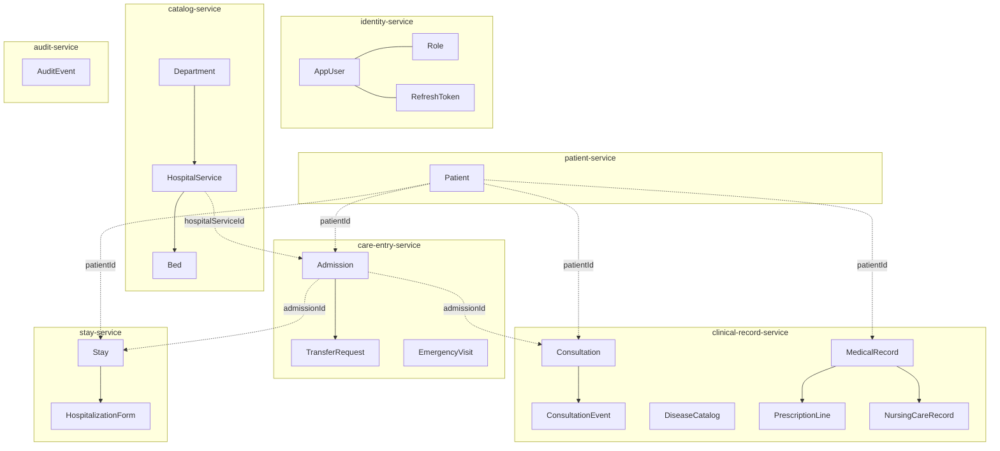

MCD détaillé (tables) : [DIAGRAMMES_UML.md §5](DIAGRAMMES_UML.md#5-modèle-du-domaine-mcd--erdiagram).

---

## 5. Classes participantes (Mermaid)

Stéréotypes : **boundary** = UI / API ; **control** = service applicatif ; **entity** = persistance JPA.

### 5.1 CU 1 — S'authentifier

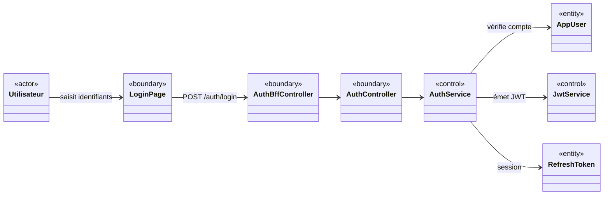

### 5.2 CU 2 — Gérer les utilisateurs

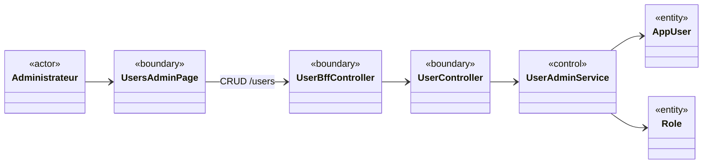

### 5.3 CU 3 — Gérer les services hospitaliers

```mermaid
classDiagram
  direction LR
  class Administrateur {
    <<actor>>
  }
  class HospitalServicesPage {
    <<boundary>>
  }
  class HospitalServiceBffController {
    <<boundary>>
  }
  class DepartmentController {
    <<boundary>>
  }
  class HospitalServiceController {
    <<boundary>>
  }
  class DepartmentService {
    <<control>>
  }
  class HospitalServiceCatalogService {
    <<control>>
  }
  class Department {
    <<entity>>
  }
  class HospitalService {
    <<entity>>
  }
  class Bed {
    <<entity>>
  }

  Administrateur --> HospitalServicesPage
  HospitalServicesPage --> HospitalServiceBffController
  HospitalServiceBffController --> DepartmentController
  HospitalServiceBffController --> HospitalServiceController
  DepartmentController --> DepartmentService --> Department
  HospitalServiceController --> HospitalServiceCatalogService
  HospitalServiceCatalogService --> HospitalService
  HospitalServiceCatalogService --> Bed
  HospitalService --> Department
```

### 5.4 CU 4 — Gérer les activités du système

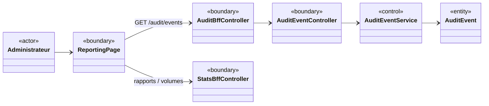

### 5.5 CU 5 — Enregistrer un patient

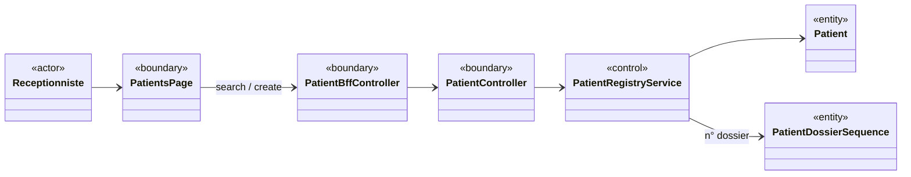

### 5.6 CU 6 — Gérer les admissions

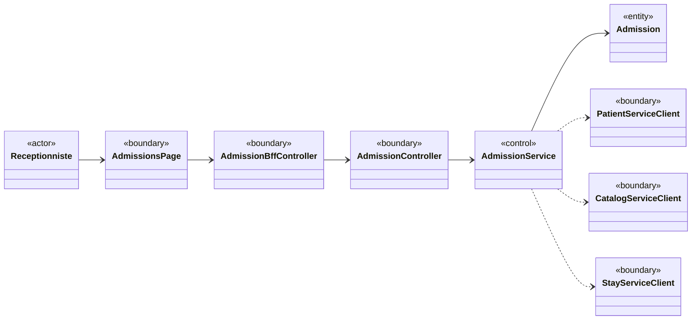

### 5.7 CU 7 — Prise en charge médicale

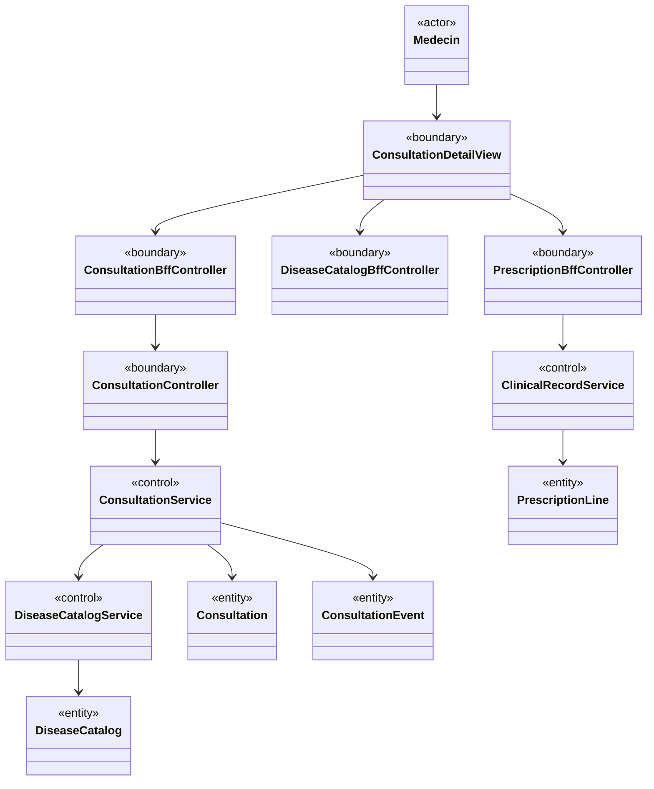

### 5.8 CU 8 — Enregistrer les soins

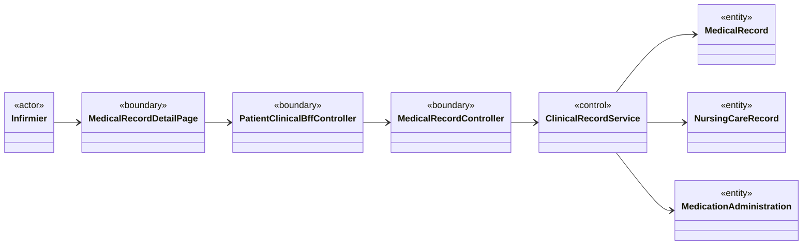

---

## 6. Diagrammes d'activité (Mermaid)

### 6.1 CU 1 — S'authentifier

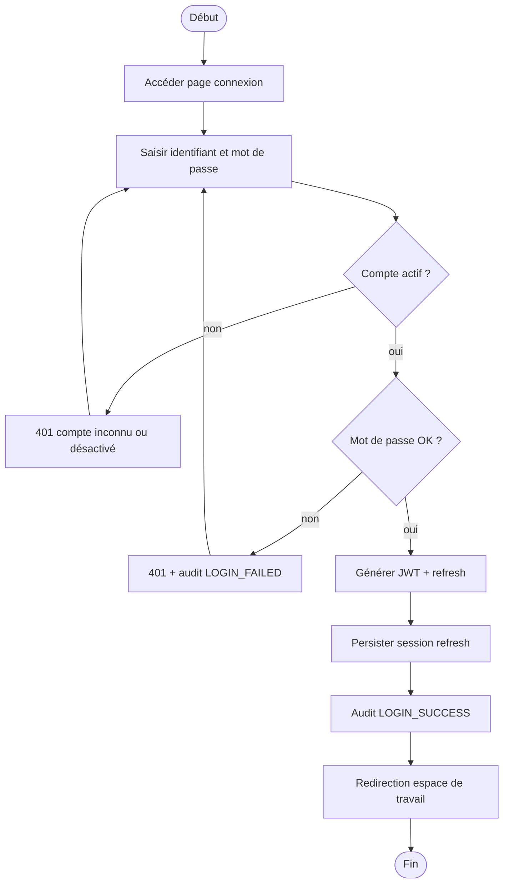

### 6.2 CU 2 — Gérer les utilisateurs


### 6.3 CU 3 — Gérer les services hospitaliers

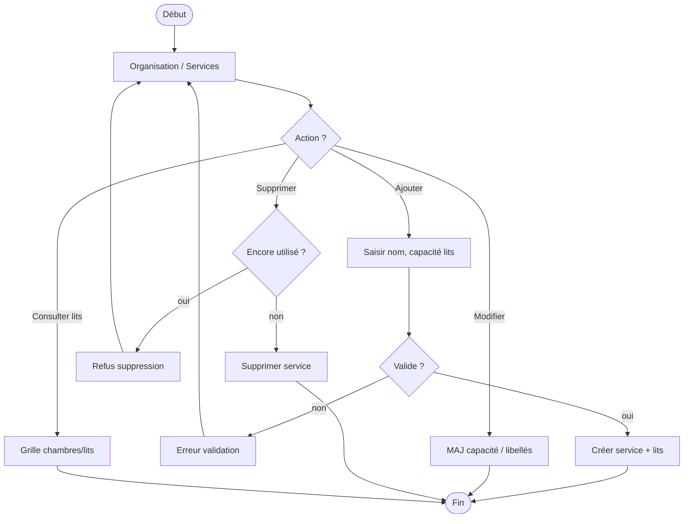

### 6.4 CU 4 — Gérer les activités du système


### 6.5 CU 5 — Enregistrer un patient

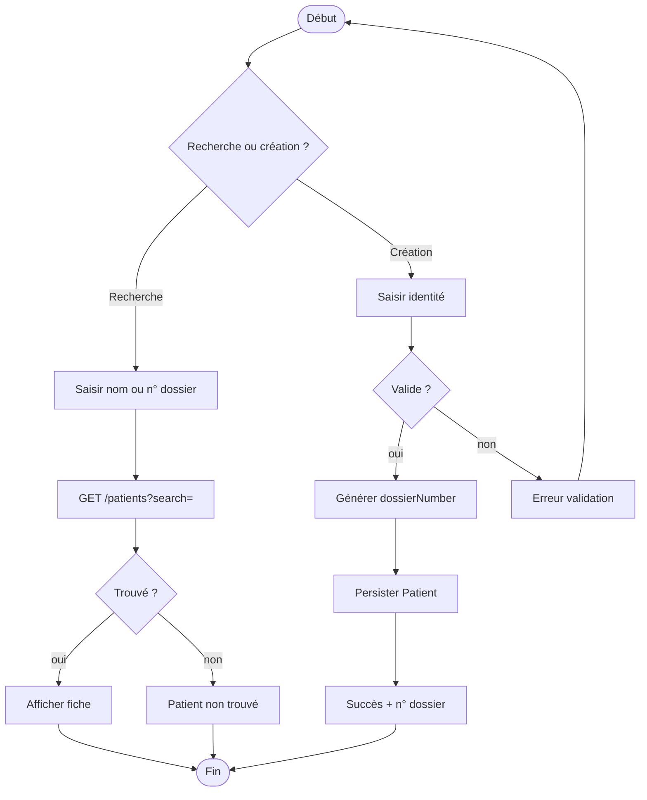

### 6.6 CU 6 — Gérer les admissions

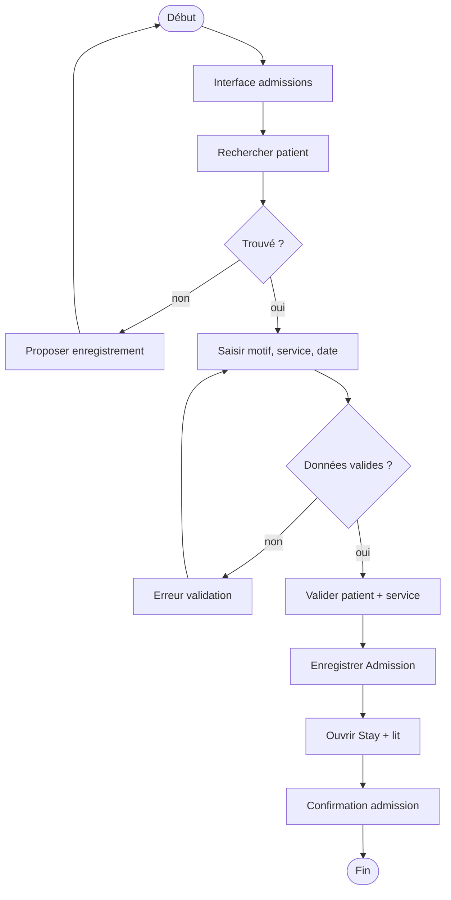

### 6.7 CU 7 — Prise en charge médicale


### 6.8 CU 8 — Enregistrer les soins

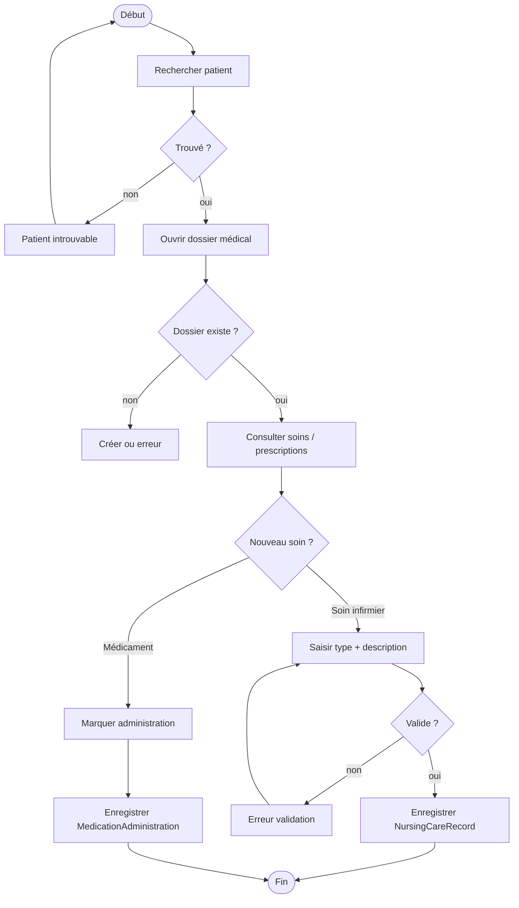

---

## 7. Diagrammes de conception (Mermaid)

### 7.1 Architecture en couches

Voir [DIAGRAMMES_UML.md §7.1](DIAGRAMMES_UML.md#71-vue-densemble--architecture-en-couches-plateforme).

### 7.2 Séquence — authentification

Voir [DIAGRAMMES_UML.md §7.3](DIAGRAMMES_UML.md#73-séquence--authentification-login).

### 7.3 Séquence — admission

Voir [DIAGRAMMES_UML.md §7.4](DIAGRAMMES_UML.md#74-séquence--enregistrer-une-admission).

### 7.4 Séquence — prise en charge médicale

Voir [DIAGRAMMES_UML.md §7.7](DIAGRAMMES_UML.md#77-séquence--prise-en-charge-médicale-consultation).

### 7.5 Séquence — prescription et administration

Voir [DIAGRAMMES_UML.md §7.5](DIAGRAMMES_UML.md#75-séquence--prescription-et-administration).

### 7.6 Classes — consultation et catalogue

Voir [DIAGRAMMES_UML.md §7.8](DIAGRAMMES_UML.md#78-patron-consultation--clinical-record-service).

### 7.7 États — Admission

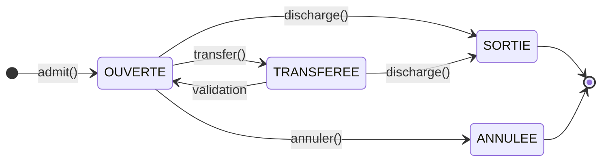

### 7.8 États — Stay (séjour)

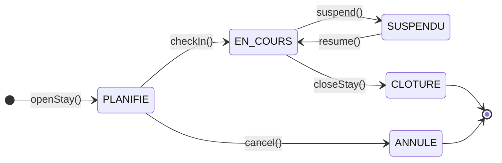

---

## Export PNG

```bash
# Avec @mermaid-js/mermaid-cli (npm)
npx @mermaid-js/mermaid-cli -i docs/MERMAID_MEMOIRE_AFYA.md -o docs/mermaid/out/
```

Ou copier chaque bloc `` ```mermaid `` dans [mermaid.live](https://mermaid.live) → Export PNG/SVG.

PlantUML équivalent : [plantuml/README.md](plantuml/README.md).
