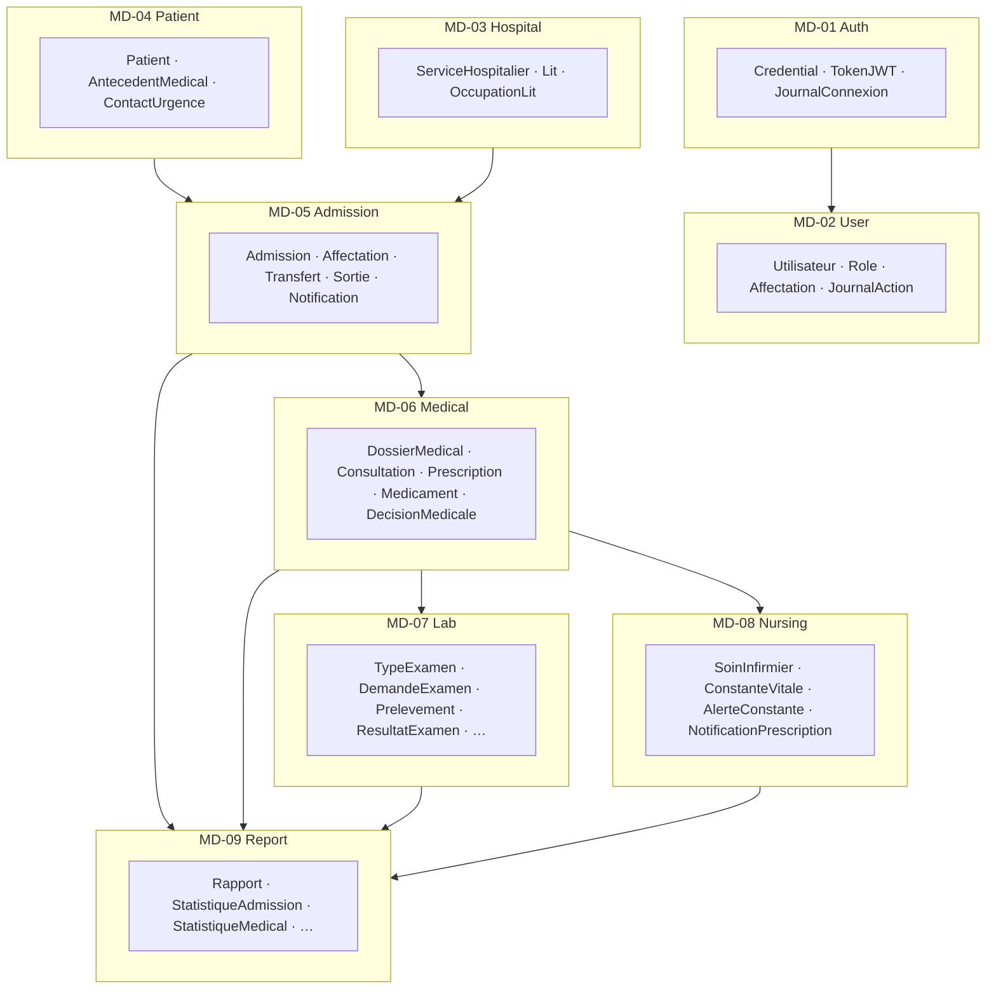

# Modèles du domaine par microservice — mémoire (référence officielle)

**Système de gestion des patients — HGR Jason Sendwe**

> Ce document constitue la **référence officielle du mémoire** pour la modélisation du domaine.  
> Chaque microservice possède son propre modèle et sa propre base de données (isolation des données).

**Implémentation logicielle (prototype Afya)** : voir [MAPPING_MODELE_ANALYSE_AFYA.md](MAPPING_MODELE_ANALYSE_AFYA.md) pour la correspondance avec les **9 services Java** déployés.

---

## Vue d'ensemble — 9 microservices

---

## MD-01 — Auth Service

*Responsabilité : authentification et gestion des tokens JWT*

| Classe | Rôle |
|--------|------|
| `Credential` | Identifiants, mot de passe hashé, statut, tentatives |
| `TokenJWT` | Jetons émis, rôle, expiration, révocation |
| `JournalConnexion` | Traces connexion / déconnexion / échec |

**PlantUML :** [plantuml/memoire/MD01_AuthService.puml](plantuml/memoire/MD01_AuthService.puml)

---

## MD-02 — User Service

*Responsabilité : gestion des comptes et rôles des utilisateurs*

| Classe | Rôle |
|--------|------|
| `Utilisateur` | Profil, identifiant, contact, statut |
| `Role` | ADMIN, MEDECIN, RECEPTIONNISTE, INFIRMIERE, LABORANTIN |
| `Affectation` | Lien utilisateur ↔ service hospitalier (dates) |
| `JournalAction` | Historique des actions utilisateur |

**PlantUML :** [plantuml/memoire/MD02_UserService.puml](plantuml/memoire/MD02_UserService.puml)

---

## MD-03 — Hospital Service

*Responsabilité : gestion des services hospitaliers et des lits*

| Classe | Rôle |
|--------|------|
| `ServiceHospitalier` | Unité de soins, capacité, responsable |
| `Lit` | Numéro, type, statut (libre, occupé, …) |
| `OccupationLit` | Historique occupation patient / admission |

**PlantUML :** [plantuml/memoire/MD03_HospitalService.puml](plantuml/memoire/MD03_HospitalService.puml)

---

## MD-04 — Patient Service

*Responsabilité : gestion des dossiers d'identité des patients*

| Classe | Rôle |
|--------|------|
| `Patient` | Identité administrative, dossier, contacts |
| `AntecedentMedical` | Antécédents médicaux, chirurgicaux, allergies |
| `ContactUrgence` | Personnes à contacter en urgence |

**PlantUML :** [plantuml/memoire/MD04_PatientService.puml](plantuml/memoire/MD04_PatientService.puml)

---

## MD-05 — Admission Service

*Responsabilité : admissions, transferts et sorties*

| Classe | Rôle |
|--------|------|
| `Admission` | Entrée patient, type (normale / urgence), statut |
| `Affectation` | Service et lit assignés |
| `Transfert` | Mouvement inter-services |
| `Sortie` | Clôture du parcours (guéri, décédé, …) |
| `NotificationAdmission` | Alertes hospitalisation, sortie, transfert |

**PlantUML :** [plantuml/memoire/MD05_AdmissionService.puml](plantuml/memoire/MD05_AdmissionService.puml)

---

## MD-06 — Medical Service

*Responsabilité : consultations, prescriptions, dossier médical et décisions*

| Classe | Rôle |
|--------|------|
| `DossierMedical` | Dossier patient, médecin référent |
| `Consultation` | Acte médical, diagnostic, observations |
| `Prescription` | Ordonnance liée à une consultation |
| `Medicament` | Lignes de prescription (posologie, voie) |
| `DecisionMedicale` | Décision hospitalisation ou sortie |

**PlantUML :** [plantuml/memoire/MD06_MedicalService.puml](plantuml/memoire/MD06_MedicalService.puml)

---

## MD-07 — Lab Service

*Responsabilité : demandes d'examens, prélèvements et résultats*

| Classe | Rôle |
|--------|------|
| `TypeExamen` | Catalogue examens (biologie, imagerie, …) |
| `DemandeExamen` | Prescription d'examens par le médecin |
| `LigneDemandeExamen` | Détail des examens demandés |
| `Prelevement` | Prélèvement par le laborantin |
| `ResultatExamen` | Résultats validés |
| `ParametreResultat` | Valeurs, unités, seuils, anomalies |

**PlantUML :** [plantuml/memoire/MD07_LabService.puml](plantuml/memoire/MD07_LabService.puml)

---

## MD-08 — Nursing Service

*Responsabilité : soins infirmiers et constantes vitales*

| Classe | Rôle |
|--------|------|
| `SoinInfirmier` | Soins réalisés, lien prescription |
| `ConstanteVitale` | TA, pouls, température, SpO₂, … |
| `AlerteConstante` | Seuils dépassés (attention / critique) |
| `NotificationPrescription` | Alerte infirmière sur nouvelle prescription |

**PlantUML :** [plantuml/memoire/MD08_NursingService.puml](plantuml/memoire/MD08_NursingService.puml)

---

## MD-09 — Report Service

*Responsabilité : statistiques et rapports d'activités*

| Classe | Rôle |
|--------|------|
| `Rapport` | Document généré (PDF / Excel, période) |
| `StatistiqueAdmission` | Admissions, urgences, occupation, durée séjour |
| `StatistiqueMedical` | Consultations, prescriptions, diagnostics |
| `StatistiqueLaboratoire` | Examens, délais, anomalies |
| `StatistiqueSoins` | Soins, constantes, alertes |

**PlantUML :** [plantuml/memoire/MD09_ReportService.puml](plantuml/memoire/MD09_ReportService.puml)

---

## Récapitulatif — classes par service

| Microservice | Nb classes | Classes principales |
|--------------|------------|---------------------|
| Auth Service | 3 | Credential, TokenJWT, JournalConnexion |
| User Service | 4 | Utilisateur, Role, Affectation, JournalAction |
| Hospital Service | 3 | ServiceHospitalier, Lit, OccupationLit |
| Patient Service | 3 | Patient, AntecedentMedical, ContactUrgence |
| Admission Service | 5 | Admission, Affectation, Transfert, Sortie, NotificationAdmission |
| Medical Service | 5 | DossierMedical, Consultation, Prescription, Medicament, DecisionMedicale |
| Lab Service | 6 | TypeExamen, DemandeExamen, LigneDemandeExamen, Prelevement, ResultatExamen, ParametreResultat |
| Nursing Service | 4 | SoinInfirmier, ConstanteVitale, AlerteConstante, NotificationPrescription |
| Report Service | 5 | Rapport, StatistiqueAdmission, StatistiqueMedical, StatistiqueLaboratoire, StatistiqueSoins |
| **Total** | **38** | |

---

## Règles d'architecture (mémoire)

1. **Une base de données par microservice** — pas de jointure SQL inter-services.
2. **Références inter-services par identifiant** — `patientId`, `admissionId`, `serviceId`, etc.
3. **Communication synchrone** (REST) pour les requêtes immédiates ; **asynchrone** (bus d'événements) pour audit et notifications.
4. **Sécurité** — Auth Service émet les JWT ; chaque service valide les tokens.

---

## Lien avec le prototype Afya

Le mémoire retient **9 microservices** comme architecture cible. Le prototype Afya dispose des **9 modules Maven** correspondants (migration terminée côté code). Tableau de suivi : [MIGRATION_9_SERVICES.md](MIGRATION_9_SERVICES.md).

| Code mémoire | Microservice mémoire | Module Afya | Base |
|--------------|---------------------|-------------|------|
| MD-01 | Auth Service | `auth-service` | `afya_auth` |
| MD-02 | User Service | `user-service` | `afya_user` |
| MD-03 | Hospital Service | `hospital-service` | `afya_hospital` |
| MD-04 | Patient Service | `patient-service` | `afya_patient` |
| MD-05 | Admission Service | `admission-service` | `afya_admission` |
| MD-06 | Medical Service | `medical-service` | `afya_medical` |
| MD-07 | Lab Service | `lab-service` | `afya_lab` |
| MD-08 | Nursing Service | `nursing-service` | `afya_nursing` |
| MD-09 | Report Service | `report-service` (+ ingestion `audit-service`) | `afya_report` / `afya_audit` |

Migration legacy terminée. ~~`identity-service`~~ → auth + user ; ~~`catalog-service`~~ → `hospital-service` ; ~~`care-entry-service`~~ + ~~`stay-service`~~ → `admission-service` ; ~~`clinical-record-service`~~ → `medical-service` + `nursing-service`.

---

*Référence mémoire — HGR Jason Sendwe. Ne pas confondre avec le modèle JPA d'implémentation ([MERMAID_DOMAINE_AFYA.md](MERMAID_DOMAINE_AFYA.md)).*
