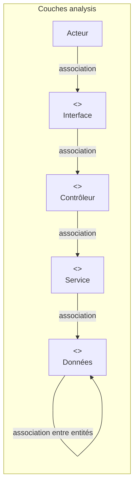
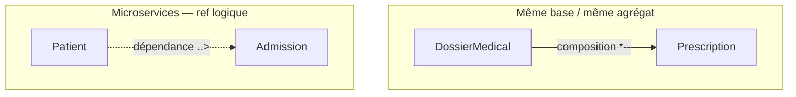

# Relations UML — diagrammes de classes Afya

Guide des **types de relations** utilisés dans les diagrammes du dossier [class_participantes_et_activite/](.) et dans la documentation mémoire.

---

## 1. Symboles UML (rappel)

| Relation UML | PlantUML | Signification | Exemple Afya |
|--------------|----------|---------------|--------------|
| **Association** | `A --> B` (flèche pleine) | Une classe **utilise** ou **communique** avec une autre ; lien structurel ou d’appel | `InterfaceConnexion --> ControleurAuthentification` |
| **Dépendance** | `A ..> B` (flèche pointillée) | Utilisation **temporaire** ou **faible** ; pas de lien permanent en mémoire | `AdmissionService ..> PatientServiceClient` |
| **Association simple** | `A -- B` (trait plein, sans flèche ou bidirectionnel) | Lien entre entités, multiplicité indiquée | `UtilisateurCompte "1" -- "0..*" SessionUtilisateur` |
| **Agrégation** | `A o-- B` (losange vide) | **Tout–partie** : B peut exister sans A | Peu utilisée ici (préférer composition pour le dossier) |
| **Composition** | `A *-- B` (losange plein) | **Tout–partie forte** : B n’existe pas sans A ; cycle de vie lié | `DossierMedical "1" *-- "0..*" Prescription` |
| **Réalisation** | `A ..|> B` ou `A --\|> B` | Implémente une **interface** | `FilesystemObjectStorageService ..|> ObjectStorageService` |
| **Héritage** | `A --\|> B` | **Spécialisation** (classe fille → parent) | Rare dans nos diagrammes analyse |
| **Lien acteur** | `Acteur --> Classe` | L’**acteur** interagit avec une frontière | `Utilisateur --> InterfaceConnexion` |

### Multiplicités (cardinalités)

| Notation | Signification | Exemple |
|----------|---------------|---------|
| `1` | Exactement un | Un dossier médical par patient |
| `0..1` | Zéro ou un | Un séjour peut avoir 0 ou 1 formulaire d’hospitalisation |
| `0..*` ou `*` | Zéro ou plusieurs | Un patient peut avoir plusieurs admissions |
| `1..*` | Un ou plusieurs | Au moins une prescription par dossier (si prescrit) |

---

## 2. Relations par type de diagramme

### 2.1 Classes participantes — analyse (`CLASSES_PARTICIPANTES_ANALYSE_FR.puml`)

Diagramme **dynamique** : enchaînement des interactions pour un cas d’utilisation.

| De | Vers | Relation | Rôle |
|----|------|----------|------|
| **Acteur** | `<<frontière>>` | Association `-->` | L’utilisateur déclenche l’interface |
| `<<frontière>>` | `<<contrôle>>` (contrôleur) | Association `-->` | L’interface transmet la requête |
| `<<contrôle>>` (contrôleur) | `<<contrôle>>` (service) | Association `-->` | Le contrôleur délègue la logique |
| `<<contrôle>>` (service) | `<<entité>>` | Association `-->` | Le service lit/écrit les données |
| `<<entité>>` | `<<entité>>` | Association `-->` | Lien métier entre données (ex. Consultation → EvenementConsultation) |

**Exemple CU 1 — Authentification :**

```
Utilisateur --> InterfaceConnexion
InterfaceConnexion --> ControleurAuthentification
ControleurAuthentification --> ServiceAuthentification
ServiceAuthentification --> UtilisateurCompte
ControleurAuthentification --> SessionUtilisateur
```

**Exemple CU 7 — Prise en charge :**

```
Medecin --> InterfaceDossierMedical
InterfaceDossierMedical --> ControleurPriseEnCharge
ControleurPriseEnCharge --> ServiceClinique
ControleurPriseEnCharge --> DossierMedical
Consultation --> EvenementConsultation
DossierMedical --> Prescription
```

---

### 2.2 Diagramme de persistance (`DIAGRAMME_PERSISTANCE_AFYA.puml`)

Diagramme **statique** : uniquement les **entités** et leurs liens en base.

| Relation PlantUML | UML | Quand l’utiliser | Exemple |
|-------------------|-----|------------------|---------|
| `"1" -- "0..*"` | Association | Lien **FK** classique, entité enfant peut exister seule ou avec plusieurs parents | `Admission "1" -- "0..*" DemandeTransfert` |
| `"1" *-- "0..*"` | **Composition** | L’enfant **appartient** au parent ; supprimé avec lui | `DossierMedical "1" *-- "0..*" Prescription` |
| `"1" *-- "0..1"` | **Composition** | Relation **un–à–zéro-ou-un** | `Sejour "1" *-- "0..1" FormulaireHospitalisation` |
| `"*" -- "*"` (via table de liaison) | Association **N–N** | Table associative | `UtilisateurCompte` ↔ `UtilisateurRole` ↔ `Role` |
| `..>` | **Dépendance** (référence logique) | **Pas de FK physique** entre microservices ; lien par identifiant | `Patient ..> Admission : identifiantPatient` |

**Composition vs association simple :**

- **Composition** (`*--`) : la prescription n’a de sens **que** dans un dossier médical ; la consultation **contient** ses événements.
- **Association** (`--`) : une demande de transfert est liée à une admission, mais modélisée comme lien FK sans losange plein.
- **Dépendance** (`..>`) : entre paquets (Patient → Admission) quand les bases sont **séparées** (architecture microservices).

---

### 2.3 Classes participantes — implémentation (`CLASSES_PARTICIPANTES_*.puml`)

Après développement : mêmes relations qu’en analyse, plus :

| Relation | Exemple |
|----------|---------|
| Association `-->` | `AuthController --> AuthService` |
| **Dépendance** `..>` | `AdmissionService ..> PatientServiceClient` (appel HTTP externe) |
| Dépendance vers audit | `UserAdminService ..> AuditPublisher` |

Les clients HTTP (`PatientServiceClient`, `CatalogServiceClient`) sont en **dépendance** (pointillés) car ce ne sont pas des entités persistées du service.

---

### 2.4 Modèle du domaine (conceptuel)

Dans [MEMOIRE_UML_ANALYSE_FR.md](../MEMOIRE_UML_ANALYSE_FR.md) et [MODELE_DOMAINE_AFYA.puml](../MODELE_DOMAINE_AFYA.puml) :

| Relation Mermaid / PlantUML | Usage |
|-----------------------------|--------|
| `-->` ou `*--` | Liens **intra-contexte** (forts) |
| `..>` | Liens **inter-contextes** par identifiant logique |

---

## 3. Tableau récapitulatif par entité (persistance)

| Entité | Relation | Vers | Type | Multiplicité |
|--------|----------|------|------|--------------|
| UtilisateurCompte | association | UtilisateurRole | N–N (via table) | 1 — 0..* |
| UtilisateurCompte | association | SessionUtilisateur | 1 parent | 1 — 0..* |
| Role | association | UtilisateurRole | N–N | 1 — 0..* |
| Departement | **composition** | ServiceHospitalier | tout–partie | 1 — 0..* |
| ServiceHospitalier | **composition** | Lit | tout–partie | 1 — 0..* |
| Patient | **dépendance** | Admission, DossierMedical, Consultation, Sejour | ref logique | 1 — 0..* |
| Admission | association | DemandeTransfert | FK | 1 — 0..* |
| Admission | **dépendance** | Sejour, Consultation | ref logique | 1 — 0..1 / 0..* |
| Sejour | **composition** | FormulaireHospitalisation | tout–partie | 1 — 0..1 |
| DossierMedical | **composition** | Diagnostic, Prescription, SoinInfirmier, DocumentClinique | tout–partie | 1 — 0..* |
| Consultation | **composition** | EvenementConsultation | tout–partie | 1 — 0..* |
| Prescription | association | AdministrationMedicament | exécution | 1 — 0..* |

---

## 4. Schéma des relations — classes participantes (analyse)



---

## 5. Schéma des relations — persistance



---

## 6. Correspondance mémoire ↔ fichiers

| Diagramme | Fichier | Relations principales |
|-----------|---------|------------------------|
| Classes participantes (FR, analyse) | `CLASSES_PARTICIPANTES_ANALYSE_FR.puml` | `-->` association |
| Persistance seule | `DIAGRAMME_PERSISTANCE_AFYA.puml` | `*--` composition, `--` association, `..>` dépendance |
| Classes participantes (impl.) | `CLASSES_PARTICIPANTES_*.puml` | `-->` + `..>` clients HTTP |
| Modèle domaine | `MODELE_DOMAINE_AFYA.puml` | `*--`, `o--`, `..>` |
| Cas d’utilisation | `CAS_UTILISATION_AFYA.puml` | `-->` acteur–CU, `..> <<include>>` |

---

## 7. Bonnes pratiques pour le rapport

1. **Classes participantes** : privilégier l’**association** (`-->`) pour le flux acteur → interface → contrôle → entité.
2. **Persistance** : utiliser la **composition** (`*--`) quand la suppression du parent doit supprimer les enfants (dossier → prescriptions).
3. **Microservices** : entre bases différentes, utiliser la **dépendance** (`..>`) avec libellé `identifiantPatient`, pas une FK dessinée en trait plein entre paquets.
4. **Toujours indiquer la multiplicité** sur le diagramme de persistance (`1`, `0..*`, `0..1`).
5. **Ne pas mélanger** sur un même diagramme : soit analyse (frontière/contrôle/entité), soit persistance (entités seules).

Version anglaise des relations : voir section 8 ci-dessous.

---

## 8. English summary (relation names)

| French | English | PlantUML |
|--------|---------|----------|
| Association | Association | `-->` |
| Dépendance | Dependency | `..>` |
| Composition | Composition | `*--` |
| Agrégation | Aggregation | `o--` |
| Réalisation | Realization | `..|>` |
| Multiplicité | Multiplicity | `"1"`, `"0..*"`, `"0..1"` |

---

Export des diagrammes : voir [README.md](README.md).
