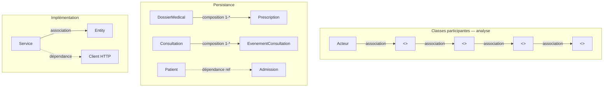

# Toutes les relations UML — diagrammes Afya

Inventaire **exhaustif** des relations utilisées dans le dossier `class_participantes_et_activite/` et fichiers liés.

Guide des types de relations : [RELATIONS_UML_DIAGRAMMES.md](RELATIONS_UML_DIAGRAMMES.md).

**Classes participantes uniquement (8 CU, détail par fichier)** : [RELATIONS_CLASSES_PARTICIPANTES_AFYA.md](RELATIONS_CLASSES_PARTICIPANTES_AFYA.md) · PlantUML [FR](RELATIONS_CLASSES_PARTICIPANTES_FR.puml) · [impl.](RELATIONS_CLASSES_PARTICIPANTES_IMPL.puml).

---

## 1. Légende des symboles

| Symbole PlantUML | Type UML | Usage Afya |
|------------------|----------|------------|
| `-->` | Association | Flux acteur → interface → contrôle → entité |
| `--` | Association (structurelle) | FK entre entités, avec multiplicité |
| `*--` | Composition | Enfant supprimé avec le parent (dossier, consultation) |
| `..>` | Dépendance | Client HTTP, référence logique inter-microservices, `<<include>>` |
| `o--` | Agrégation | Rare (modèle domaine global) |

---

## 2. Diagramme de persistance (`DIAGRAMME_PERSISTANCE_AFYA.puml`)

### 2.1 Associations et compositions (même base)

| # | Source | Relation | Cible | Multiplicité | Contexte |
|---|--------|----------|-------|--------------|----------|
| P01 | UtilisateurCompte | association | UtilisateurRole | 1 — 0..* | Identité |
| P02 | Role | association | UtilisateurRole | 1 — 0..* | Identité (N–N) |
| P03 | UtilisateurCompte | association | SessionUtilisateur | 1 — 0..* | Identité |
| P04 | Departement | **composition** | ServiceHospitalier | 1 — 0..* | Catalogue |
| P05 | ServiceHospitalier | **composition** | Lit | 1 — 0..* | Catalogue |
| P06 | Admission | association | DemandeTransfert | 1 — 0..* | Parcours |
| P07 | Sejour | **composition** | FormulaireHospitalisation | 1 — 0..1 | Séjour |
| P08 | DossierMedical | **composition** | Diagnostic | 1 — 0..* | Clinique |
| P09 | DossierMedical | **composition** | NoteClinique | 1 — 0..* | Clinique |
| P10 | DossierMedical | **composition** | Prescription | 1 — 0..* | Clinique |
| P11 | DossierMedical | **composition** | SoinInfirmier | 1 — 0..* | Clinique |
| P12 | DossierMedical | **composition** | DocumentClinique | 1 — 0..* | Clinique |
| P13 | Consultation | **composition** | EvenementConsultation | 1 — 0..* | Clinique |
| P14 | Prescription | association | AdministrationMedicament | 1 — 0..* | Clinique |

### 2.2 Dépendances (référence logique inter-microservices)

| # | Source | Relation | Cible | Libellé / clé |
|---|--------|----------|-------|----------------|
| P15 | Patient | dépendance | Admission | identifiantPatient |
| P16 | Patient | dépendance | VisiteUrgence | identifiantPatient |
| P17 | Patient | dépendance | DossierMedical | identifiantPatient |
| P18 | Patient | dépendance | Consultation | identifiantPatient |
| P19 | Patient | dépendance | Sejour | identifiantPatient |
| P20 | ServiceHospitalier | dépendance | Admission | identifiantService |
| P21 | Admission | dépendance | Sejour | identifiantAdmission |
| P22 | Admission | dépendance | Consultation | identifiantAdmission |

---

## 3. Classes participantes — analyse français (`CLASSES_PARTICIPANTES_*_FR.puml`)

Toutes les relations sont des **associations** (`-->`), sauf mention contraire.

### CU 1 — Authentification (`CLASSES_PARTICIPANTES_AUTHENTIFICATION_FR.puml`)

| # | Source | → | Cible |
|---|--------|---|-------|
| A1-01 | Utilisateur | → | InterfaceConnexion |
| A1-02 | InterfaceConnexion | → | ControleurAuthentification |
| A1-03 | ControleurAuthentification | → | ServiceAuthentification |
| A1-04 | ServiceAuthentification | → | UtilisateurCompte |
| A1-05 | ControleurAuthentification | → | SessionUtilisateur |

### CU 2 — Utilisateurs (`CLASSES_PARTICIPANTES_UTILISATEURS_FR.puml`)

| # | Source | → | Cible |
|---|--------|---|-------|
| A2-01 | Administrateur | → | InterfaceGestionUtilisateurs |
| A2-02 | InterfaceGestionUtilisateurs | → | ControleurUtilisateurs |
| A2-03 | ControleurUtilisateurs | → | ServiceGestionUtilisateurs |
| A2-04 | ServiceGestionUtilisateurs | → | UtilisateurCompte |
| A2-05 | UtilisateurCompte | → | Role |

### CU 3 — Services hospitaliers (`CLASSES_PARTICIPANTES_SERVICES_HOSP_FR.puml`)

| # | Source | → | Cible |
|---|--------|---|-------|
| A3-01 | Administrateur | → | InterfaceServicesHospitaliers |
| A3-02 | InterfaceServicesHospitaliers | → | ControleurServicesHospitaliers |
| A3-03 | ControleurServicesHospitaliers | → | ServiceCatalogueHospitalier |
| A3-04 | ServiceCatalogueHospitalier | → | ServiceHospitalier |
| A3-05 | ServiceHospitalier | → | Lit |

### CU 4 — Activités système (`CLASSES_PARTICIPANTES_ACTIVITES_FR.puml`)

| # | Source | → | Cible |
|---|--------|---|-------|
| A4-01 | Administrateur | → | InterfaceSupervision |
| A4-02 | InterfaceSupervision | → | ControleurJournalActivite |
| A4-03 | ControleurJournalActivite | → | ServiceTraçabilite |
| A4-04 | ServiceTraçabilite | → | JournalActivite |

### CU 5 — Patient (`CLASSES_PARTICIPANTES_PATIENT_FR.puml`)

| # | Source | → | Cible |
|---|--------|---|-------|
| A5-01 | Receptionniste | → | InterfacePatients |
| A5-02 | InterfacePatients | → | ControleurPatients |
| A5-03 | ControleurPatients | → | ServicePatients |
| A5-04 | ServicePatients | → | Patient |

### CU 6 — Admissions (`CLASSES_PARTICIPANTES_ADMISSIONS_FR.puml`)

| # | Source | → | Cible |
|---|--------|---|-------|
| A6-01 | Receptionniste | → | InterfaceAdmissions |
| A6-02 | InterfaceAdmissions | → | ControleurAdmissions |
| A6-03 | ControleurAdmissions | → | ServiceAdmissions |
| A6-04 | ServiceAdmissions | → | Admission |
| A6-05 | ServiceAdmissions | → | Sejour |

### CU 7 — Prise en charge (`CLASSES_PARTICIPANTES_PRISE_EN_CHARGE_FR.puml`)

| # | Source | → | Cible |
|---|--------|---|-------|
| A7-01 | Medecin | → | InterfaceDossierMedical |
| A7-02 | InterfaceDossierMedical | → | ControleurPriseEnCharge |
| A7-03 | ControleurPriseEnCharge | → | ServiceClinique |
| A7-04 | ControleurPriseEnCharge | → | DossierMedical |
| A7-05 | ControleurPriseEnCharge | → | Consultation |
| A7-06 | Consultation | → | EvenementConsultation |
| A7-07 | DossierMedical | → | Diagnostic |
| A7-08 | DossierMedical | → | Prescription |
| A7-09 | ServiceClinique | → | CatalogueMaladie |

### CU 8 — Soins (`CLASSES_PARTICIPANTES_SOINS_FR.puml`)

| # | Source | → | Cible |
|---|--------|---|-------|
| A8-01 | Infirmier | → | InterfaceSoins |
| A8-02 | InterfaceSoins | → | ControleurSoins |
| A8-03 | ControleurSoins | → | ServiceSoins |
| A8-04 | ServiceSoins | → | SoinInfirmier |
| A8-05 | ServiceSoins | → | AdministrationMedicament |
| A8-06 | DossierMedical | → | SoinInfirmier |
| A8-07 | Prescription | → | AdministrationMedicament |

**Total analyse FR : 42 associations** (fichier regroupé `CLASSES_PARTICIPANTES_ANALYSE_FR.puml` = même liste).

---

## 4. Classes participantes — implémentation (`CLASSES_PARTICIPANTES_*.puml`, anglais)

### CU 1 — Auth

| # | Source | Relation | Cible | Note |
|---|--------|----------|-------|------|
| I1-01 | User | association | LoginPage | |
| I1-02 | LoginPage | association | AuthBffController | POST /api/v1/auth/login |
| I1-03 | AuthBffController | association | AuthController | |
| I1-04 | AuthController | association | AuthService | |
| I1-05 | AuthService | association | AppUser | |
| I1-06 | AuthService | association | JwtService | |
| I1-07 | AuthService | association | RefreshToken | |

### CU 2 — Utilisateurs

| # | Source | Relation | Cible |
|---|--------|----------|-------|
| I2-01 | Administrateur | association | UsersAdminPage |
| I2-02 | UsersAdminPage | association | UserBffController |
| I2-03 | UserBffController | association | UserController |
| I2-04 | UserController | association | UserAdminService |
| I2-05 | UserAdminService | association | AppUser |
| I2-06 | UserAdminService | association | Role |

### CU 3 — Services hospitaliers

| # | Source | Relation | Cible |
|---|--------|----------|-------|
| I3-01 | Administrateur | association | HospitalServicesPage |
| I3-02 | HospitalServicesPage | association | HospitalServiceBffController |
| I3-03 | HospitalServiceBffController | association | HospitalServiceController |
| I3-04 | HospitalServiceController | association | HospitalServiceCatalogService |
| I3-05 | HospitalServiceCatalogService | association | HospitalService |
| I3-06 | HospitalService | association | Department |
| I3-07 | HospitalServiceCatalogService | association | Bed |

### CU 4 — Activités

| # | Source | Relation | Cible |
|---|--------|----------|-------|
| I4-01 | Admin | association | ReportingPage |
| I4-02 | ReportingPage | association | AuditBffController |
| I4-03 | ReportingPage | association | StatsBffController |
| I4-04 | AuditBffController | association | AuditEventController |
| I4-05 | AuditEventController | association | AuditEventService |
| I4-06 | AuditEventService | association | AuditEvent |

### CU 5 — Patient

| # | Source | Relation | Cible |
|---|--------|----------|-------|
| I5-01 | Receptionniste | association | PatientsPage |
| I5-02 | PatientsPage | association | PatientBffController |
| I5-03 | PatientBffController | association | PatientController |
| I5-04 | PatientController | association | PatientRegistryService |
| I5-05 | PatientRegistryService | association | Patient |
| I5-06 | PatientRegistryService | association | PatientDossierSequence |

### CU 6 — Admissions

| # | Source | Relation | Cible |
|---|--------|----------|-------|
| I6-01 | Receptionniste | association | AdmissionsPage |
| I6-02 | AdmissionsPage | association | AdmissionBffController |
| I6-03 | AdmissionBffController | association | AdmissionController |
| I6-04 | AdmissionController | association | AdmissionService |
| I6-05 | AdmissionService | association | Admission |
| I6-06 | AdmissionService | **dépendance** | PatientServiceClient |
| I6-07 | AdmissionService | **dépendance** | CatalogServiceClient |
| I6-08 | AdmissionService | **dépendance** | StayServiceClient |

### CU 7 — Prise en charge

| # | Source | Relation | Cible |
|---|--------|----------|-------|
| I7-01 | Med | association | ConsultationDetailView |
| I7-02 | ConsultationDetailView | association | ConsultationBffController |
| I7-03 | ConsultationDetailView | association | DiseaseCatalogBffController |
| I7-04 | ConsultationDetailView | association | PrescriptionBffController |
| I7-05 | ConsultationBffController | association | ConsultationController |
| I7-06 | ConsultationController | association | ConsultationService |
| I7-07 | ConsultationService | association | Consultation |
| I7-08 | ConsultationService | association | ConsultationEvent |
| I7-09 | ConsultationService | association | DiseaseCatalogService |
| I7-10 | DiseaseCatalogService | association | DiseaseCatalog |

### CU 8 — Soins

| # | Source | Relation | Cible |
|---|--------|----------|-------|
| I8-01 | Infirmier | association | MedicalRecordDetailPage |
| I8-02 | MedicalRecordDetailPage | association | PatientClinicalBffController |
| I8-03 | PatientClinicalBffController | association | MedicalRecordController |
| I8-04 | MedicalRecordController | association | ClinicalRecordService |
| I8-05 | ClinicalRecordService | association | MedicalRecord |
| I8-06 | ClinicalRecordService | association | NursingCareRecord |
| I8-07 | ClinicalRecordService | association | MedicationAdministration |
| I8-08 | ClinicalRecordService | association | PrescriptionLine |

### Synthèse implémentation (`CLASSES_PARTICIPANTES_AFYA.puml`) — dépendances externes

| # | Source | Relation | Cible | Note |
|---|--------|----------|-------|------|
| S-01 | UserAdminApplicationService | dépendance | AuditPublisher | |
| S-02 | CatalogAdminApplicationService | dépendance | AuditPublisher | |
| S-03 | AdmissionOrchestrationService | dépendance | PatientRestClient | |
| S-04 | AdmissionOrchestrationService | dépendance | CatalogReadClient | |
| S-05 | ClinicalApplicationService | dépendance | PatientRestClient | valider patient |
| S-06 | CarePathApplicationService | dépendance | AdmissionOrchestrationService | sortie / transfert |
| S-07 | NursingApplicationService | dépendance | MedicalRecord | |

---

## 5. Cas d'utilisation (`CAS_UTILISATION_AFYA.puml`)

### 5.1 Acteur → cas d'utilisation (association)

| Acteur | → | Cas d'utilisation |
|--------|---|-------------------|
| Administrateur | → | Authentification, Gérer comptes, Gérer services, Rapports, Journal audit |
| Réceptionniste | → | Authentification, Enregistrer patient, Rechercher patient, Admission, Affectation service, Transfert, Historique admissions |
| Médecin | → | Authentification, Dossier médical, Diagnostics, Prescriptions, Sortie/transfert |
| Infirmier(ère) | → | Authentification, Rechercher patient, Dossier médical, Consulter prescriptions, Soins, Exécution, Historique soins |

### 5.2 Include (dépendance `..>`)

| Source | Relation | Cible | Stéréotype |
|--------|----------|-------|------------|
| Enregistrer l'admission | dépendance | Enregistrer un patient | <<include>> |
| Consulter le dossier médical | dépendance | Rechercher un patient | <<include>> |

---

## 6. Tableau maître — comptage par type

| Type de relation | Persistance | Analyse FR (8 CU) | Implémentation | Cas d'utilisation |
|------------------|-------------|-------------------|----------------|-------------------|
| Association `-->` / `--` | 11 (+ 3 N–N via table) | 42 | ~55 | ~25 acteur–CU |
| Composition `*--` | 8 | 0 | 0 | 0 |
| Dépendance `..>` | 8 | 0 | 10+ | 2 include |

---

## 7. Schéma global (Mermaid)

---

## 8. Fichiers sources

| Contenu | Fichier(s) |
|---------|------------|
| Persistance | `DIAGRAMME_PERSISTANCE_AFYA.puml` |
| Analyse FR (par CU) | `CLASSES_PARTICIPANTES_*_FR.puml` |
| Analyse FR (regroupé) | `CLASSES_PARTICIPANTES_ANALYSE_FR.puml` |
| Implémentation | `CLASSES_PARTICIPANTES_*.puml` (sans `_FR`) |
| Cas d'utilisation | `CAS_UTILISATION_AFYA.puml` |
| Modèle domaine | `../MODELE_DOMAINE_AFYA.puml` |

---

*Document généré pour le mémoire Afya — phase analyse et implémentation.*
